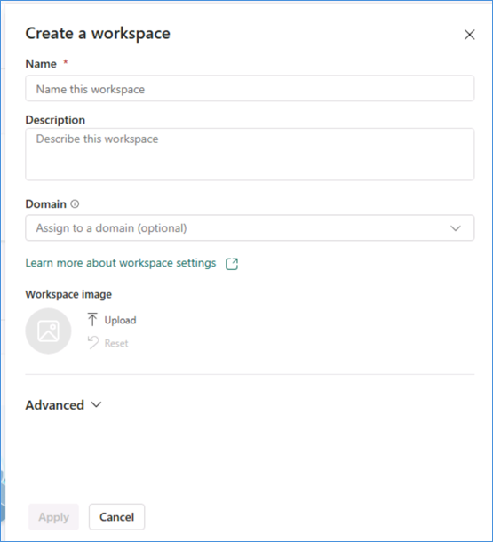

# Creating workspace for Fabric IQ
A dedicated Microsoft Fabric workspace is established to serve as the centralized foundation for all Fabric IQ capabilities, enabling seamless integration of data, analytics, and AI-driven insights. This workspace is configured with appropriate capacity, governance, and role-based access to support secure and scalable operations.

## Section 1: Getting started
In this section of the workshop, you will be logging into the Microsoft Fabric Portal and creating a new Fabric Workspace.

### Task 1.1: Login
Using a web browser of your choice, please navigate to this Microsoft Fabric link.

1. Enter your AAD Username e.g. AIAP.<YourCustomUserName>@fabcon25eu.onmicrosoft.com in the Email field, then click on the Submit button.

   
   
   > During the workshop, you should have received a printed one-pager from the proctor or speaker. Replace <YourCustomUserName> with the value provided on that sheet. Then, enter or copy the AAD user from the page, for example: AIAP.user001@fabcon25eu.onmicrosoft.com.

2. Enter your password and click on the Sign in button.

   > During the workshop, you should have received a printed one-pager from the proctor or speaker. Please enter or copy the Password from that page.

   

3. If prompted with "Stay signed in?" select "Yes" and proceed.

4. If popup "Welcome to the Fabric view" is showed, feel free to close it by selecting 'X' on the top right corner and proceed with the workshop content.

   

### Task 1.2: Set up a Fabric workspace with proper capacity 
1. You should be able to find a New Workspace tile on the mid-top mid-left side of the screen. Select it to open the Create a workspace blade on the right side.
   
   

2. In the Create a workspace blade,
   
   

   and enter a unique name for the Workspace Name field.

   > **Note:** To ensure your workspace name is unique, add the suffix from your username to the workspace name. For example, if your username is AIAP.user001@fabcon25eu.onmicrosoft.com, use FabricWorkspaceuser001 as the workspace name (where user001 is taken from your username).

   

3. Select Advanced and scroll down to see the License mode options and selected Capacity.
   
   

4. After you scrolled down, make sure that License mode is set to Fabric capacity and that Capacity is selected to your available option.
   
   

5. Next, click the **green Apply button** on the **bottom left** of the Create a workspace blade.
   
   

6. On the following page, you may get a popup titled "Introducing task flows (preview)". Click the green Got it button.
   
   
