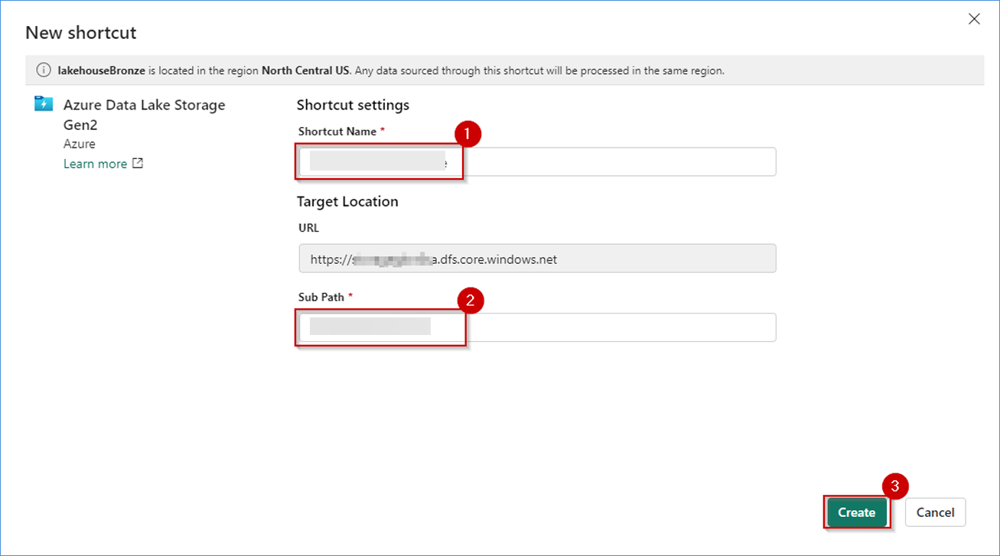
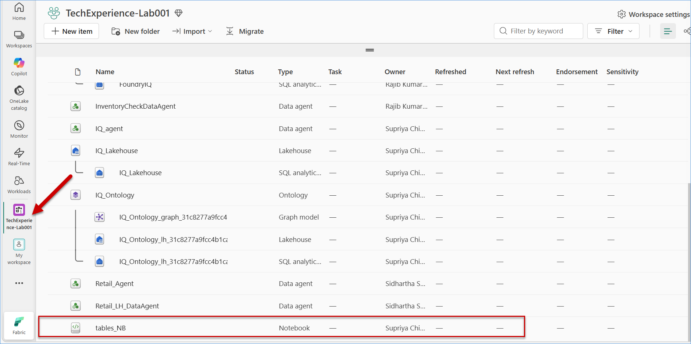
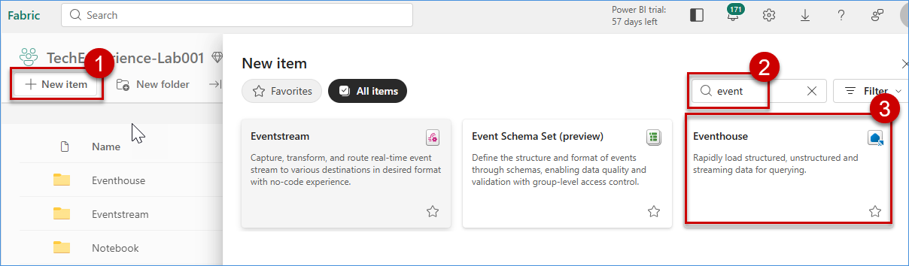
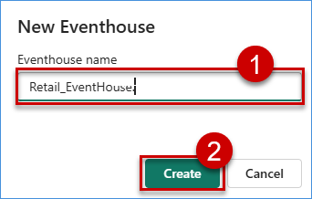
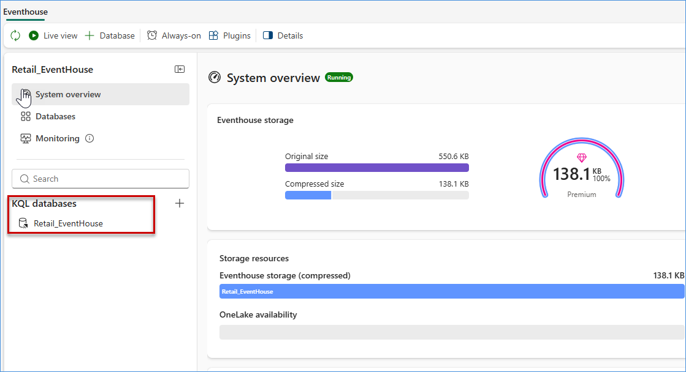
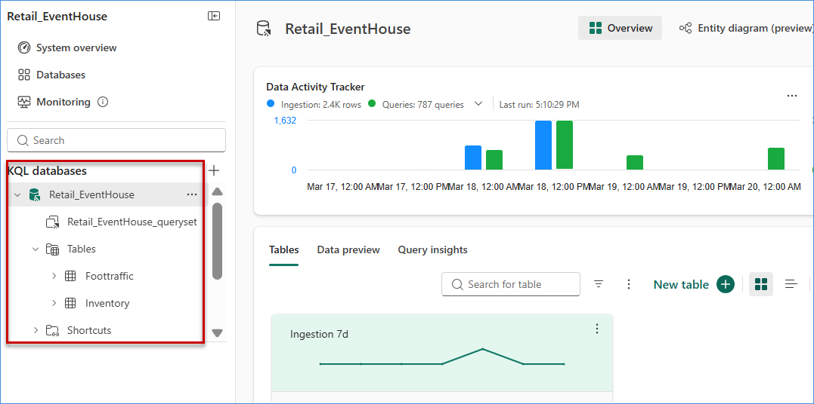

# Build a Lakehouse for ontology
Fabric Lakehouse provides the governed data layer from which the Semantic Model is created, enabling Ontology IQ to understand business entities, metrics, and relationships for intelligent AI-driven analytics.

## Section 1: Creating Lakehouse
In this section of the workshop, you will be creating Lakehouse and load batch data into the Lakehouse.

### Task 1.1: Navigate to Fabric Workspace
This task to navigate to Fabric Workspace to create Lakahouse under this workspace.

1. Select the workspaces option and choose appropriate workspace to create Lakeshosue.

    
   
### Task 1.2: Creating Lakehouse in the Workspace
This task demonstrates how to create a Lakehouse in the selected Fabric workspace.

1. Click on **+ Newitem** and select **Lakehouse** from the available options.

    

2. In the **New Lakehouse** dialog box, Enter a **Name** for the Lakehouse and Ensure the **Lakehouse schemas** option is enabled

    
    > **Note:**  
    > - Enabling **Lakehouse schemas** allows organizing tables into logical schemas (e.g., `sales`, `marketing`).  

3. Click on **Create**.

4. Wait for the Lakehouse to be provisioned successfully.

5. Once created, the Lakehouse will open automatically.

6. Verify the following components are available:
   - **Tables** section
   - **Files** section
 
     
### Task 1.3: Batch load to Lakehouse
This task demonstrates how to perform a batch load of multiple CSV files into the Lakehouse and automatically create tables using a PySpark notebook.

#### Step 1: Create Shortcut to ADLS Gen2

1. Navigate to your Fabric workspace and open the **Lakehouse** created in the previous task.

      

2. Go to the **Files** section.

3. Click on **New Shortcut**.
 
    

4. Select **Azure Data Lake Storage Gen2** as the source.
 
    

5. In the **New shortcut** window, under **Connection settings**, paste the Storage Account endpoint in the **URL** field: 
  https://storage{LAB_INSTANCE_ID}.dfs.core.windows.net/ .
   > **Note:** Wait for the screen to load. The connection details may be auto-populated.

6. Under **Connection credentials**:
- Select **Authentication kind** as **Account key**
- Paste the **Account key** in the provided field
   > **Note:** Wait for the Account Key to be validated. If details are not auto-filled, ensure the correct key is provided.

7. Click on **Next**.
  
      
     
8. In the **Shortcut settings** section:
- Enter **Shortcut Name** as **csvfiles**
- Enter **Sub Path** as:
  ```
  /fabricqlabdata/raw
9. Click on **Create** to create the shortcut.

      

10. Verify that the shortcut is created under the **Files** section and CSV files are visible and Confirm that the file list is populated

    

#### Step 2: Import Notebook

1. Navigate to your **Fabric Workspace**.

2. On the workspace homepage, click on the **Import** option.

3. From the available options, select **Notebook**. 

4. Choose **From this computer** as the source.

     

5. Browse and select the provided notebook file from your **VM system**.

6. Click on **Upload** to import the notebook.

     

7. Once the notebook is imported, open it from the workspace.

8. Verify that:
   - The notebook opens successfully
   - All code cells are visible and properly loaded

#### Step 3: Configure Notebook

1. Open the imported notebook.

     

2. Update the following parameters in the notebook:

   - **Workspace ID**
   - **Lakehouse ID**

     

3. To get these values:

  - Navigate to your Fabric workspace and open the **Lakehouse** created in the previous task.

    

  - Observe the URL in the browser address bar. It will look similar to:
     ```
     https://app.fabric.microsoft.com/groups/<workspace-id>/lakehouses/<lakehouse-id>

     ```
    

    - Identify the values as follows:
    - The value after **`groups/`** is the **Workspace ID**
    - The value after **`lakehouses/`** is the **Lakehouse ID**

4. Example:
   
   https://app.fabric.microsoft.com/groups/12345-abcde/lakehouses/67890-fghij

    - From this URL:
    - The value between **`groups/`** and **`/lakehouses`** is the **Workspace ID**  
    👉 Example: `12345-abcde`
    - The value after **`lakehouses/`** is the **Lakehouse ID**  
    👉 Example: `67890-fghij`
    - Copy both values carefully and use them in the notebook.

    > **Note:**  
    > - Make sure you copy the IDs correctly    without extra spaces. 
    > - These IDs are required for the notebook     to access your Lakehouse files.


#### Step 4: Attach Lakehouse and Run Notebook

1. In the notebook, go to the **Explorer** pane on the left side.

2. Click on **+ Add data items**.

3. From the options displayed, select **From OneLake catalog**.
 
    

4. Browse and select the **Lakehouse** created in the previous steps.

5. Click **Add** to attach the Lakehouse to the notebook.

    

6. Verify that the Lakehouse is successfully attached:
   - The Lakehouse appears under the **Data items** section
   - You can see **Tables** and **Files** folders

4. Once the Lakehouse is attached, click on **Run All** (or the **Run ▶️** button) to execute the notebook.
  
   
      
5. Wait for the execution to complete successfully.

6. After execution:
   - Navigate back to the **Lakehouse**
   - Go to the **Tables** section

7. Verify that:
   - Tables are created automatically
   - Tables are organized under appropriate schemas (e.g., `dbo`, `marketing`, `ontology`)

    

    > **Note:**  
    > - Attaching the Lakehouse is mandatory    before running the notebook.  
    > - The notebook reads CSV files and    creates Delta tables automatically in the  Lakehouse.


## Section 2: Eventhouse creation for Fabric IQ
In this section of the workshop, you will be creating Eventhouse and load streaming events and enables fast KQL-based queries for live dashboards and operational intelligence.

### Task 1.1: Creating Eventhouse
This task to create Eventhouse under the workspace which will load realtime data.

1. Follow the above step to navigate and choose the appropriate Fabric Workspace.
2. Click **New Item** to create Eventhouse.

    

3. Provide proper name and click **Apply** button to create Eventhouse

    

4. Wait for few moment to create Eventhouse. Once created, it will redirect to dashboard. KQL database will be created by default.

    

5. Click the Eventhouse database to load database in separate tab.

    