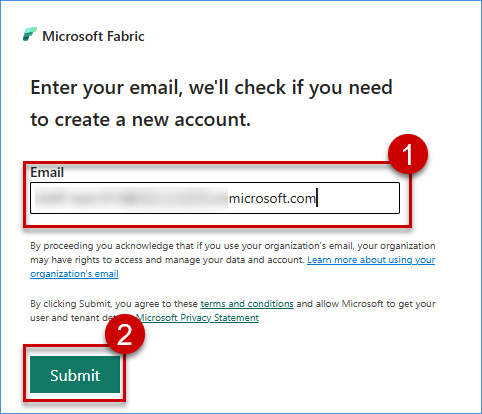
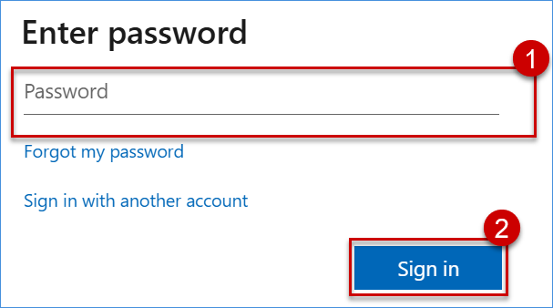
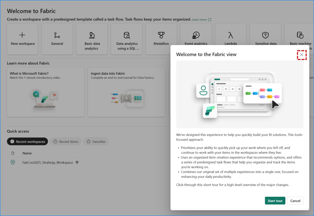
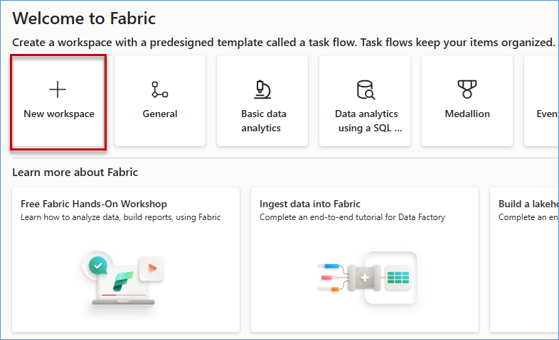
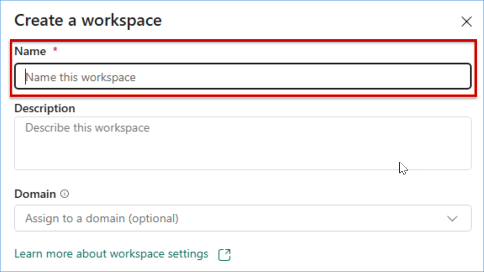
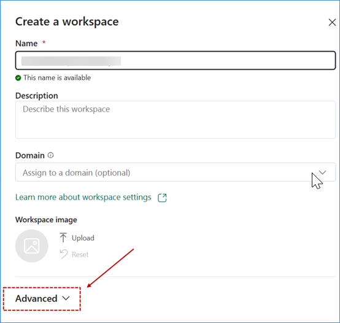
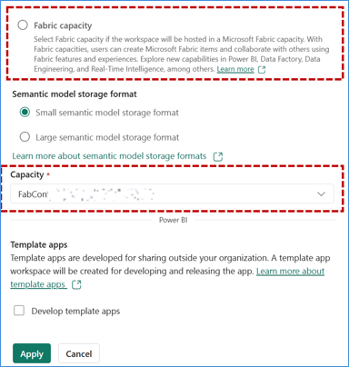
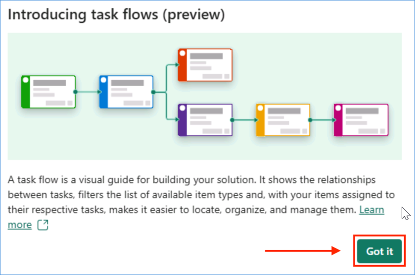

# Exercise 1: Create a Workspace for Fabric IQ
A dedicated **Microsoft Fabric** workspace is established to serve as the centralized foundation for all **Fabric IQ** capabilities, enabling seamless integration of data, analytics, and AI-driven insights. This workspace is configured with appropriate capacity, governance, and role-based access to support secure and scalable operations.

**Eva** (**Data Engineer**) is tasked by **Rupesh** to create a governed workspace where **Fabric IQ** artifacts can live securely.

## ✅ Outcome
- Fabric-enabled Workspace created  
- Capacity-backed environment configured  
- Workspace ready for:
  - Lakehouse setup  
  - Ontology creation  
  - Data Agent development

In this section of the workshop, you will be logging into the Microsoft Fabric Portal and creating a new Fabric Workspace.

## Task 1.1: User login to Microsoft Fabric
Using a web browser of your choice, please navigate to this Microsoft Fabric link.

1. Enter your AAD username **<inject key= "AzureAdUserEmail" enableCopy="true"/>** in the Email field, then click on the Submit button.

   
   

2. Now paste the following **Password**: **<inject key= "AzureAdUserPassword" enableCopy="true"/>** and click on **Sign in**.

     

3. If prompted with "Stay signed in?" select "Yes" and proceed.

4. If a pop-up titled "Welcome to the Fabric view" is displayed, feel free to close it by selecting 'X' on the top-right corner and proceed with the workshop content.

   

### Task 1.2: Set up a Fabric workspace with proper capacity 
1. You should be able to find a New Workspace tile near the top-left area of the screen. Select it to open the Create a workspace blade on the right side.
   
   

2. Type the name **<inject key= "WorkspaceName" enableCopy="true"/>**, **validate** the availability of the name.

   

3. click on **Advanced** and scroll down to see the Workspace type or license options.
   
   

4. After you scroll down, then choose **Fabric** or **Fabric Capacity** by clicking on `Radio Button` and under the capacity details select available fabric capacity in the tenant.
   
   

5. Next, click the **Apply button** at the **bottom left** of the Create a workspace blade.
   
   

6. On the following page, you may get a pop-up titled "Introducing task flows (preview)". Click the green Got it button.
   
   
