# Exercise 2: Build a Lakehouse for Ontology
Fabric **Lakehouse** provides the governed data layer from which the **Semantic Model** is created, enabling **Ontology IQ** to understand business entities, metrics, and relationships for intelligent AI-driven analytics.

**EVA** ingests data from multiple enterprise and operational sources, including:
- **Store Inventory Systems**
- **Online Sales Platforms**  
- **Campaign Management Systems**  
- **Historical Stock-out Data**  

All ingested data is consolidated into **Microsoft OneLake**, eliminating data silos and enabling a unified data foundation for analytics and AI-driven insights.

## ✅ Outcome
- Lakehouse successfully created  
- Structured tables prepared for data modeling  
- Foundational layer established for business semantics

## Task 2.1: Building a Lakehouse
In this task of the workshop, you will be creating a Lakehouse.

1. Click on the Workspaces option and choose the workspace created in the earlier step to create a Lakehouse.

    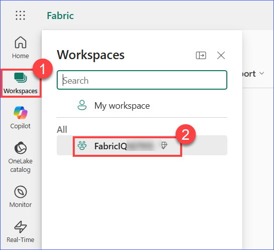
   
2. Click on **+ New item** and select **Lakehouse** from the available options.

    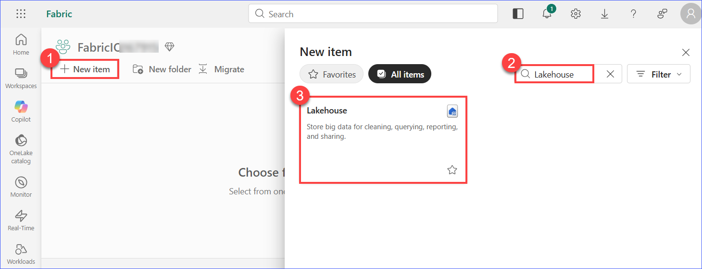

3. In the **New Lakehouse** dialog box, Enter a **Name:** **<inject key= "Lakehouse" enableCopy="true"/>** for the Lakehouse and Ensure the **Lakehouse schemas** option is enabled.

4. Click on **Create**.

    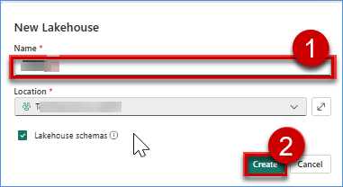
    
    > **Note:** Enabling **Lakehouse schemas** allows organizing tables into logical schemas (e.g., `sales`, `marketing`).  

5. Wait for the Lakehouse to be successfully provisioned. Once created, the Lakehouse will open automatically.

7. Verify the following components are available:
   - **Tables** section
   - **Files** section
   
## Task 2.2: Load batch data into the Lakehouse
This task demonstrates how to perform a batch load of multiple CSV files into the Lakehouse and automatically create tables using a PySpark notebook.

#### Step 1: Create Shortcut to ADLS Gen2

1. Navigate to your Fabric workspace and open the **Lakehouse** created in the previous task.

      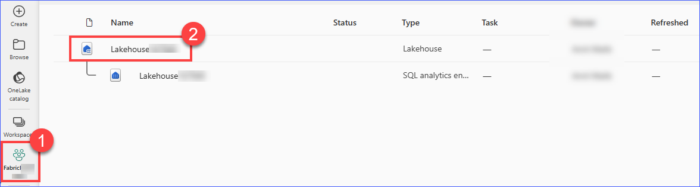

2. Go to the **Files** section.

3. Click on **New shortcut**.
 
    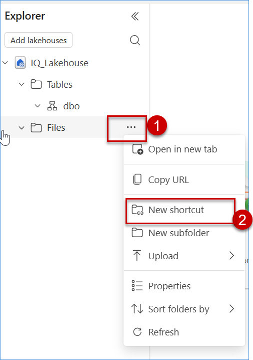

4. Select **Azure Data Lake Storage Gen2** as the source.
 
    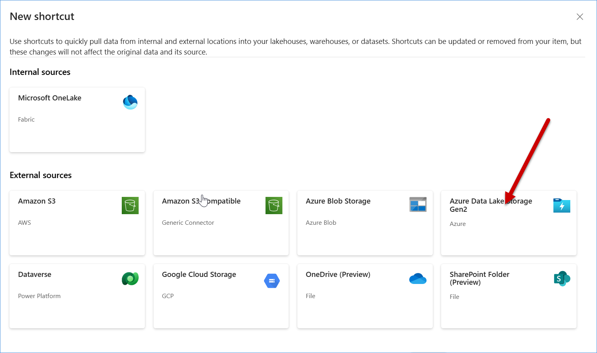

5. In the **New shortcut** window,click on **New connection**.

    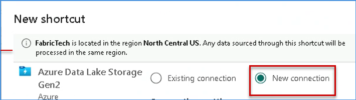

6. Under **Connection settings**, paste the Storage Account endpoint in the **URL** field: **<inject key= "storageDfsEndpoint" enableCopy="true"/>**.
   > **Note:** Wait for the screen to load. The connection details may be auto-populated.

7. Under **Connection credentials**:
    - Select **Authentication kind** as **Account key**
    - Paste the **Account key**: **<inject key= "storageKey" enableCopy="true"/>** in the provided field

    > **Note:** Wait for the Account Key to be validated. If details are not auto-filled, ensure the correct key is provided.

8. Click on **Next**.
  
     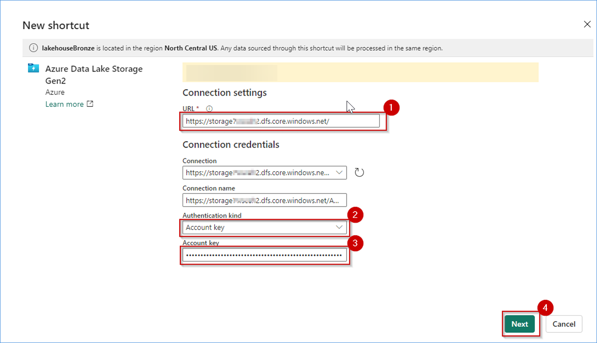 
     
9. In the Select a bucket or directory window, select both the **customersloyalty** and **fabriciqlabdata** containers from the left panel, and then click on the **Next** button to proceed.
 
    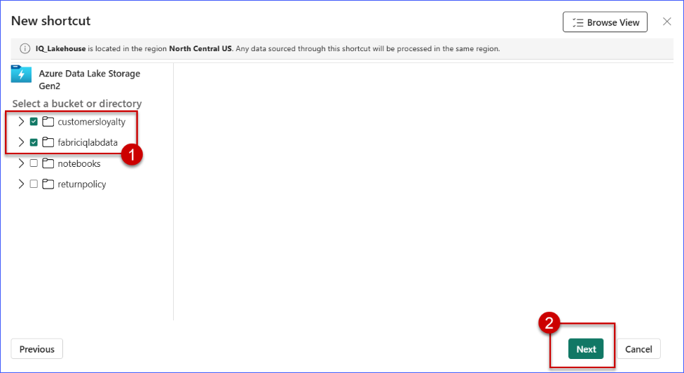

10. In the Transform to Delta screen,You will see a message indicating that the data is not in Delta format.Click on **Skip** to continue.

      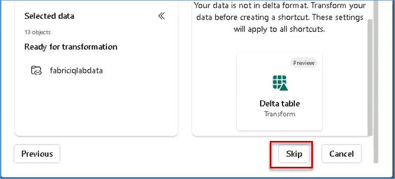

11. Review the Target type and Shortcut location and Verify the items listed under Preview shortcuts next Click on **Create** to complete the shortcut creation

     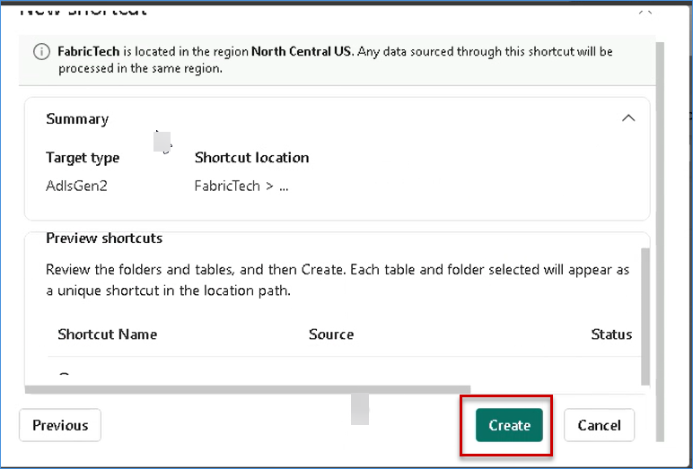 

12. Verify that the shortcut is created under the **Files** section and that the CSV files are visible and Confirm that the file list is populated

    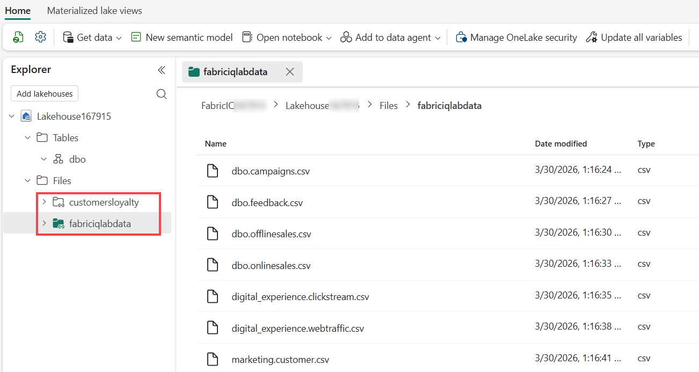 

#### Step 2: Import Notebook

1. Navigate to your **Fabric workspace**: **<inject key= "WorkspaceName" enableCopy="false"/>**.

2. On the workspace homepage, click on the **Import** option.

3. From the available options, select **Notebook**. 

4. Choose **From this computer** as the source.

    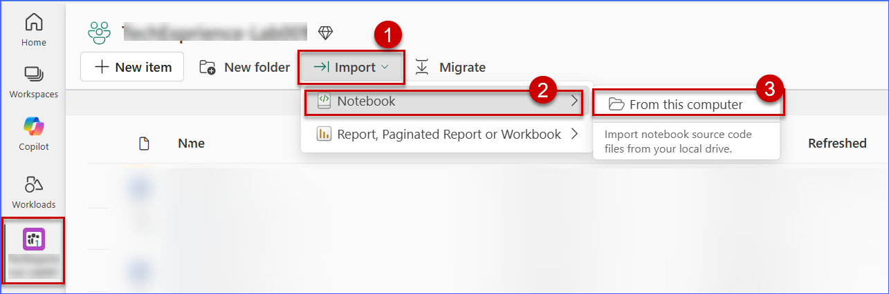 

5. Click on **Upload** to import the notebook.

    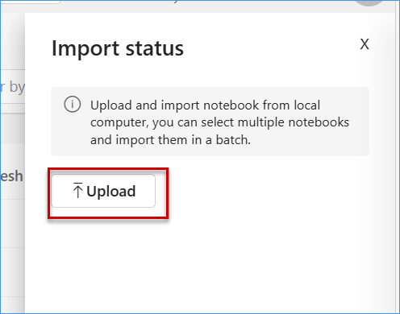 

6. To browse the notebooks from your virtual machine, open File Explorer. Click on the address bar, type the path `C:\FabricIQLab\Notebooks`, then select the **Auto create tables from Files** notebook file and click on the **Open** button.
 
     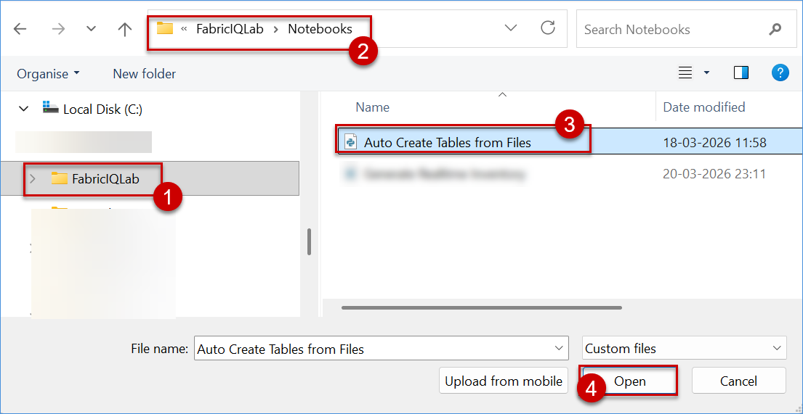

7. Once the notebook is imported, open it from the workspace.

     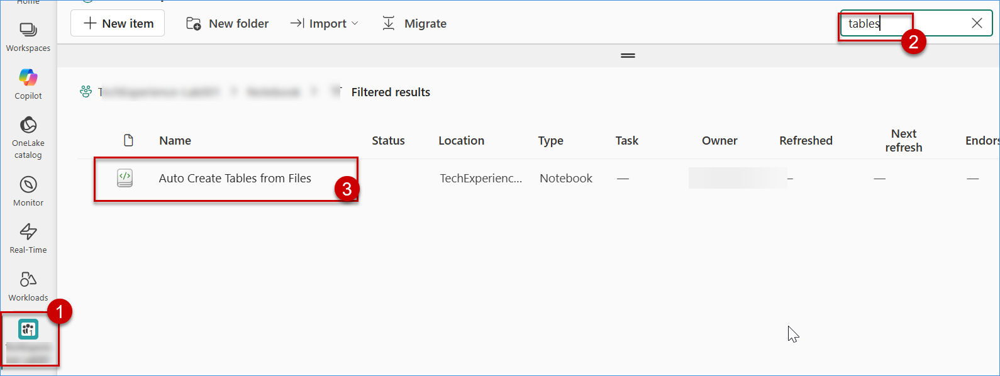

8. Verify that:
   - The notebook opens successfully
   - All code cells are visible and properly loaded

   > **Note:**  
   > - The **URL** represents the Storage Account.  
   > - Ensure correct values are provided to avoid    connection errors.

#### Step 3: Configure Notebook

1. Open the imported notebook.

    

2. Update the following parameters in the notebook:

   - **Workspace ID**
   - **Lakehouse ID**

    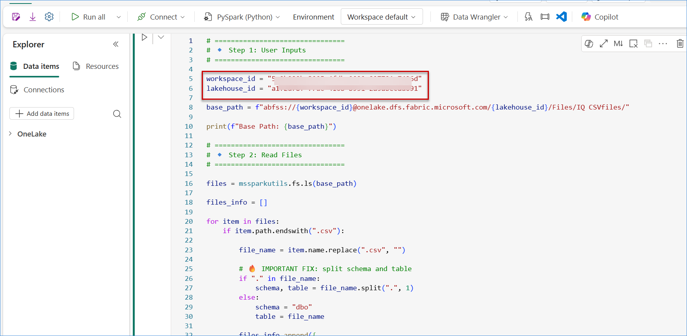 

3. To get these values:

  - Navigate to your Fabric workspace and open the **Lakehouse**: **<inject key= "Lakehouse" enableCopy="false"/>** created in the previous task.

    

  - Observe the URL in the browser address bar. It will look similar to: `https://app.fabric.microsoft.com/groups/<workspace-id>/lakehouses/<lakehouse-id>`

    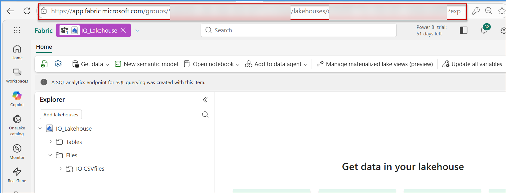

    - Identify the values as follows:
    - The value after **`groups/`** is the **Workspace ID**
    - The value after **`lakehouses/`** is the **Lakehouse ID**
    - The **Lakehouse ID** should be copied only up to the question mark **(?)** in the URL. Ignore anything that appears after ?.

4. Example:
   
   https://app.fabric.microsoft.com/groups/12345-abcde/lakehouses/67890-fghij

    - From this URL:
    - The value between **`groups/`** and **`/lakehouses`** is the **Workspace ID**  
    👉 Example: `12345-abcde`
    - The value after **`lakehouses/`** is the **Lakehouse ID**  
    👉 Example: `67890-fghij`
    - Copy both values carefully and use them in the notebook.

    > **Note:**  
    > - Make sure you copy the IDs correctly    without extra spaces. 
    > - These IDs are required for the notebook     to access your Lakehouse files.

#### Step 4: Attach Lakehouse and Run Notebook

1. In the Notebook: **Auto create tables from Files**, go to the **Explorer** pane on the left side.

2. Click on **+ Add data items**.

3. From the options displayed, select **From OneLake catalog**.
 
    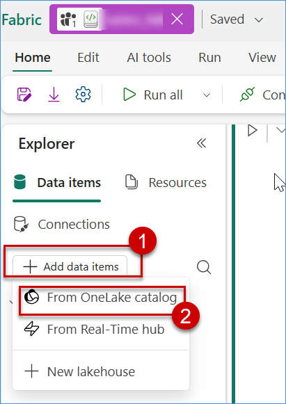

4. Browse and select the **Lakehouse**: **<inject key= "Lakehouse" enableCopy="false"/>** created in the previous steps.

5. Click **Add** to attach the Lakehouse to the notebook.

    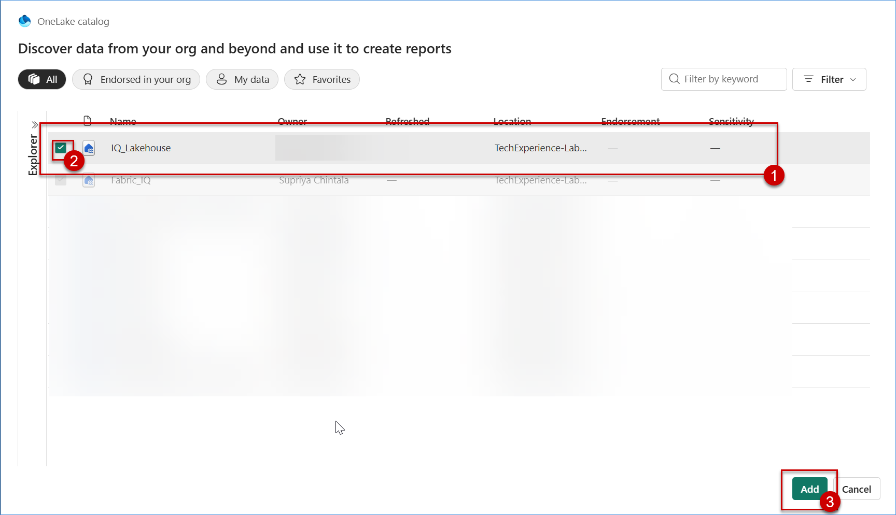

6. Verify that the Lakehouse is successfully attached:
   - The Lakehouse appears under the **Data items** section
   - You can see **Tables** and **Files** folders

7. Once the Lakehouse is attached, click on **Run All** (or the **Run ▶️** button) to execute the notebook.
  
   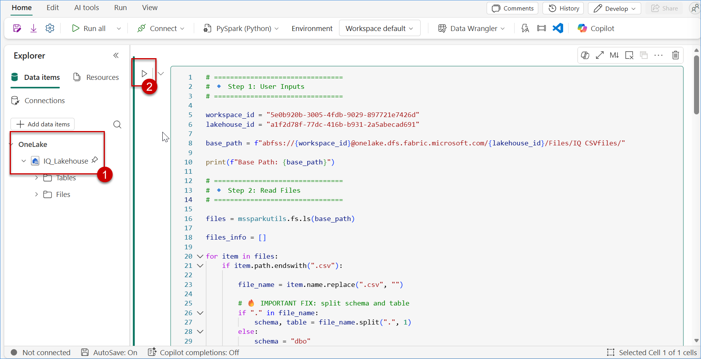
      
8. Wait for the execution to complete successfully.

9. After execution:
   - Navigate back to the **Lakehouse**
   - Go to the **Tables** section
   - Click on the three dots (⋯) menu and select **Refresh** to update the tables view

10. Verify that:
    - Tables are created automatically
    - Tables are organized under appropriate schemas (e.g., `dbo, marketing, ontology`)

        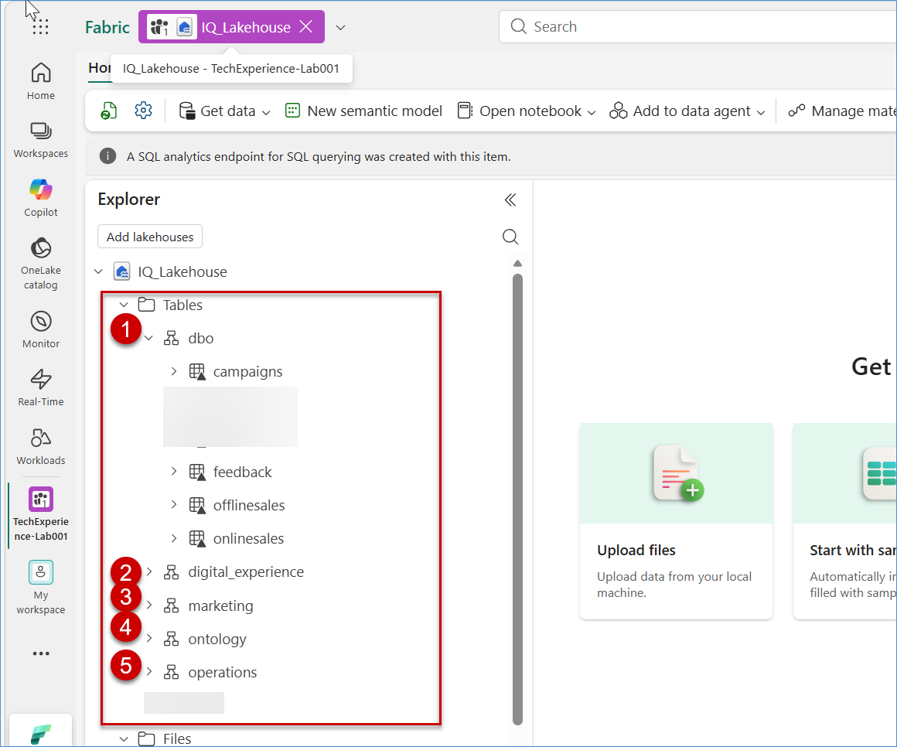

        > **Note:**  
        > - Attaching the Lakehouse is mandatory    before running the notebook.  
        > - The notebook reads CSV files and    creates Delta tables automatically in the  Lakehouse.

