# Exercise 2: Generate Ontology Data

In this section, you will create a Fabric **Lakehouse** and a **Eventhouse** and integrates batch and real-time data into a unified platform. The Lakehouse scalable storage and the Eventhouse processes streaming data enables **Ontology IQ** to understand business entities, metrics, and relationships for intelligent AI-driven analytics.

**EVA** ingests data from multiple enterprise and operational sources, including:
- **Store Inventory Systems**
- **Online Sales Platforms**  
- **Campaign Management Systems**  
- **Historical Stock-out Data**  

All ingested data is consolidated into **Microsoft OneLake**, eliminating data silos and enabling a unified data foundation for analytics and AI-driven insights.
## ✅ Outcome
- Lakehouse successfully created  
- Structured tables prepared for data modeling  
- Foundational layer established for business semantics

## Task 2.1: Building a Lakehouse
In this task of the workshop, you will be creating a Lakehouse.

1. Click on the Workspaces option and choose the workspace: **<inject key= "WorkspaceName" enableCopy="false"/>** created to create a Lakehouse.

    
   
2. Click on **+ New item** and select **Lakehouse** from the available options.

    

3. In the **New Lakehouse** dialog box, Enter a **Name:** **<inject key= "Lakehouse" enableCopy="true"/>** for the Lakehouse and Ensure the **Lakehouse schemas** option is enabled.

4. Click on **Create**.

    
    
    > **Note:** Enabling **Lakehouse schemas** allows organizing tables into logical schemas (e.g., `sales`, `marketing`).  

5. Wait for the Lakehouse to be successfully provisioned. Once created, the Lakehouse will open automatically.

7. Verify the following components are available:
   - **Tables** section
   - **Files** section
   
        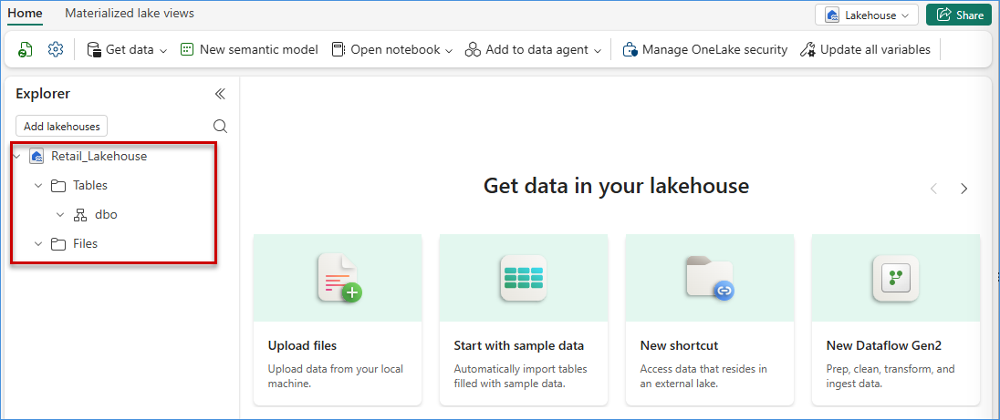

        >**Note:** Both Tables and Files section is empty.

8. To upload files, click **...** in Files section. Mouseover the **Upload** option and click **Upload files** option.

    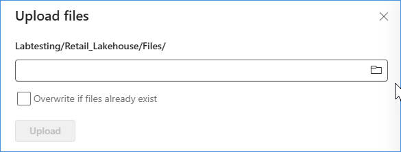

9. **Click** folder icon at right side to open and choose file path.

    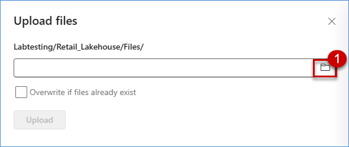

10. Below files should be present at appropriate **File Explorer** path.

    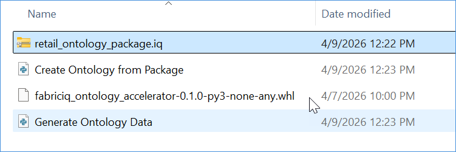

11. Select **retail_ontology_package.iq** file and click **Upload**

    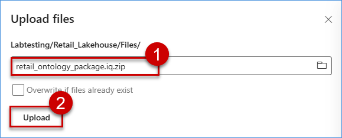

    > Rename this file and remove .zip after all update completed.

12. Repeat point 11 to upload **fabriciq_ontology_accelerator-0.1.0-py3-none-any.whl** file

13. Close the upload window once both file uploaded.

    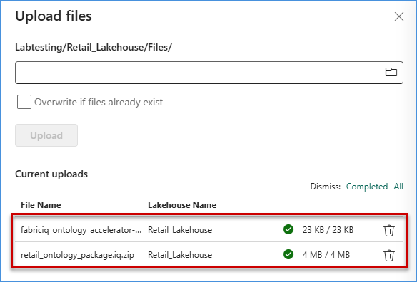

14. Now, the **Files** section of the Lakehosue will how both files. 

    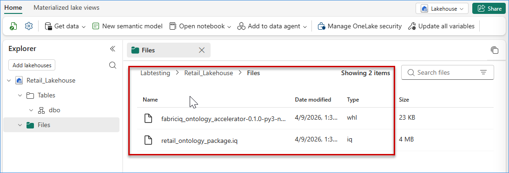

    > Dont forget to rename **retail_ontology_package.iq.zip** file and remove .zip after all update completed.

#### Understanding the Uploaded Files

> **Note:** 
> - `retail_ontology_package.iq` is a ZIP-based package. The `.iq` extension is added so the Fabric IQ workflow can recognize it as an ontology package. It contains structured definition of ontology to bind source static  data for the **Lakehouse**, and time-series operational data that will later be loaded into the **Eventhouse**.
> - `fabriciq_ontology_accelerator-0.1.0-py3-none-any.whl` is a Python helper library used within the notebook workflow to process the ontology package and generate data in the Lakehouse and Warehouse. It provides the necessary execution logic to read the package and load the data accordingly.

**What is inside `retail_ontology_package.iq`?**

The package is organized into four folders: `instance_data`, `events_data`, `definition`, and `binding`.

- **`instance_data`:** Holds data files which contains the batch and transactional retail data that are loaded into the **Lakehouse**. For our lab, we have considered below entities:
  
  - `carriers.csv`: Stores logistics provider details; used to track shipping partners, delivery performance, and transportation assignments.
  - `customers.csv`: Contains customer profiles; supports segmentation, behavior analysis, personalization, and customer-centric reporting.
  - `demand_signals.csv`: Captures batch data on demand indicators; used for trend detection, demand spikes, and responsive supply chain decisions.
  - `forecasts.csv`: Stores predicted demand values; enables planning, budgeting, and comparison against actual sales performance.
  - `inventories.csv`: Tracks stock levels across locations; supports replenishment, stock optimization, and inventory availability analysis.
  - `orders.csv`: Stores customer transaction records; enables revenue tracking, order lifecycle monitoring, and sales analytics.
  - `order_lines.csv`: Contains individual items within orders; used for detailed sales, pricing, and product-level analysis.
  - `product_categories.csv`: Defines product groupings; supports hierarchical classification, category-level reporting, and assortment analysis.
  - `products.csv`: Holds product details; enables performance tracking, pricing analysis, and inventory-product relationships.
  - `promotions.csv`: Stores campaign and discount data; supports effectiveness analysis, uplift measurement, and marketing optimization.
  - `regions.csv`: Defines geographic hierarchies; enables regional performance analysis and location-based business insights.
  - `returns.csv`: Tracks returned items; supports return rate analysis, quality issues identification, and reverse logistics.
  - `shipments.csv`: Stores shipment records; enables delivery tracking, fulfillment analysis, and logistics performance monitoring.
  - `stores.csv`: Contains retail store details; supports store-level performance, operations analysis, and location-based insights.
  - `warehouses.csv`: Stores warehouse information; supports storage management, inventory distribution, and supply chain optimization.

- **`events_data/`** : Holds data files which contains the real-time (Timeseries) data that are loaded into the **Eventhouse**. For our lab, we have considered below entities:
  - `carriers.csv`: Captures real-time logistics provider updates; monitors delivery status, transit delays, and carrier performance across active shipments.
  - `customers.csv`: Streams customer interactions and activities; supports real-time personalization, behavioral tracking, and dynamic engagement insights.
  - `demand_signals.csv`: Captures live demand events; enables immediate detection of demand spikes, trends, and rapid supply chain adjustments.
  - `forecasts.csv`: Continuously updated demand predictions; integrates real-time signals to refine forecasting accuracy and support dynamic planning decisions.
  - `inventories.csv`: Tracks real-time stock levels; enables instant visibility into availability, replenishment needs, and inventory movement across locations.
  - `products.csv`: Maintains product activity data; supports real-time tracking of performance, availability, and demand-driven product insights.
  - `regions.csv`: Represents geographic performance streams; enables real-time regional analysis, trend monitoring, and location-based decision-making insights.
  - `shipments.csv`: Tracks live shipment movements; provides real-time visibility into delivery progress, delays, and fulfillment execution.
  - `stores.csv`: Captures real-time store operations; monitors sales activity, inventory changes, and in-store performance continuously.

- **`definition/`**: Holds entity definition and its relationship details.
  - `entity_types.csv`: Capture both batch and real-time entities and its attributes along with identity and time series column
  - `relationship_types.csv`: Defines the logical relationships between entity types. 

- **`binding/`**: Holds entity binding and its relationship which is required to build Ontology.
  - `binding_entity_types.csv`: Maps ontology properties to the physical source tables and columns in the Lakehouse or Eventhouse, including time-series binding details. 
  - `binding_relationship_types.csv`: Maps ontology relationships to the source tables and join keys used to connect entities. 

> In summary, the `.iq` file provides the **business model and packaged sample data**, while the `.whl` file provides the parametrized **execution logic** that processes that package and loads data into Fabric services. 

## Task 2.2: Building a Eventhouse
In this section of the workshop, you will create an **Eventhouse**, ingest streaming events, and enable fast **KQL-based queries** to power live dashboards and support operational intelligence use cases.

**April (CEO)** requires real-time visibility into inventory performance during promotional campaigns.

To address this need, EVA enhances the data model with:
- Eventhouse for high-throughput event data storage  
- Streaming inventory updates  
- An Operations Agent to detect and monitor anomalies in real time data streaming 

> *“Don’t tell me about yesterday’s stock outs — tell me before they happen.”*

## ✅ Outcome
- Creating Eventhouse  
- Loading real-time data in the Eventhouse kusto table.  
- KQL-powered queries available for live dashboards  

1. Follow the above steps to navigate and choose the appropriate Fabric Workspace.
2. Click **New Item** to create Eventhouse.

    

3. Provide proper name and click the **Create** button to create the Eventhouse

    

4. Wait for a few moments for the Eventhouse to be created. Once created, you will be redirect to the dashboard. KQL database will be created by default.

    

    > Currently we have empty database

5. Please Navigate to the right side to locate **Eventhouse Details**, copy the **Query URI**, and note down the **Eventhouse Name** and **Database Name**, keeping all three details safe for use in the next exercises.

    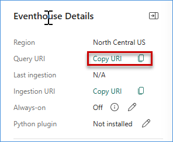

    > **Note:** The Eventhouse Name is the name you provided while creating the Eventhouse, and the Database Name is the same as the Eventhousename by default.

## Task 2.3: Loading data into Lakehouse and Eventhouse
#### Step 1: Import notebook 
1. Navigate to your **Fabric workspace**.

2. On the workspace homepage, click on the **Import** option.

3. From the available options, select **Notebook**. 

4. Choose **From this computer** as the source.

     

5. Click on **Upload** to import the notebook.

    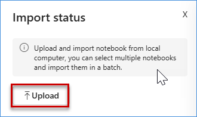 

6. To browse the notebooks from your virtual machine, open File Explorer. Click on the address bar, type the path `C:\FabricIQLab\Notebooks`, then select the **Generate Ontology Data** notebook file and click on the **Open** button.

     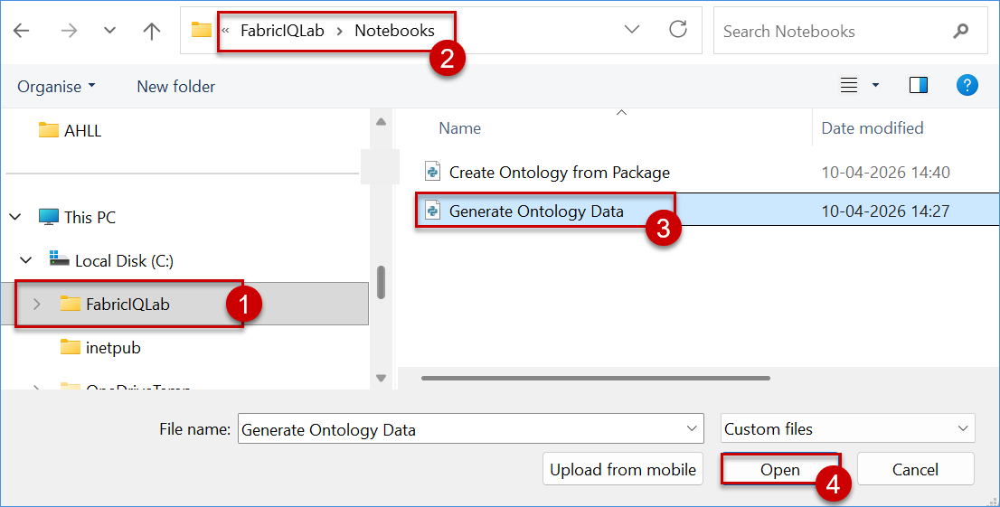 

7. After upload, notebook will be listed in the workspace area.

     

#### Step 2: Execute notebook
1. Click **Generate Ontology Data** notebook from the list.
  
     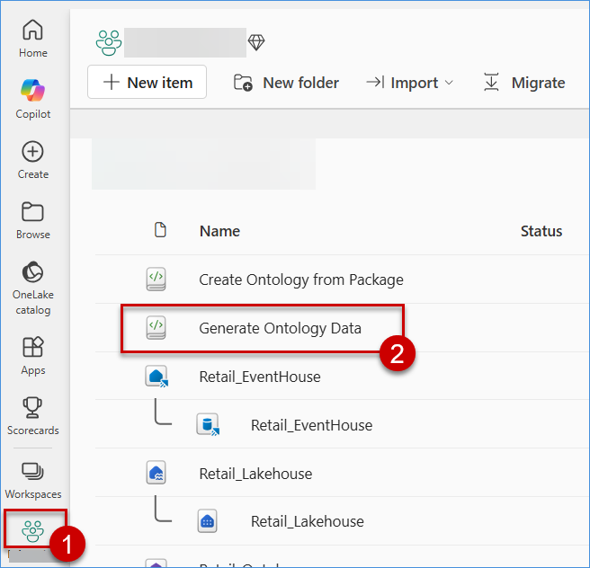
  

2. Notebook will open in a different tab without binding with any datastore(Lakehouse)

    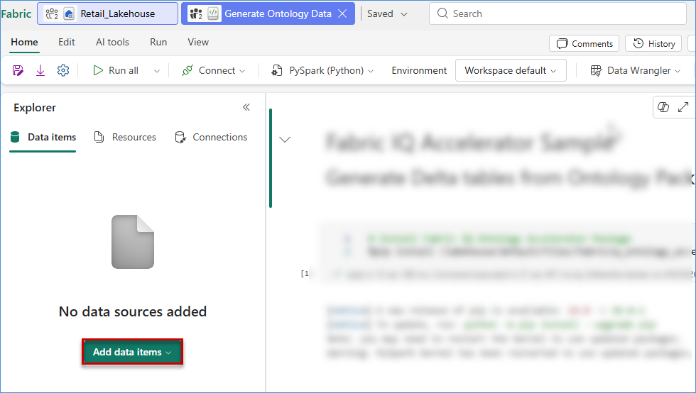 

3. Click **Add data items** and select **From OneLake catalog** to open OneLake ares.

    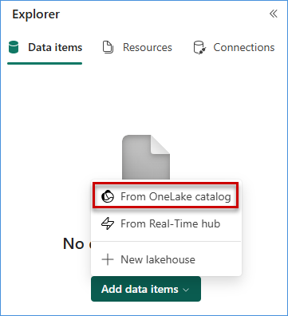 

4. Select above created Lakehosue and click **Add** to include in the notebook execution.

    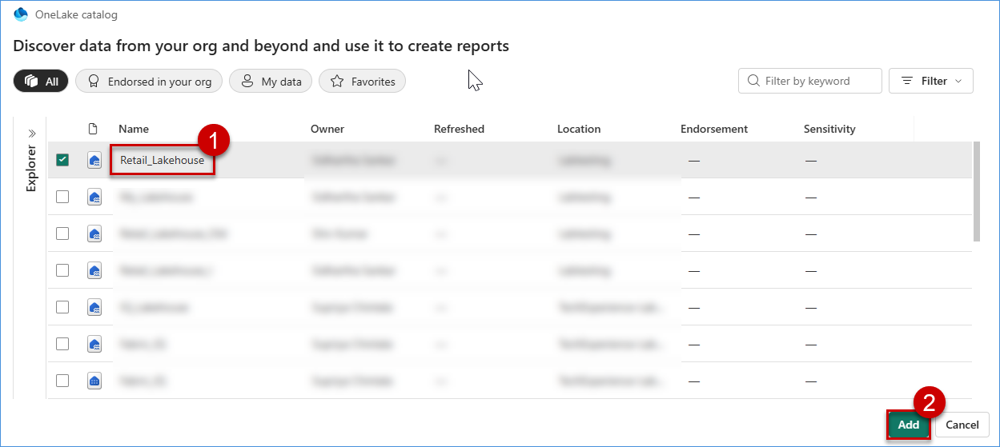 

5. Now, selected **Lakehouse** will be binded with Notebook.

    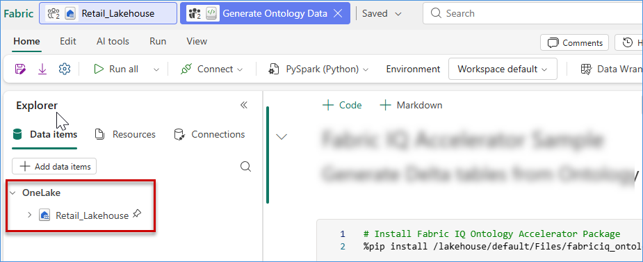 

    >Now, we are good to run this notebook.

6. For the notebook configuration, please move to last cell(Create kusto tables) and replace the value for **eventhouse_cluster_uri** and **eventhouse_database**

    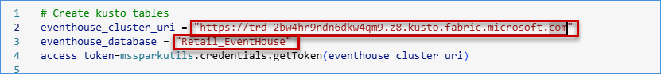 

7. After configuration, click **Run all** button at top banner and execute entire notebook cell by cell.
    - First cell will install .whl file to execute all refrerenced files.
    - Second cell will execute ontology package and load data in the Lakehouse

        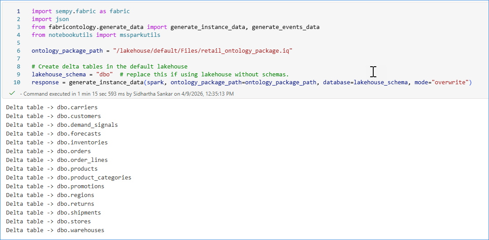 
    - Third and last cell will load data in the Eventhouse.
        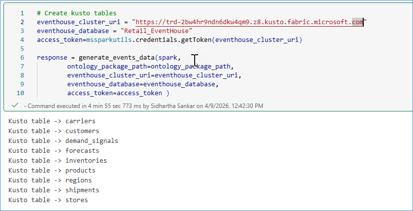 

8. Wait for the execution to complete successfully.

9. Let's validate both Lakehouse and Eventhouse whether data is loaded or not.

10. Navigate to the Lakehouse that was created earlier and verify that the data is successfully loaded. 

    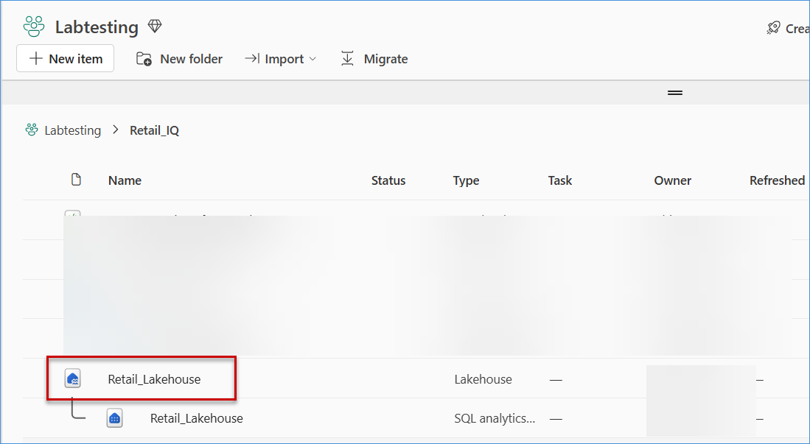 

11. Go to the **Tables** section
   and Click on the three dots (⋯) menu and select **Refresh** to load all table under **dbo** schema.

    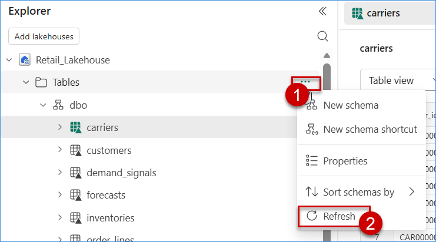 

12. Verify that Tables are created automatically
    
    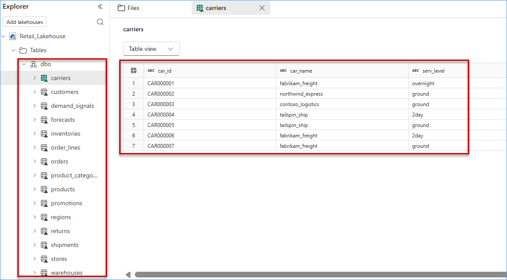 

13. Navigate to the Eventhouse that was created earlier and verify that the data is successfully loaded. 

    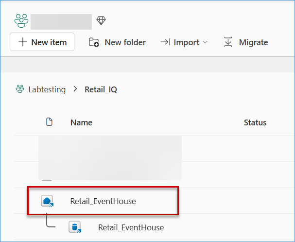 

14. Refresh Eventhouse database to see all **real time tables**.

    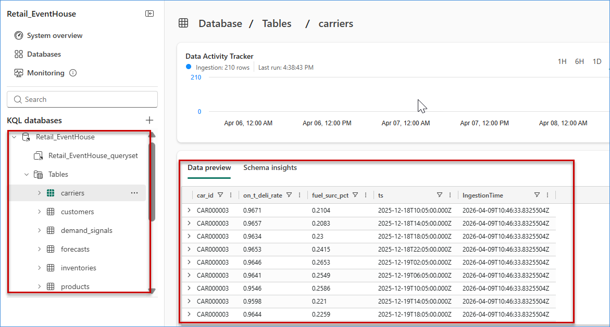 