# Exercise 3: 🧩 Create Ontology

In this section, you will build an **Ontology** from the previously created **Lakehouse** and **Eventhouse** with binded attributes to map datasets into governed entities and relationships. This forms the foundation for **Data Agents** and enables context-aware analytics across the enterprise.

**Ontology IQ** introduces a business-centric semantic layer that defines entities, relationships, and contextual meaning — enabling intuitive data discovery and accurate natural language insights.
This marks a breakthrough moment in transitioning from structured data to business-understandable intelligence.

**EVA** generates a **Fabric IQ Ontology** where:
- Manages customer data and marketing interactions 
- Defines products, product_categories, and assortment performance 
- Supports demand forecasting and trend analysis 
- Manages inventory, logistics, and supply operations
- Tracks store performance and operational activities
- Defines regions for geographic performance analysis

> *“This is how our business actually works — not just how data is stored.”*

## ✅ Outcome
- Ontology successfully created  
- Graph view of business relationships established  
- AI-ready business language layer enabled for Data Agents

## Task 3.1: Generate ontology from package
#### Step 1: Import notebook 
1. Navigate to your **Fabric workspace**.

2. On the workspace homepage, click on the **Import** option.

3. From the available options, select **Notebook**. 

4. Choose **From this computer** as the source.

     

5. Click on **Upload** to import the notebook.

     

6. To browse the notebooks from your virtual machine, open File Explorer. Click on the address bar, type the path `C:\FabricIQLab\Notebooks`, then select the **Create Ontology from Package** notebook file and click on the **Open** button.

      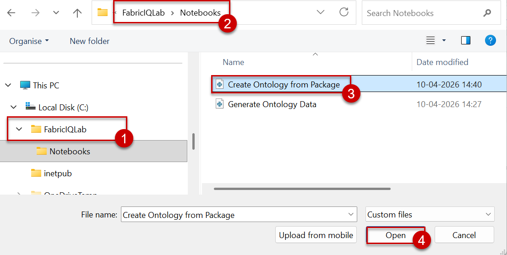 

7. After upload, notebook will be listed in the workspace area.

    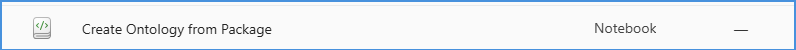

#### Step 2: Execute notebook
1. Click **Create Ontology from Package** notebook from the list.

    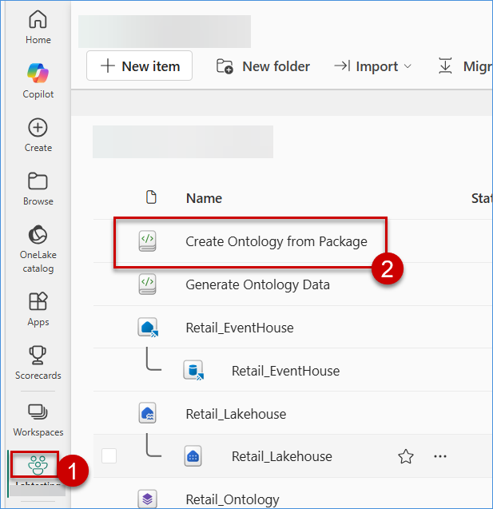

2. Notebook will open in a different tab without binding with any datastore(Lakehouse)

     

3. Click **Add data items** and select **From OneLake catalog** to open OneLake ares.

     

4. Select above created Lakehosue and click **Add** to include in the notebook execution.

     

5. Now, selected **Lakehouse** will be binded with Notebook.

     

    >Now, we are good to run this notebook.

6. For the notebook configuration, please move to 2nd cell(Out of two cells) and replace the value for:

   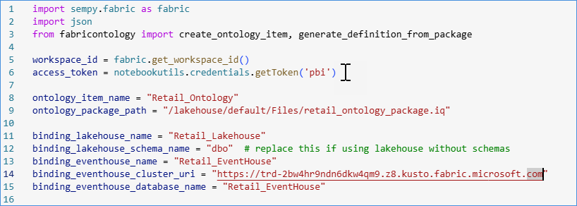 

    - ontology_item_name: `Provide Ontology Name(Unique)`
    - binding_lakehouse_name: `Lakehouse name created in last exercise`
    - binding_eventhouse_name: `Eventhouse name created in last exercise`
    - binding_eventhouse_cluster_uri: `Query URI copied from last exercise`
    - binding_eventhouse_database_name: `Database name from Eventhouse`

8. After configuration, click **Run all** button at top banner and execute entire notebook cell by cell.
    - First cell will install .whl file to execute all refrerenced files.
    - Second cell will execute ontology package to create **Ontology**

9. Below is the response from successful run

    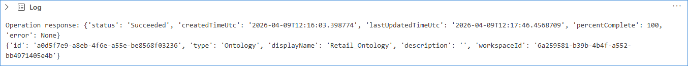 

10. Navigate to the workspace area to see the new Ontology created.

    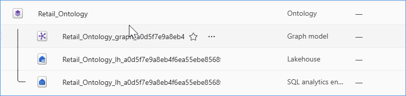 

11. Click **Ontology**. It will redirect to a different page to see its details.

    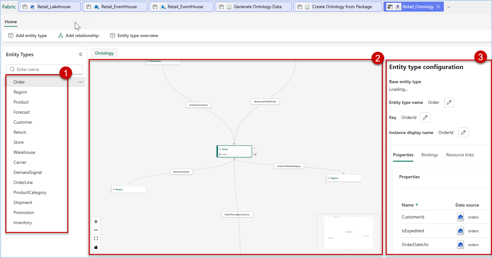 
    > 
    - Left area will hold all the entities binded from Lakehouse and Eventhouse
    - Middle area wll provide relational view of each selected entity.
    - Right area will show its properties and binding details.

## Task 3.2: Ontology Validation
1. To validate each entities and its detials, please select any. In below case, I have selected Product.

2. Product entity build relationship with "OrderLine", "Shipment", "Region", "Customer", and "Return"

    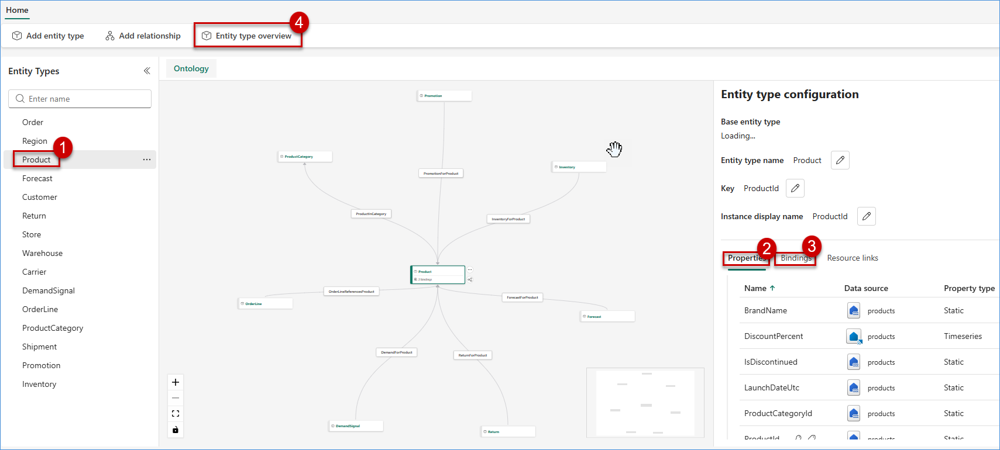 

3. Click **Entity type overview** from top banner to see the graph views

    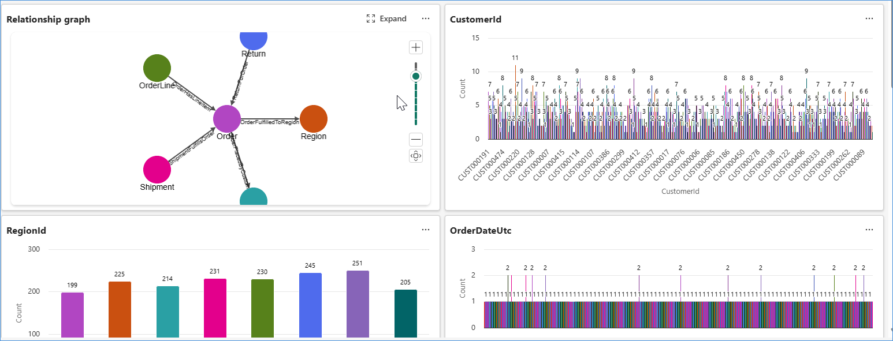 

4. Click **Properties** from right side configuration area to see all attributes details binded from Lakehosue(Static) and Eventhouse(Timeseries)

    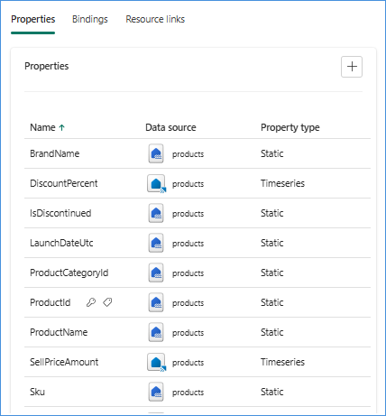 

5. Click **Bindings** to validate both statis and timeseries data binding.

    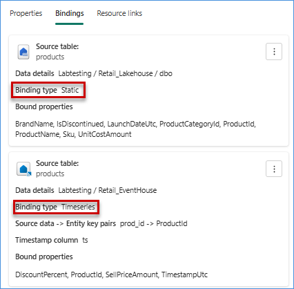 

    > Please validate attribute details which were provision for static and timeseries.
