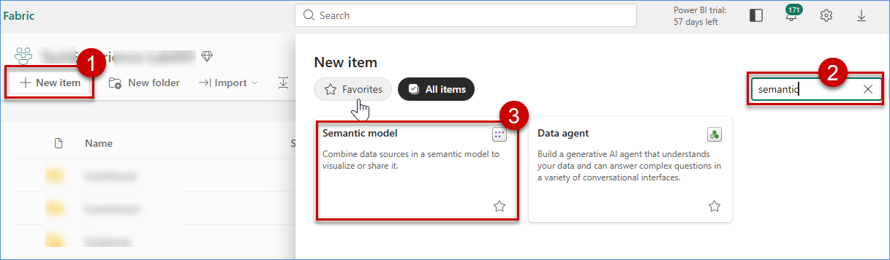
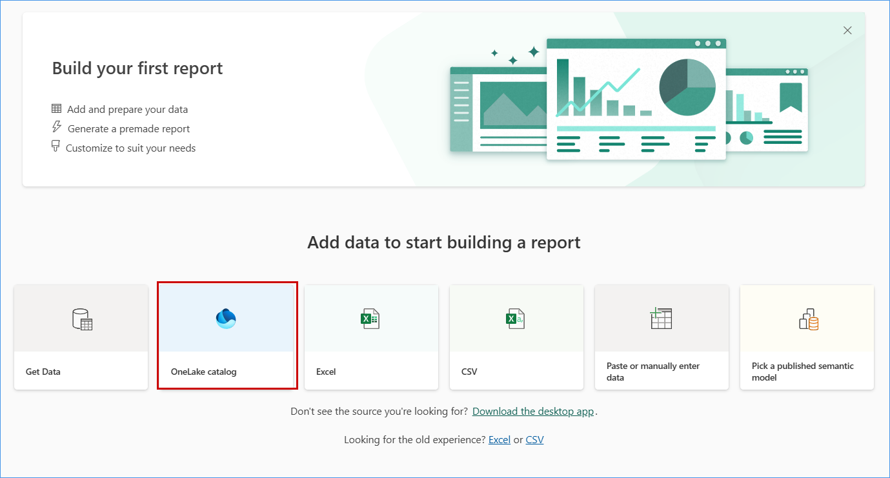
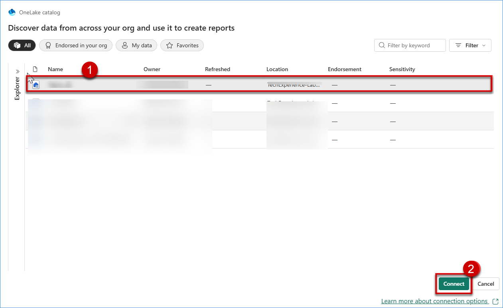
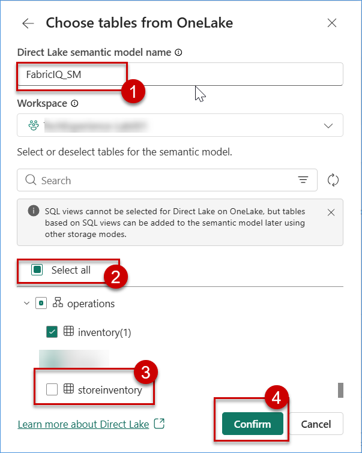
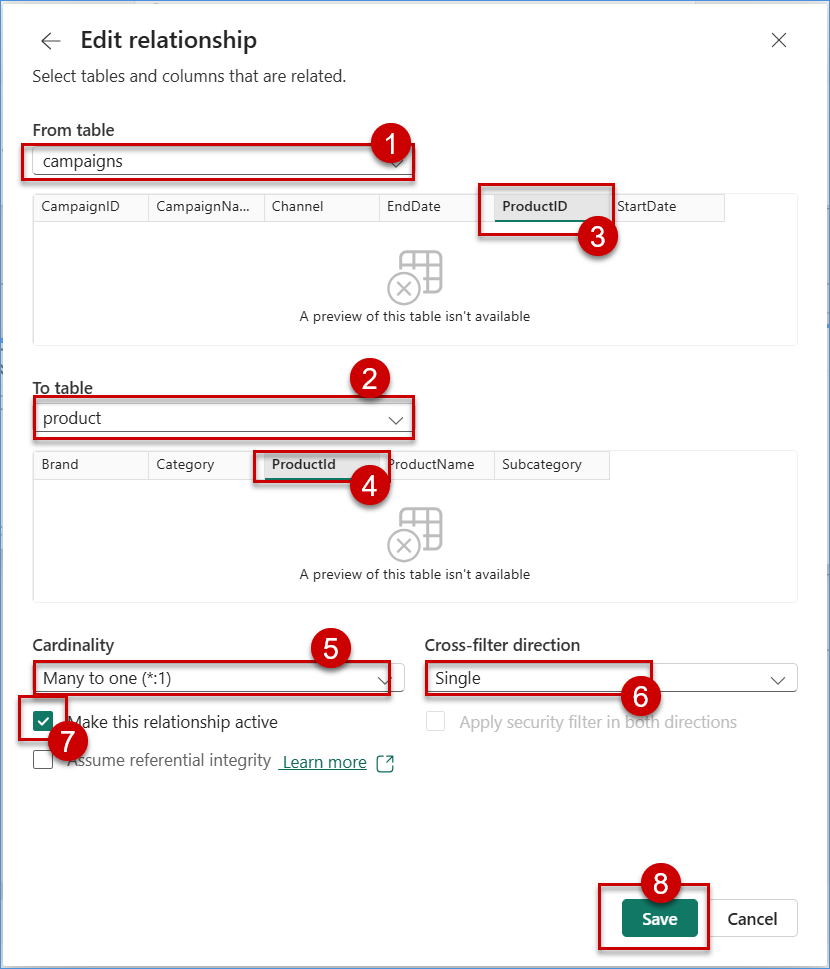
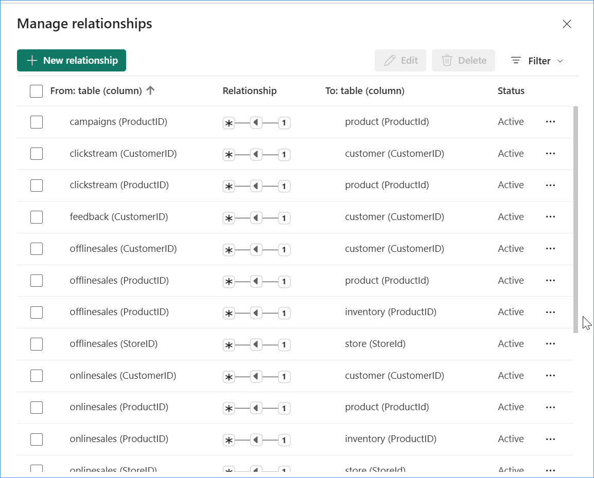
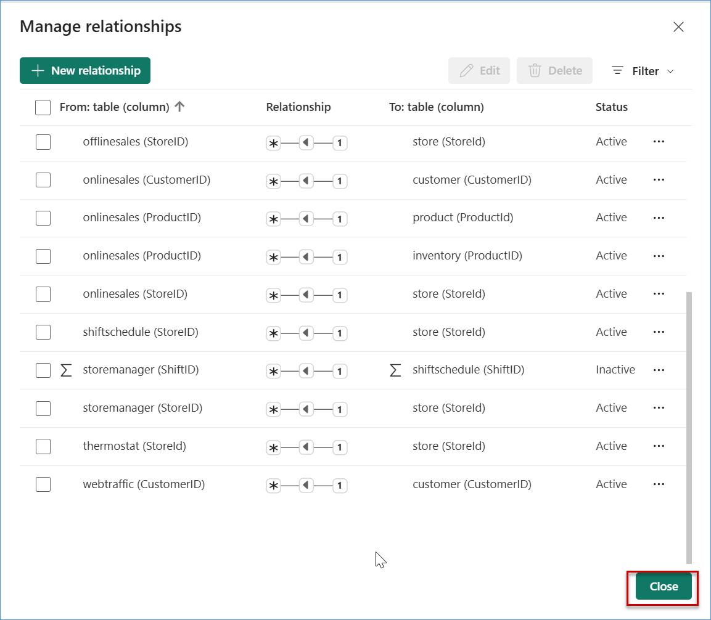

#  Exercise 3: Generating Semantic Model
**Serena (Data Analyst) shares a common concern:**

> *“I don’t want to figure out which tables to join — I want to understand which products are driving customer churn.”*

To simplify analytical access and enable business-driven insights, EVA generates a **semantic model** that includes:
- Well-defined and clean relationships  
- Business-friendly measures and KPIs  
- Standardized and shared data definitions  

## ✅ Outcome
- Semantic model aligned to the retail business domain  
- Dataset prepared for Ontology generation  
- Enables intuitive, insight-driven analysis without complex data joins

## Task 3.1: Build a Direct Lake Semantic Model 
1. In your Fabric workspace, click on the **New item** button in the top command bar.
2. In the New item creation pane, use the search bar to type **"Semantic model"**.
3. Select the **Semantic model** card in the search results and click on it to initiate creation.
   
    

## Task 3.2: Choose required entities/tables for the semantic model 

1. After clicking **Semantic Model**, you will be prompted to choose the data source. Select **OneLake catalog**.

    

2. Choose the data source within the OneLake catalog, then select the **Fabric_IQ** Lakehouse and click on **Connect**.

    

3. Now, you will redirected to creation of Semantic Model. Provide the model name **Fabric_IQ_SM**  and select workspace.

4. In the table selection window, expand each schema and click on **Select all** to include all available tables, and make sure to deselect **storeinventory** table, and then click on **Confirm**.

    

   > **Note**: Ensure that all tables are selected except **storeinventory**, as it is not required for this semantic model.

## Task 3.3: Establish relationships between entities
This task demonstrate how to establish relationships between Lakehouse entities within Microsoft Fabric to create a connected, business-friendly data model.

1. In Semantic Model page, click on **Manage relationships**.

    

2. For creating relationship, click on **New relationship** button at top.

    

3. Select the **campaigns** table as the From table and the **product** table as the To table, and create a relationship based on the **ProductID** column. Configure the appropriate **cardinality** and **cross-filter direction**, **Enable** Make this relationship active, and then click on the Save button.
 
    

4. Repeat the process to create all required relationships as shown in the Image below and click on **Close**.

   > **Note**: Select the left-side table as the From table and the right-side table as the To table, set cardinality to Many-to-one, choose Single for cross-filter direction, enable Make this relationship active, and then click Save. Alternatively, you can drag and drop the master unique ID from the master table to  the transaction table to build relationship page. Choose the cardinality, direction, and click save.

   

   
