# Exercise 4: Build Real-Time Intelligence and Operations Agent

In this section of the workshop, you will create an **Eventhouse**, ingest streaming events, and enable fast **KQL-based queries** to power live dashboards and support operational intelligence use cases.

**April (CEO)** requires real-time visibility into inventory performance during promotional campaigns.

To address this need, EVA enhances the data model with:
- Eventhouse for high-throughput event data storage  
- Streaming inventory updates  
- An Operations Agent to detect and monitor anomalies in real time  

> *“Don’t tell me about yesterday’s stock outs — tell me before they happen.”*

## ✅ Outcome
- Eventstream and Eventhouse successfully configured  
- Real-time inventory monitoring enabled  
- KQL-powered queries available for live dashboards  
- Proactive operational intelligence for promotion performance
- Operations Agent monitors inventory anomalies
- RTI dashboard supports live decisions

## Task 4.1: Create an Eventhouse for real-time data
This task to creates an Eventhouse in the workspace to load real-time data. 

1. Follow the above steps to navigate and choose the appropriate Fabric Workspace.
2. Click **New Item** to create Eventhouse.

    

3. Provide proper name as **Retail_Eventhouse** and click the **Apply** button to create the Eventhouse

    

4. Wait for a few moments for the Eventhouse to be created. Once created, you will be redirect to the dashboard. KQL database will be created by default.

    

5. Click the Eventhouse database to load the database in separate tab.

    

## Task 4.2: Ingest streaming telemetry into Eventhouse
In this task, you will configure a real-time data stream using Eventstream and connect it to the Eventhouse created in the previous lab. You will also generate streaming data and ingest it into a KQL database table.

#### Step 1: Creating Eventstream

1. In your Fabric workspace, click on the **New item** button in the top command bar.
2. In the New item creation pane, use the search bar to type **"Eventstream"**.
3. Select the **Eventstream** card in the search results and click on it to initiate the creation process.

   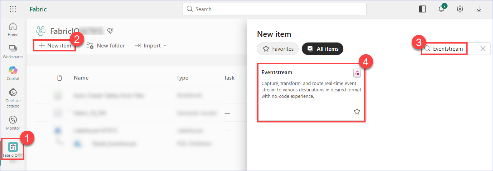

4. The **New Eventstream** dialog box will appear, Enter the name as **Inventory_ES**, then click on **create**

   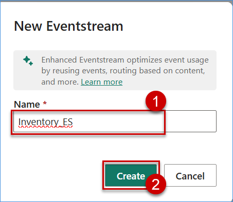

5. Once the Eventstream is created, it will open automatically.On the Eventstream canvas, you will see options to start building the data flow.
6. Click on **Use custom endpoint** to begin configuring the real-time data stream.

    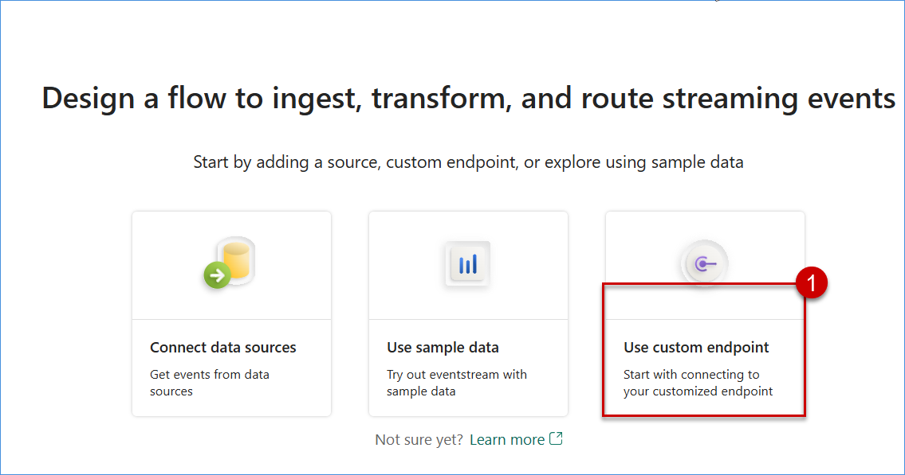  

7. In the **Custom endpoint** configuration window, enter the source name as **Inventory-Source** and click on **Add**.

    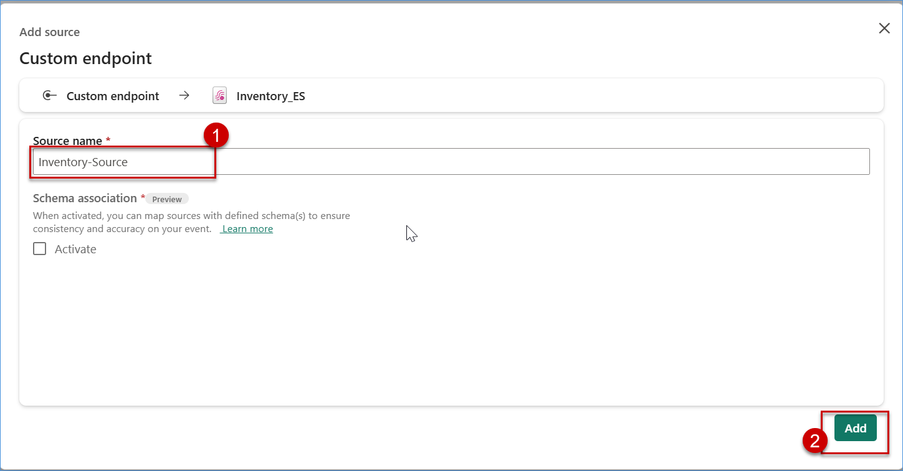  

#### Step 2: Configure Destination (Eventhouse)

1. After adding the custom endpoint source, the Eventstream canvas will open.

2. Ensure you are in **Edit mode** (as shown at the top right).  
   > Changes will be applied only after publishing.

3. Click on **Transform events or add destination** on the right side of the canvas.

4. From the options displayed, select **Eventhouse** under Destinations.
 
      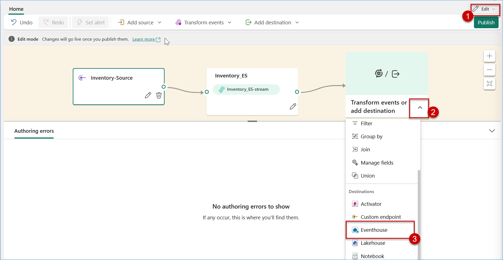  

5. The **Eventhouse settings** panel will open on the right side.

6. Configure the following details:
   - Select the **Eventhouse** created in the previous lab
   - Choose the **default KQL database**
   - In the table section, select **Create new table**

7. Enter the table name as: **`inventory`**

8. Click on **Done** to save the destination configuration.

9. Click on **Save** to save the Eventstream changes.

     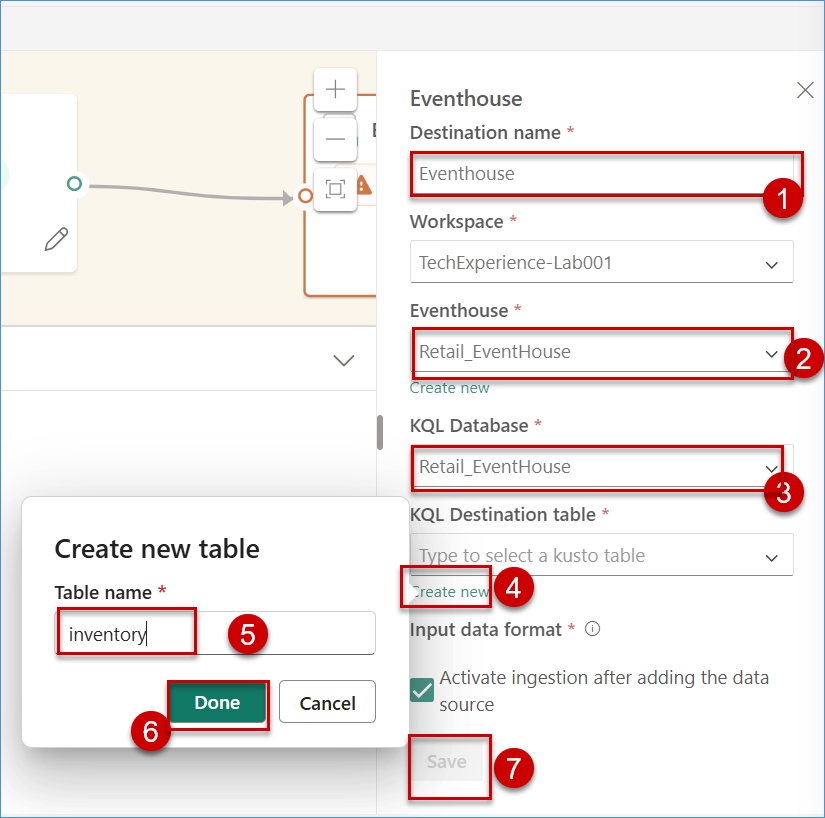 

10. Click on **Publish**

    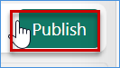 

> **Note:**  
> - Ensure you are in **Edit mode** before making changes.  
> - The destination configuration will route incoming streaming data to the Eventhouse table.  
> - The table `inventory` will be created automatically during data ingestion. 

#### Step 3: Retrieve Connection Details (SAS Authentication)

1. In the Eventstream canvas, ensure the status is set to **Live** (top right corner).

2. Click on the **Inventory (Custom endpoint)** source box.

3. In the bottom **Details** section, click on **SAS Key Authentication**.

4. Locate the **Event hub name** and click on the **Copy (📋) icon** next to it.

5. Locate the **Connection string primary key**:
   - Click on the **Eye (👁️) icon** to reveal the key
   - Then click on the **Copy (📋) icon** to copy the value

6. Save both values (Event hub name and Primary key) in notepad, as they will be used in the notebook to send real-time data.

   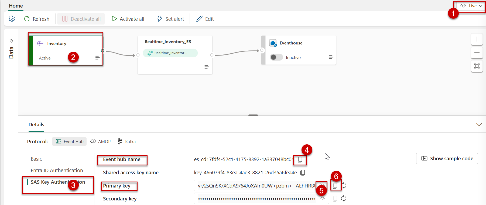

> **Note:**  
> - These credentials allow external applications (like notebooks) to push data into Eventstream.  
> - Ensure values are copied correctly without extra spaces.

#### Step 4: Generate Real-Time Data using Notebook

1. Navigate to your **Fabric workspace**: **<inject key= "WorkspaceName" enableCopy="false"/>**.

2. On the workspace homepage, click on the **Import** option.

3. From the available options, select **Notebook**. 

4. Choose **From this computer** as the source.

     

5. Browse and select the provided notebook file from your **VM system**.

6. Click on **Upload** to import the notebook.

      

7. To browse the notebooks from your virtual machine, open File Explorer. Click on the address bar, type the path `C:\FabricIQLab\Notebooks`, then select the **Generate realtime Inventory** notebook file and click on the **Open** button.     

    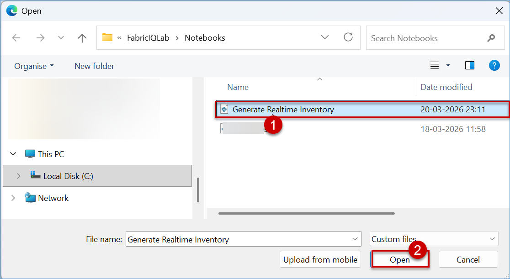 

8. Once the notebook is imported, open it from the workspace.

     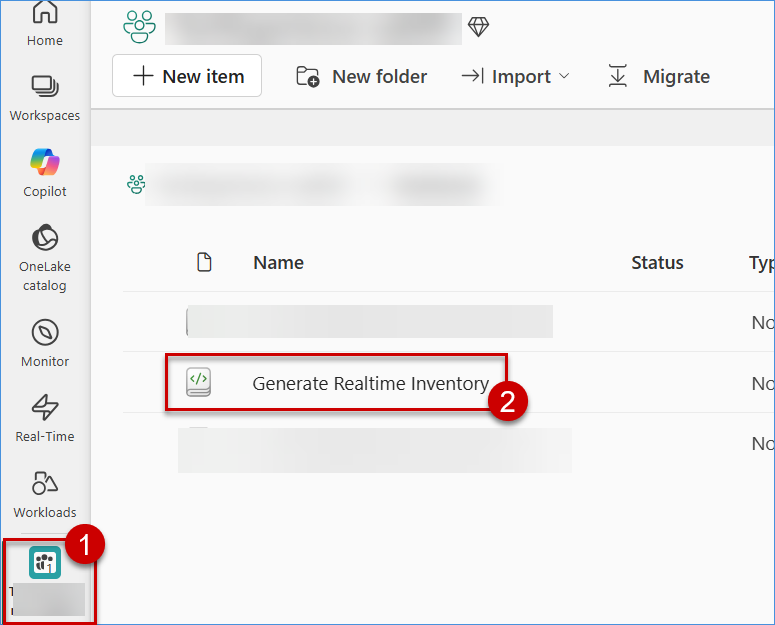

9. In the notebook, go to the **Explorer** pane on the left side.

10. Click on **+ Add data items**.

11. From the options displayed, select **From OneLake catalog**.
 
      

12. Browse and select the **Lakehouse**: **<inject key= "Lakehouse" enableCopy="false"/>** created in the previous steps.

13. Click **Add** to attach the Lakehouse to the notebook.

      

13. Verify that the Lakehouse is successfully attached:

15. Locate the section in the notebook where the following parameters are defined:
    - **Connection string primary key**
    - **Event Hub name**

16. Replace these values with the details copied earlier from the Eventstream:
    - Paste the **Connection string primary key**
    - Paste the **Event Hub name**

    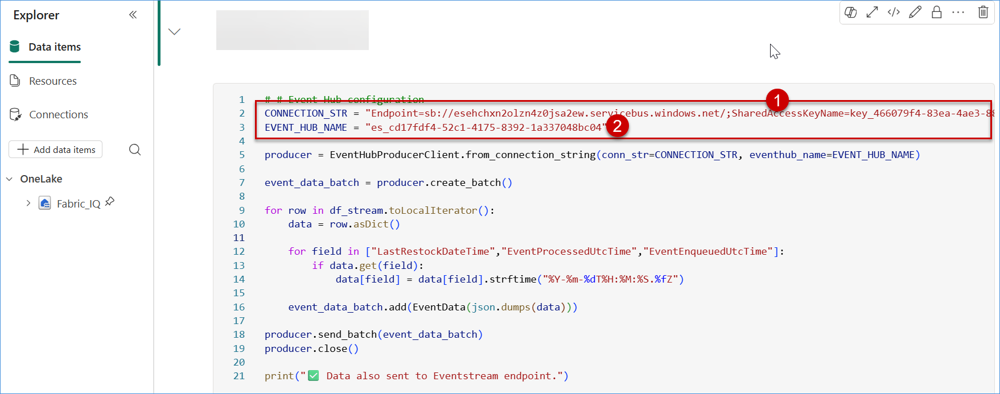

17. Next, locate the query or code section where the Lakehouse name is **<inject key= "Lakehouse" enableCopy="false"/>**.

18. Replace the existing Lakehouse name with your **Lakehouse name**: **<inject key= "Lakehouse" enableCopy="true"/>**.

    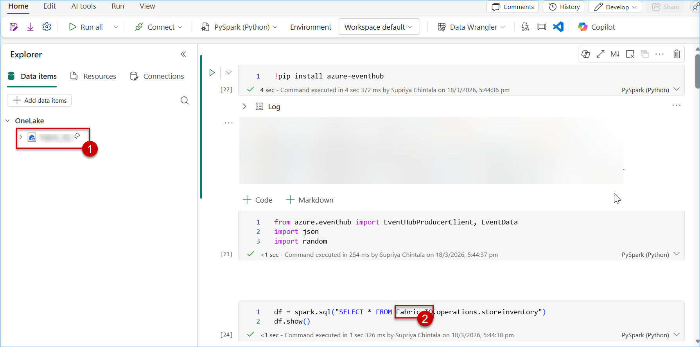

19. Ensure all required values are updated correctly:
    - Event Hub name ✅  
    - Connection string primary key ✅  
    - Lakehouse name ✅  

        > **Note:** Before running the notebook cells, ensure that the **Eventstream is in Active state**.
        If the Eventstream is not active, the data will not be ingested and the table will not be created in the Eventhouse.

20. After updating the values go to first cell, click on **Run this cell and all below** to execute the notebook.

    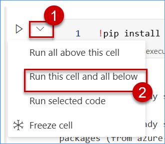

21. The notebook will:
    - Generate real-time streaming data
    - Send data to Eventstream using the custom endpoint
    - Automatically load data into the Eventhouse table (`inventory`)

> **Note:**  
> - Make sure there are no extra spaces while copying values.  
> - Incorrect Event Hub details will result in no data ingestion.  
> - Ensure the Lakehouse name is updated correctly to avoid query errors.

#### Step 5: Validate Data in Eventhouse

1. Navigate to the **Eventhouse** created in the previous lab.

     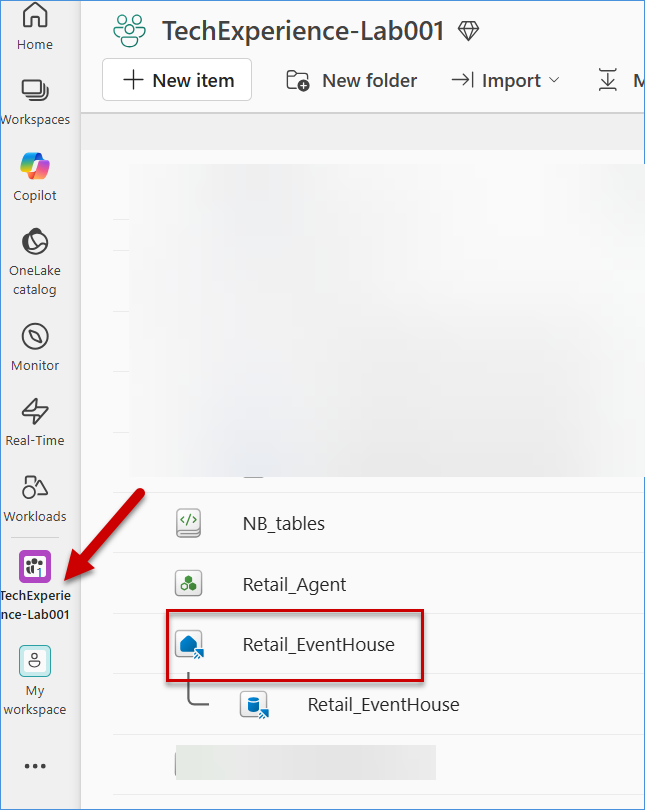

2. Once the Eventhouse opens, go to **Retail_Eventhouse**. click on **Retail_Eventhouse**, it will load the database in a separate tab.

    

3. In the database explorer, expand the **Tables** section and locate the **`inventory`** table from the available list.

    >**Note:** If the table does not appear, please refresh the tab and try again.

     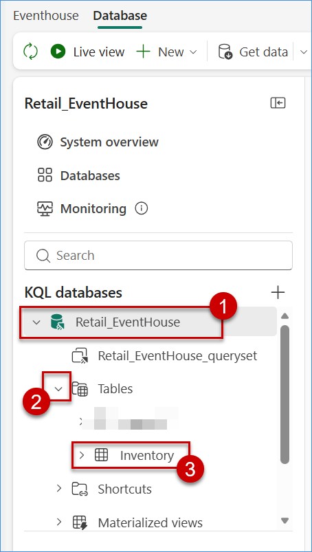

4. In the left pane, under **KQL databases**, select your database (e.g., `Retail_EventHouse_queryset`). In the query editor, enter the following query to validate ingested data:

     ```kql    
        inventory
        | take 10 
     ```     

    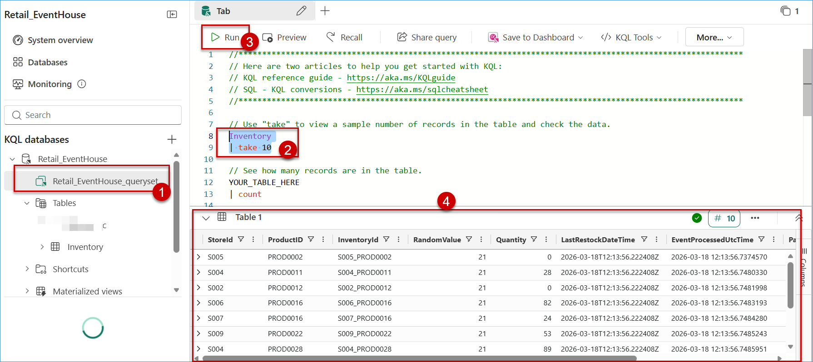

5.Select the query and click on the Run button at the top to execute the query.

6.Observe the results displayed at the bottom:
  - A table with columns such as StoreId, ProductID, Quantity, etc.
  - This confirms that real-time data is successfully ingested into the inventory table

    > **Note:**  
    > - If no data appears, wait a few seconds and click Run again.
    > - Ensure the Eventstream is in Live mode and the notebook executed successfully.

## Task 4.3: Create Operations Agent (Fabric IQ)
1. Select Fabric Workspace and click **New Item**.
2. In the search box type **Operations Agent** keyword to get Operation Agent. Click **Operation Agent**.

    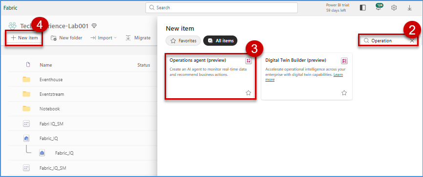

3. New popup window will apear. Provide Operation Agent name as **Retail_OperationAgent** and select workspace in the Location section. Click **Create**.

    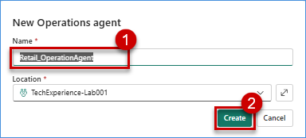

4. After create, Operation Agent will load its blank play area. 

    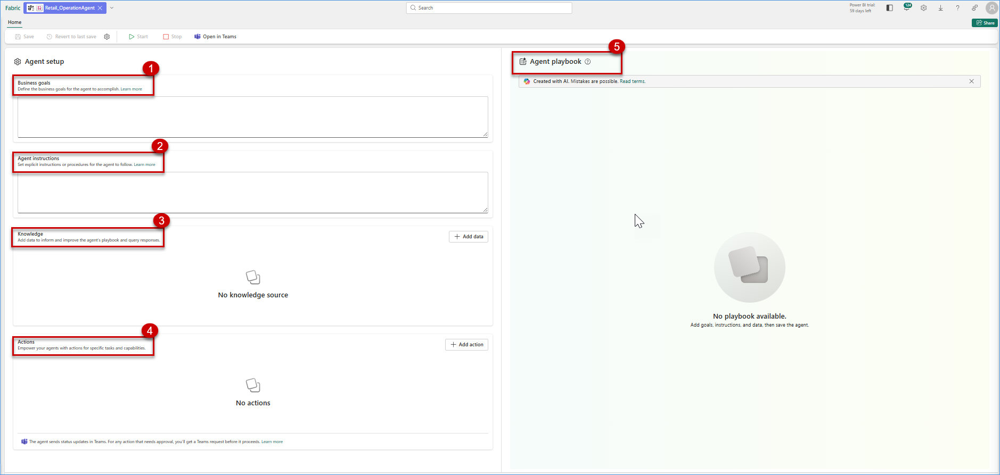

5. Opertion Agent has sections like **Business goal**, **Agent instructions**, **Knowledge**, **Action**. Right side we have **Agent playbook** area.

6. Provide **Business goal** for RTI.

    ```
   Enable proactive, AI-driven inventory and operational intelligence to:
   Prevent product quantity before they reduced more
   Protect revenue from lost sales opportunities
   Improve on-shelf availability for high-demand products
   Increase customer satisfaction and trust
   Reduce reactive firefighting by store and supply chain  teams
   ```
    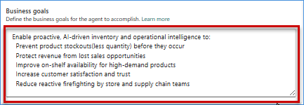

7. Provide **Agent instuction** which agent will follow all the instructions and take action.

    ```
    Objective
    Monitor the Inventory table in Eventhouse and identify amount of Quantity and RandomValue to monitor and compare
    Provide structured alerts and recommended actions.
    Do not execute any operational actions. 
    
    Knowledge Data Source:
   Database: Retail_EventHouse
   Table: Inventory
   Columns: "StoreId", "ProductID", "Quantity", "RandomValue", "LastRestockDateTime"
 
    
    Monitoring Logic
    IF Quantity = 0 THEN
           Classify the Risk Level as "Critical" and Generate immediate alert and Indicate that the product is "Out of Stock"
    IF Quantity ≤ RandomValue THEN
           Classify the Risk Level as "High Risk" and  Generate immediate alert and Indicate that inventory is "Below Quantity Level"
    IF Quantity > RandomValue THEN
           Classify the Risk Level as "Normal" and Do not generate alert
    CONTINUE Monitoring
    
    Alert Requirements:
     For each "Critical" or "High Risk" item, send alert message by including below columns and its values 
            StoreId
            ProductID
            Quantity
            RandomValue
            Risk Level
            LastRestockDateTime
    ```
    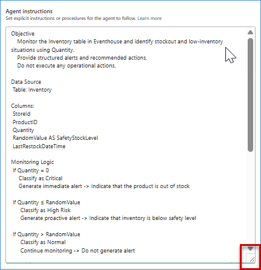

8. If instruction length is bigger then hold & drag bottom right corner to expand the window. So that, all instruction can be visible.

9. Add knowledge base in the **Knowledge** section. Click **Add data**.

    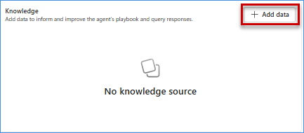

10. Chose **Eventhouse** to add in the knowledge section

    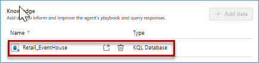

11. Click **Save** button to generate **Agent playbook**. 

    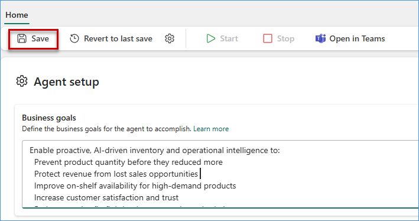

    **Save** button will be disabled and process playbook 

    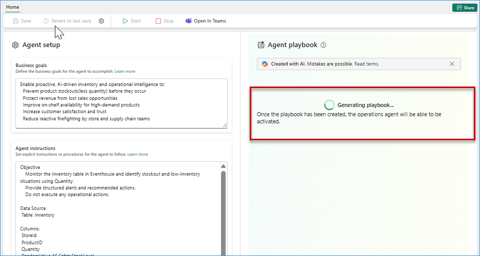

12. After few moment, Agent playbook will be generated with all its step by step action details.

    **Playbook - Business glossary & Objects**
        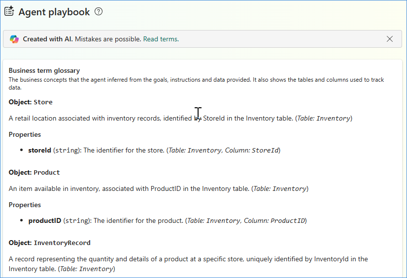

    **Playbook - Properties and Rules**
    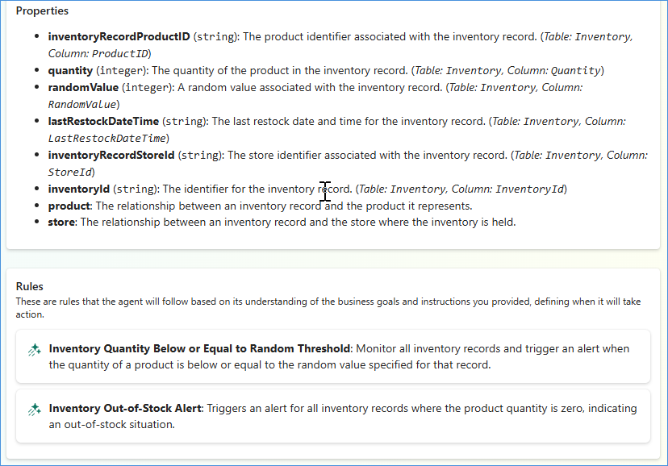

13. Read the **Agent playbook** and start the **Operation Agent** if all instructions are correct.

14. Now, Operation Agent is ready to track, monitor, and sending alert message if any anomaly detected.

## Task 4.4: Observe agent behavior in real-time
1. Creating **Custom Action** with clicking **Add action**

    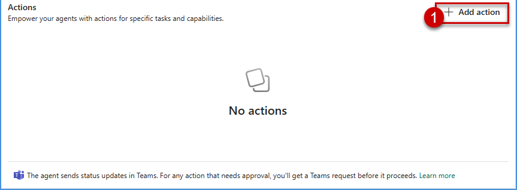

2. Now action creation popup will appear to include action name and its description (It's mandatory and any short description you can provide). Also, user can pass parameter for explicit specification while taking action. Click **Create** to create custom action.

    **Action Name:** Inventory_Action

    **Action Description:** Inventory action is a custom action. When action is required, Activator will trigger this action to send a message/email to the authorized operation team.

    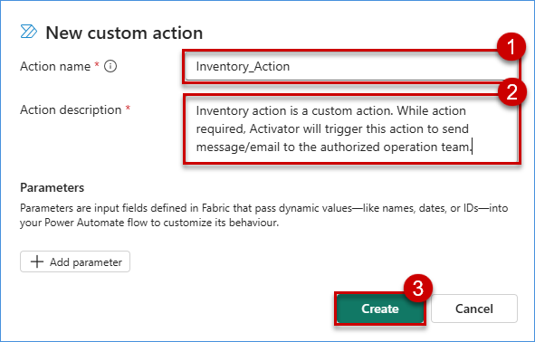

3. Now, custom action will be created for operation agent.

4. Action need to configure **Custom Action**. User need to click **Connect** for configuration.

    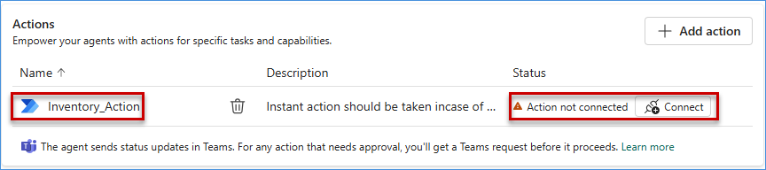

5. Configure Custom Action - Activator Setup. Follow the steps below to configure the activator for your custom action:
    - In the Workspace dropdown, select **<inject key= "WorkspaceName" enableCopy="false"/>**.
    - Under Activator, choose Create a new item.
    - In the New item name field, enter **Inventory_Activator**.
    - Click on Create activator to complete the setup.

        >**Note:** Ensure the correct workspace is selected before creating the activator.

        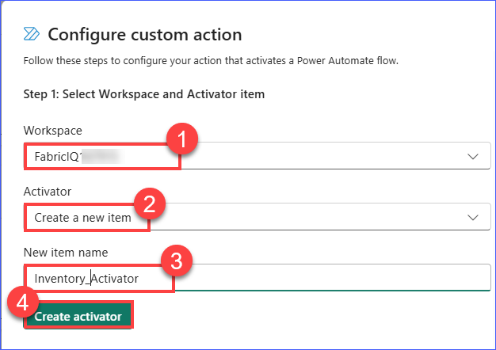

6. In custom action configuration pan, user need to choose **Workspace**, **Activator** (if not available, select and click **New activator**). 

    - Click **Create a connection** button to get connection details for activator.
   - After the connection is created, copy the connection string and save at safe place.
   - Click **Open flow builder** to open the PowerAutomate flow in a separate browser tab.

        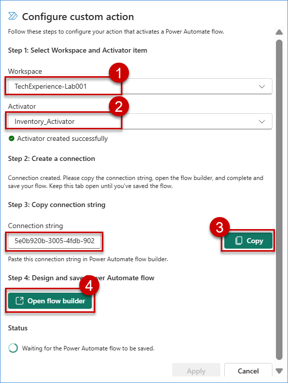

7. User can see 2nd tab for PowerAutomate in the browser window.
    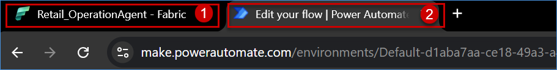

8. In the PowerAutomate flow page, click **Activator** action to open its properties page.
    - Paste the connection string which was copied.
    - Sign in to your account for proper authorization if not already connected. Click on Change connection, select Add new, and then click Sign in to proceed.

        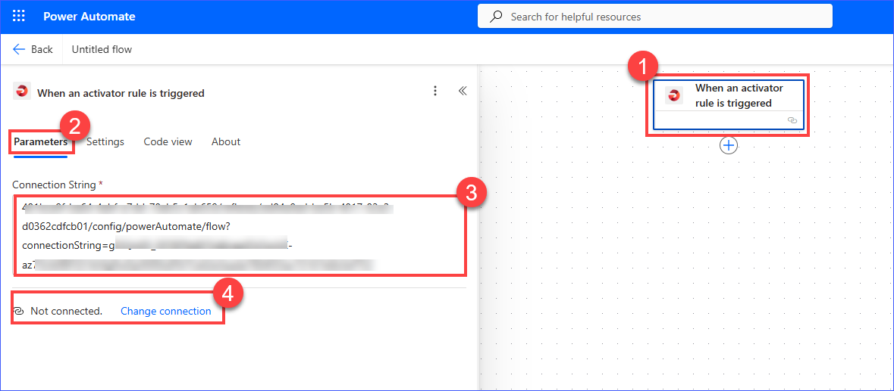

9. Only the activator will not work here. so use should add output action.

10. Click "'+'" (available below activator action) to insert new action.

    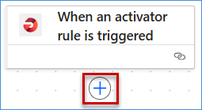

11. In action selection pan, please search **Team** to establich Team Chat. Click **See all** to visualize all actions for Team.

    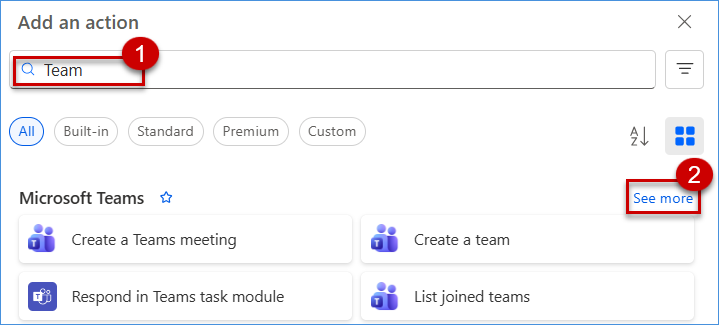

12. Select **Get messages in chat** from the list. This will help the **Activator** action to post messages in teams.

    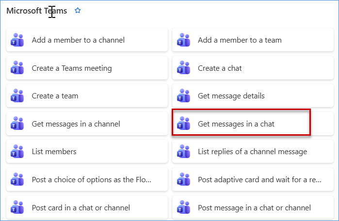

13. The User needs to authorize Teams by providing an account for message communication.

    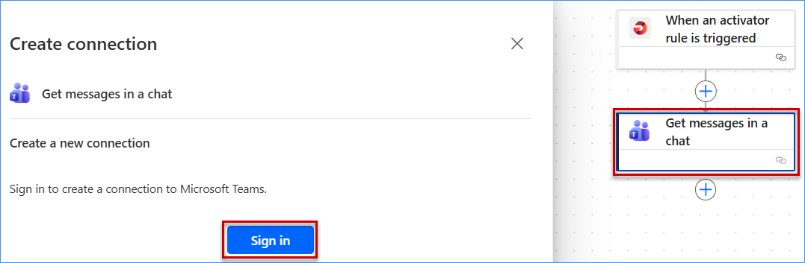

14. Click **Sign in** to authorize account **<inject key= "AzureAdUserEmail" enableCopy="true"/>**.

    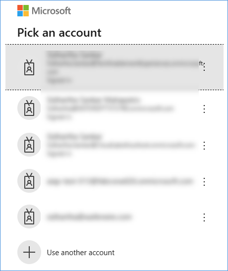

15. Now configuration required for posting team message. Configure if property window open by default at left side or click action to open.

    - **Post as**: Flow bot (other options are MS Copilot studio agent, User, Custom value.)
    - **Post in**- Chat with flow bot (Other values are Channel, Group chat, Custom value.)
    - **Recipient** - Select account to get message
    - **Message** - I have provided static message. We can create cutomize and dynamic message based on parameters.
    - **Autorization** - Sign in account if not there.

        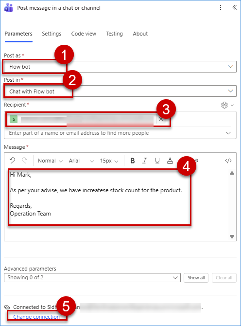   

16. Click **Save** to save the flow activity. We can see successful message in the banner.

    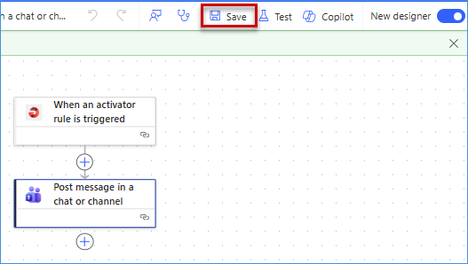 

17. Select Fabric tab in the browser to see the Operation agent screen. Now **Apply** button will be enable.
    >Apply button will enable once flow saved successfully.

18. Click **Apply** button to save Custom Action.

    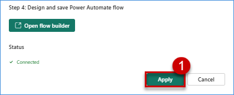     

19. Click **Save** button again in Operation Agent to generate Playbook.

20. Start the Operation Agent once Playbook generated successfully.

21. Now we can see **Team** message sent by Operation Agent when we find any anomaly.

    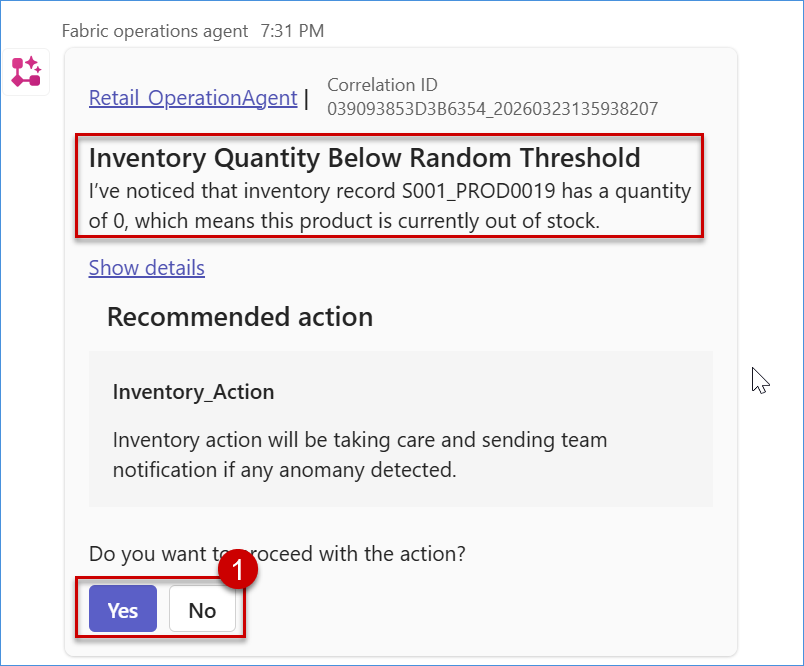   

22. To take action, we can click **Yes/No**. Click **Yes** to activate trigger and send message to respective team.

23. Activator will acknowledge with below message. 

    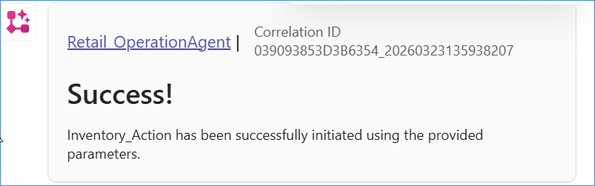  

24. After action taken by operation team, workflow will send confirmation message back.

    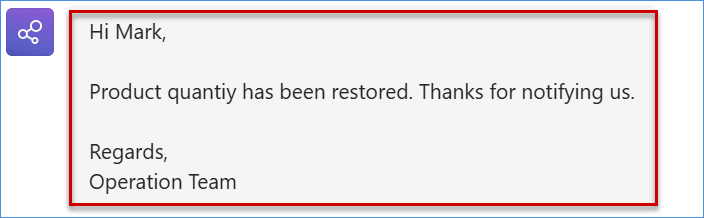  
