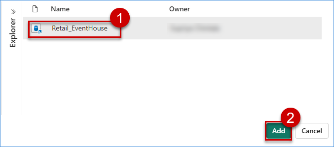

# Exercise 5: ⚡ Create Operations Agent

In this section of the workshop, you will create an **Operations Agent** pointing to Eventhouse.

**April (CEO)** requires real-time visibility on sales order and customer insight along with product inventory analysis and performance.

To address this need, EVA enhances the data model with:
- Eventhouse for high-throughput event data storage  
- Streaming inventory updates  
- An Operations Agent to detect and monitor anomalies in real time  

> *“Don’t tell me about yesterday’s stock outs — tell me before they happen.”*

## ✅ Outcome
  
- Real-time monitoring enabled  
- KQL-powered queries available for live dashboards  
- Proactive operational intelligence for promotion performance
- RTI dashboard supports live decisions

## Task 5.1: Create Operations Agent (Fabric IQ)
1. Select Fabric Workspace and click **New Item**.
2. In the search box type **Opertion** keyword to get Operation Agent. Click **Operation Agent**.

    

3. New popup window will apear. Provide Operation Agent name and select workspace in the Location section. Click **Create**.

    

4. After create, Operation Agent will load its blank play area. 

    

5. Opertion Agent has sections like **Business goal**, **Agent instructions**, **Knowledge**, **Action**. Right side we have **Agent playbook** area.

6. Provide **Business goal** for RTI.

    ```
   Enable proactive, AI-driven sales intelligence to:
    - Detect low-confidence and unreliable forecasts
    - Identify sudden demand spikes or drops
    - Ensure timely and accurate forecast availability
    - Support proactive inventory and supply planning
   ```
    

7. Provide **Agent instuction** which agent will follow all the instructions and take action.

    ```
    Objective:
    Monitor the forecasts table in Eventhouse to evaluate forecast accuracy, detect anomalies in demand        predictions, and track forecast confidence.
    Provide structured alerts with recommended actions.
 
    Knowledge Data Source:
    Database: Retail_EventHouse
    Table: forecasts
    Columns: fcst_id, fcst_units, fcst_amt, fcst_conf_pct, ts
 
    Monitoring Logic:
       IF fcst_conf_pct < 0.15 THEN
           Classify the Risk Level as "Critical" and Generate immediate alert and Indicate "Low Confidence Forecast"
       IF fcst_conf_pct < 0.70 THEN
           Classify the Risk Level as "High Risk" and Generate immediate alert and Indicate "Average Confidence Forecast"
       IF none of the above conditions met  THEN
            Classify the Risk Level as "Normal" and do not generate any alert 
       CONTINUE Monitoring
     Alert Requirements:
     For each Critical, High Risk, or High Opportunity event, send alert including:
        fcst_id
        fcst_units
        fcst_amt
        fcst_conf_pct
        Risk Level    
        Alert Message (e.g., forecase low confidence / Sales Spike / No Activity)

    ```
    

8. If instruction length is bigger then hold & drag bottom right corner to expand the window. So that, all instruction can be visible.

9. Add knowledge base in the **Knowledge** section. Click **Add data**.

    

10. Chose **Eventhouse** and click **Add** to add in the knowledge section

    

    After add we can see knowledge base.
    
    

11. Click **Save** button to generate **Agent playbook**. 

    > Please click "Playbook" button if it need explicit click to generate Agent playbook.

    

    **Save** button will be disabled and process playbook 

    

12. After few moment, Agent playbook will be generated with all its step by step action details.

    **Playbook - Business glossary & Objects**
        

    **Playbook - Properties and Rules**
    

13. Read the **Agent playbook** and start the **Operation Agent** if all instructions are correct.

14. Now, Operation Agent is ready to track, monitor, and sending alert message if any anomaly detected.

## Task 5.2: Observe agent behavior in real-time
1. Creating **Custom Action** with clicking **Add action**

    

2. Now action creation popup will appear to include **action name** and **copy the below description** (It's mandatory and any short description you can provide). Also, user can pass parameter for explicit specification while taking action. Click **Create** to create custom action.

    
```
Inventory action is a custom action. While action required. Activator will trigger this action to send message/email to the authorized operation team.
```

4. Now, custom action will be created for operation agent.

    

5. Action need to configure **Custom Action**. User need to click **Connect** for configuration.

6. In custom action configuration pan, user need to choose **Workspace**, **Activator** (if not available, select and click **New activator**). 

    

   - Click **Create a connection** button to get connection details for activator.
   - After the connection is created, copy the connection string and save at safe place.
   - Click **Open flow builder** to open the PowerAutomate flow in a separate browser tab.
7. User can see 2nd tab for PowerAutomate in the browser window.
    

8. In the PowerAutomate flow page, click **Activator** action to open its properties page.
    - Paste the connection string which was copied.
    - Sign in to the account for proper authorization if not connected.

    

9. Only the activator will not work here. so use should add output action.

10. Click "'+'" (available below activator action) to insert new action.

    

11. In action selection pan, please search **Team** to establich Team Chat. Click **See all** to visualize all actions for Team.

    

12. Select **Get messages in chat** from the list. This will help the **Activator** action to post messages in teams.

    

13. The User needs to authorize Teams by providing an account for message communication.

    

14. Click **Sign in** to authorize account. It will ask the account. User need to select account.

    

15. Now configuration required for posting team message. Configure if property window open by default at left side or click action to open.

        

    - Post as - Flow bot (other options are MS Copilot studio agent, User, Custom value.)
    - Post in - Chat with flow bot (Other values are Channel, Group chat, Custom value.)
    - Recipient - Select account to get message
    - Message - I have provided static message. We can create cutomize and dynamic message based on parameters.
    - Autorization - Sign in account if not there.

16. Click **Save** to save the flow activity. We can see successful message in the banner.

     

17. Select Fabric tab in the browser to see the Operation agent screen. Now **Apply** button will be enable.
    >Apply button will enable once flow saved successfully.

18. Click **Apply** button to save Custom Action.

         

19. Click **Save** button again in Operation Agent to generate Playbook.

20. Start the Operation Agent once Playbook generated successfully.

21. Now we can see **Team** message sent by Operation Agent when we find any anomaly. 
    - For example : you can refer below image

       

22. To take action, we can click **Yes/No**. Click **Yes** to activate trigger and send message to respective team.

23. Activator will acknowledge with below message. 
     - For example : you can refer below image

      

24. After action taken by operation team, workflow will send confirmation message back.

      