# Exercise 5: Generating an Ontology from a Semantic Model

In this section, you will build an **Ontology** from the previously created **Semantic Model** to map datasets into governed entities and relationships. This forms the foundation for **Data Agents** and enables context-aware analytics across the enterprise.

**Ontology IQ** introduces a business-centric semantic layer that defines entities, relationships, and contextual meaning — enabling intuitive data discovery and accurate natural language insights.
This marks a breakthrough moment in transitioning from structured data to business-understandable intelligence.

**EVA** generates a **Fabric IQ Ontology** where:
- Stores are represented as business entities  
- Products, Inventory, and Campaigns are modeled as relationships  
- Business meaning and operational context become explicit  

> *“This is how our business actually works — not just how data is stored.”*

## ✅ Outcome
- Ontology successfully created  
- Graph view of business relationships established  
- AI-ready business language layer enabled for Data Agents

## Task 5.1: Generate ontology from a semantic model

1. Open the **Fabric_IQ_SM** semantic model from the workspace **<inject key= "WorkspaceName" enableCopy="false"/>** in semantic model, click on **Generate Ontology** icon at top right menu.

    

2. Select your Fabric **Workspace** and provide the Ontology **Name**: **FabricIQOntology** field and then click on **Create** button.

    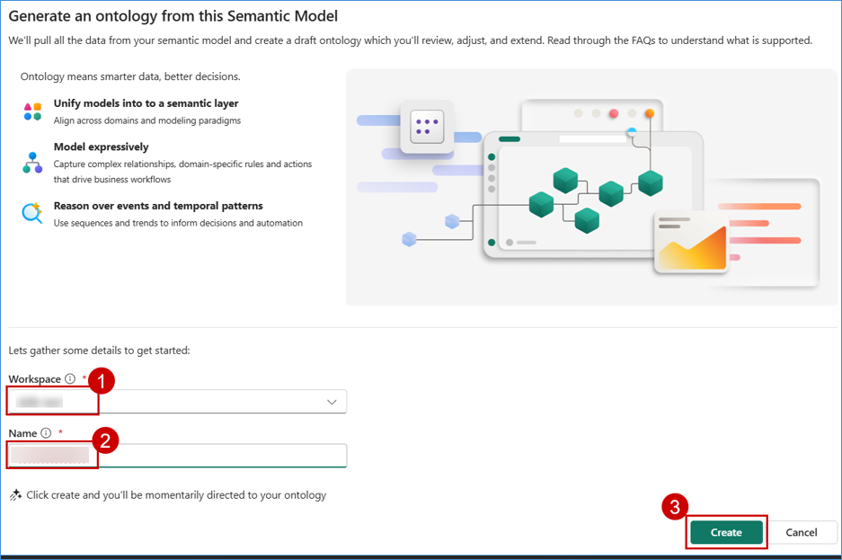

3. In Ontology page, we can see all the entities published. Click on **inventory** entity type.

    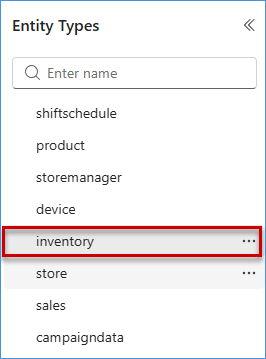

## Task 5.2: Additional attributes (stream data) to enrich the ontology's capabilities
1. In the **Entity type configuration** pane, click on **Bindings** and Click on **Add data to entity type**.

    

2. Click on **Retail_EventHouse** Eventhouse and click on **Connect**.

    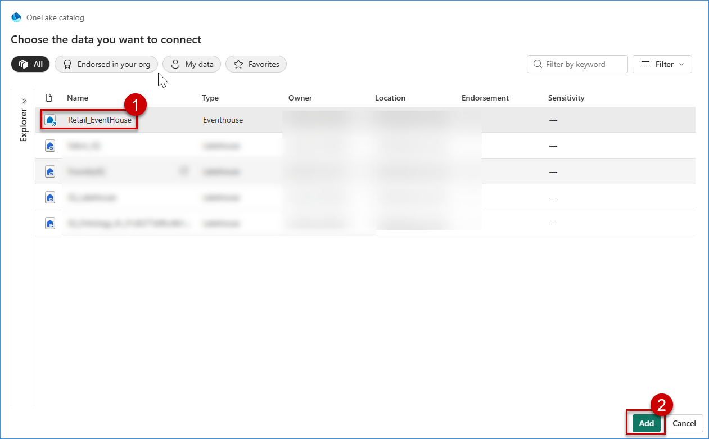

3. Select **inventory** table and click on **Next** button.

    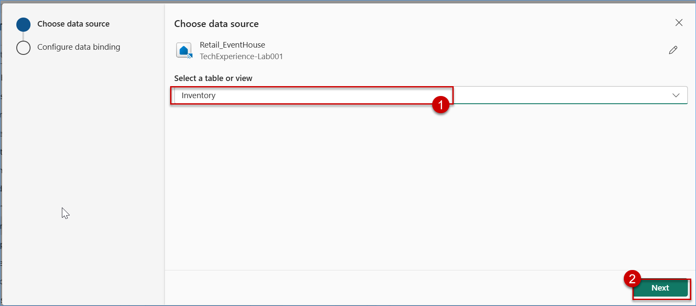

4. Select **EventProcessedUtctime** for **Source data timestamp column** field, select Static and Timeseries columns and then click on **Save** button.

    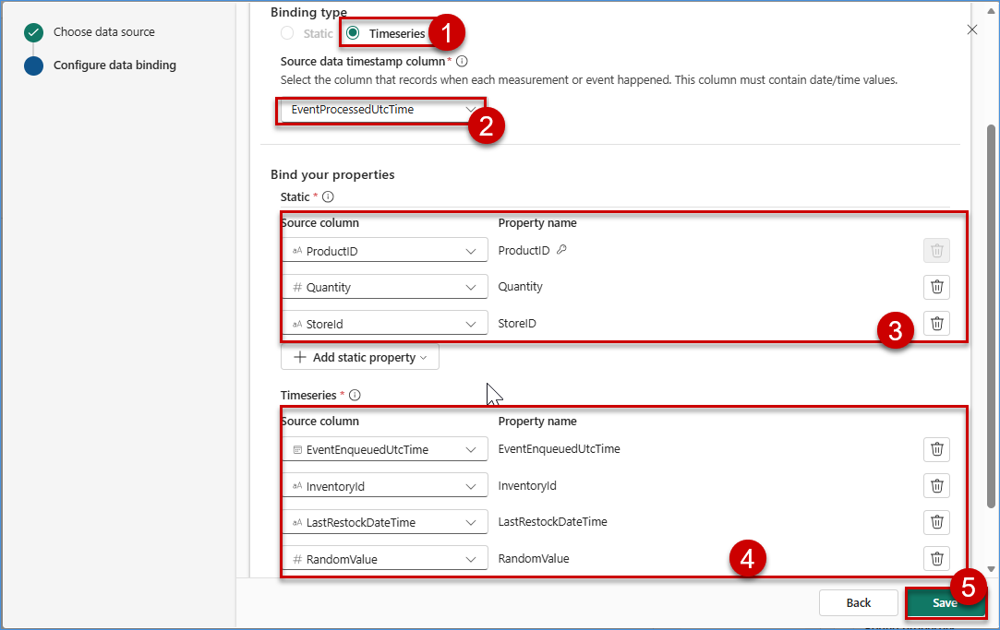

5. Verify the Properties.

    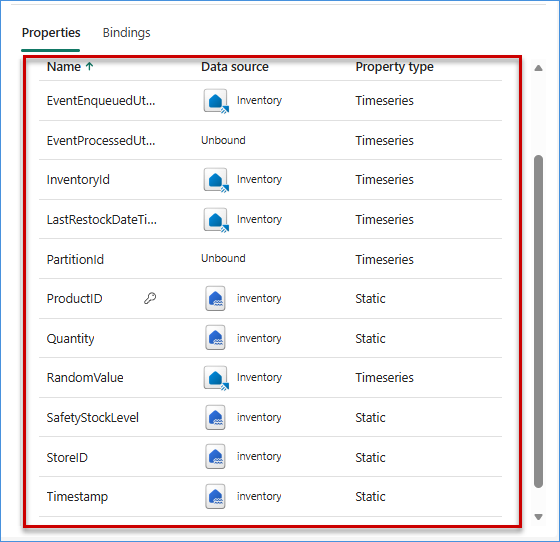

6. Repeat above steps if you want to bind other real time data to any entity.

    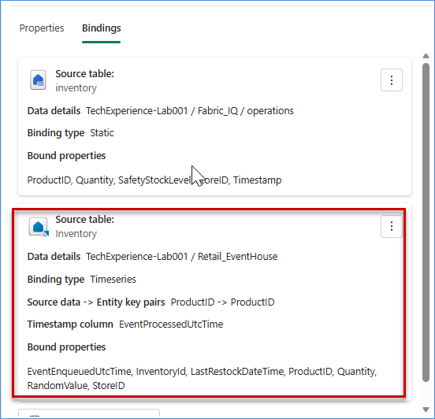

## Task 5.3: Validate the attribute binding and key attributes for establishing ontology relationships
1. Check the different entity types and verify the key. If no key exists, click **Add entity type key**, 

    

2. Select the all key column from the provided options, and then click **Save**.

    | Entity        | Key                      |
    |---------------|--------------------------|
    | feedback      | feedbackid               |
    | shiftschedule | ShiftID                  |
    | thermostat   | DeviceId                 |
    | Store         | StoreId                 |
    | webtraffic    | SessionID                |
    | onlinesales   | TransactionID            |
    | product       | productID                |
    | offlinesales  | TransactionID            |
    | inventory     | ProductID                |
    | campaigns     | ProductID                |
    | storemanager  | CombinedID               |
    | customer      | customerID               |
    | clickstream   | SessionID                |

3. After adding keys for all entities, validate the relationships between them.Click on any **entity** in the graph view. You will notice that **relationships are automatically created** between related entities. Click on any **relationship line/name** in the graph (for example, **campaigndata_has_product**).  

4. Once selected, the **Relationship configuration** panel will open on the right side, where you can View the **Source entity** and View the **Target entity** and  Understand how the entities are connected (join columns)
     
     For example, if the relationship name is **campaigns_has_product**:
      - **Source** → campaigns  
      - **Target** → product  

    Verify that all relationships are correctly mapped based on the entity names and data.

      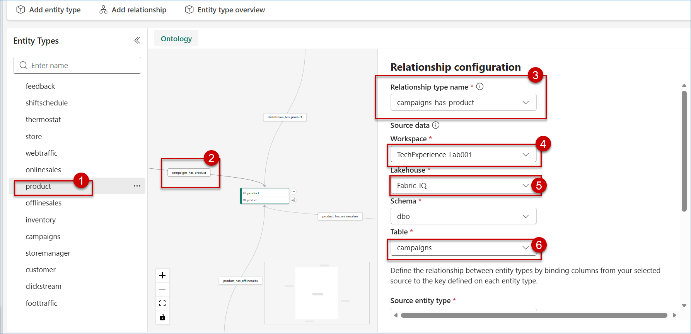

5. If a relationship is not created automatically, select the required **entity** from the Entity Types list, then click on **Add relationship** from the top menu. In the dialog box, enter a **relationship name**, select the appropriate **Source entity type** and **Target entity type**, and then click on **Add relationship type** to create the relationship.

    - Relationship Name: **feedback_provided_customer**
    - Source Entity type: **feedback**
    - Target entity type: **customer**

     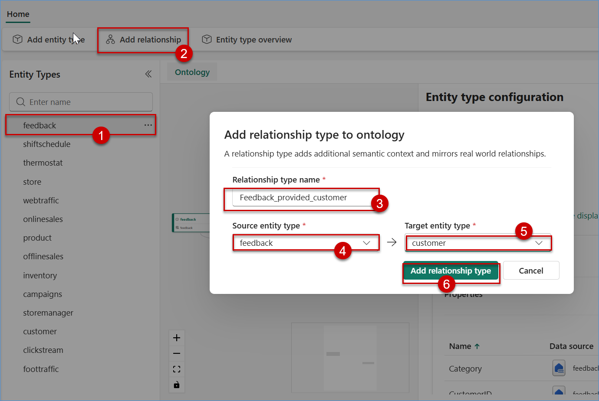

6. In the Relationship configuration panel, select the appropriate **Workspace**, **Lakehouse**, and **Table**, then map the **Source column (CustomerID)** to the corresponding **Target entity key column (CustomerID)**, ensuring both sides are correctly linked, and finally click on **Create** to establish the relationship.

    - Workspace: **<inject key= "WorkspaceName" enableCopy="false"/>**
    - Lakehouse: **<inject key= "Lakehouse" enableCopy="true"/>**
    - Schema: **dbo**
    - Table: **feedback**
    - Source Column: **CustomerID**

        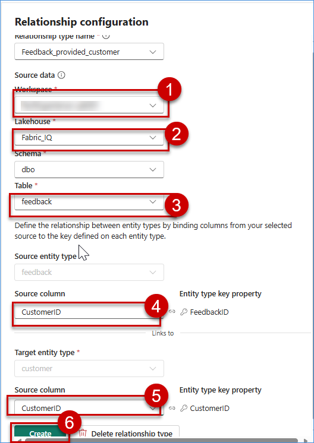

7. Repeat above two steps for each and every entity to create proper relationship.

8. Click on any entity type.

    

9. Click on "Entity type overview".

    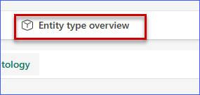

10. Click on **Last 30 days - Automatic - Average** and select **Time range** as **Last 24 hours** and then click on **Apply**.

    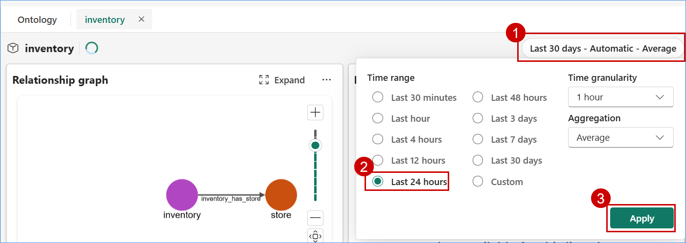

11. Now Ontology IQ is ready for all the entities for business usage. We can click any entity to check its overview. Below I have select **Product**

    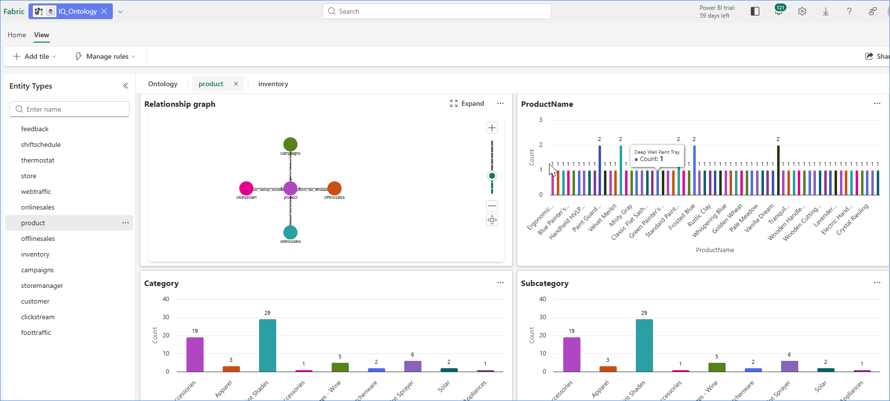
