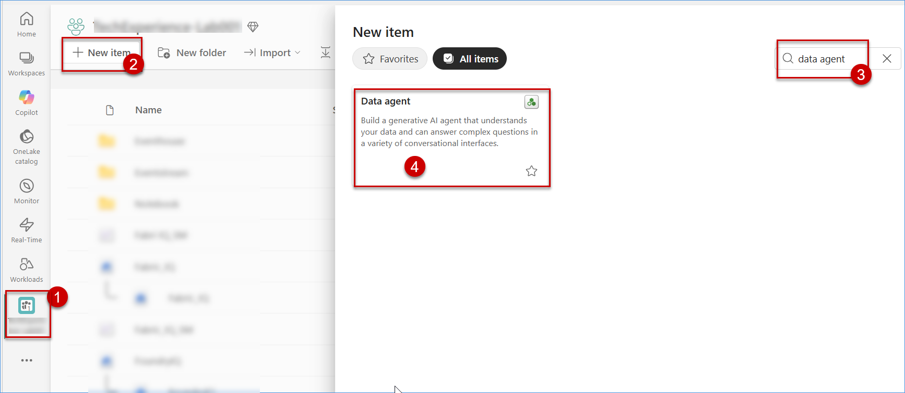
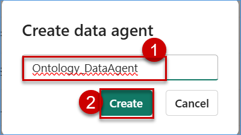
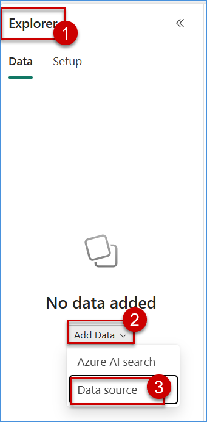
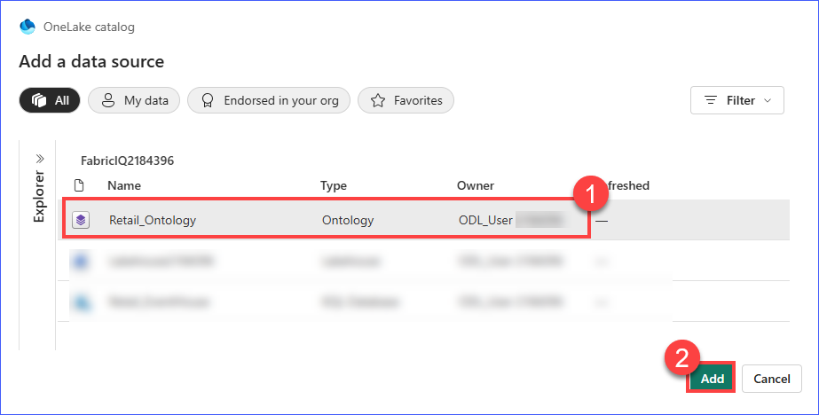
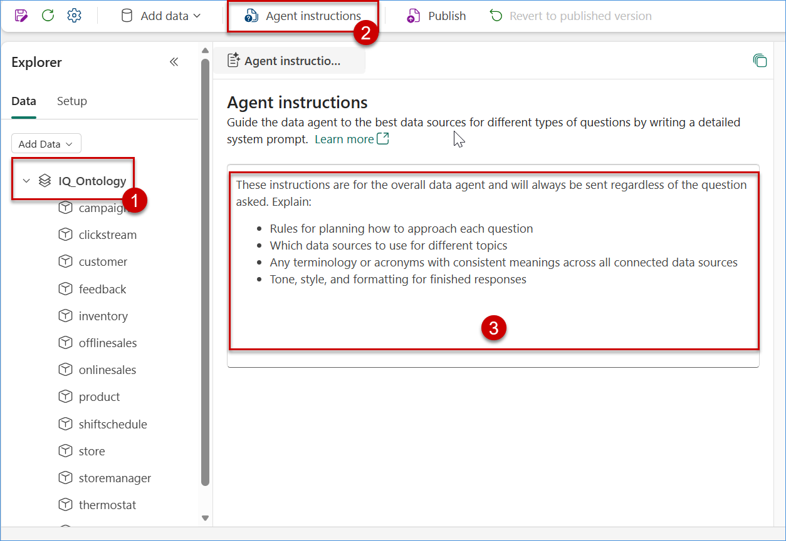
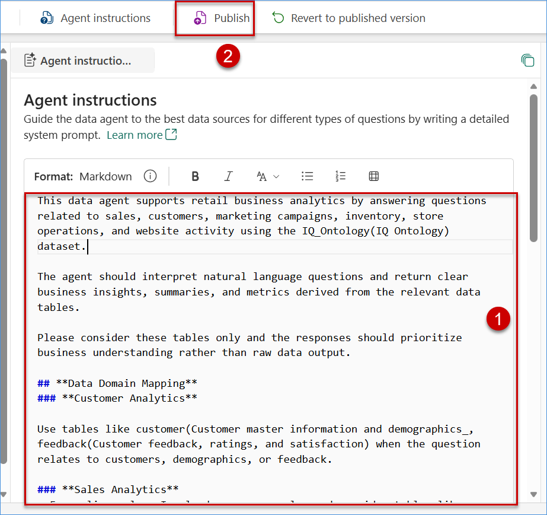
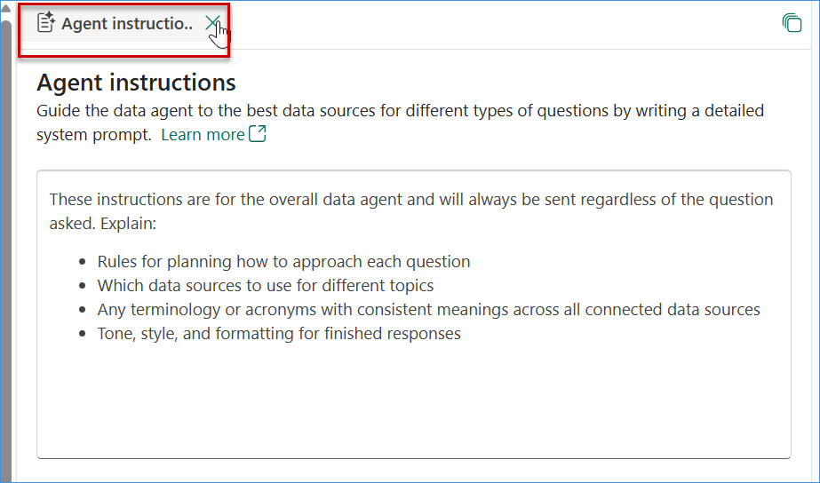
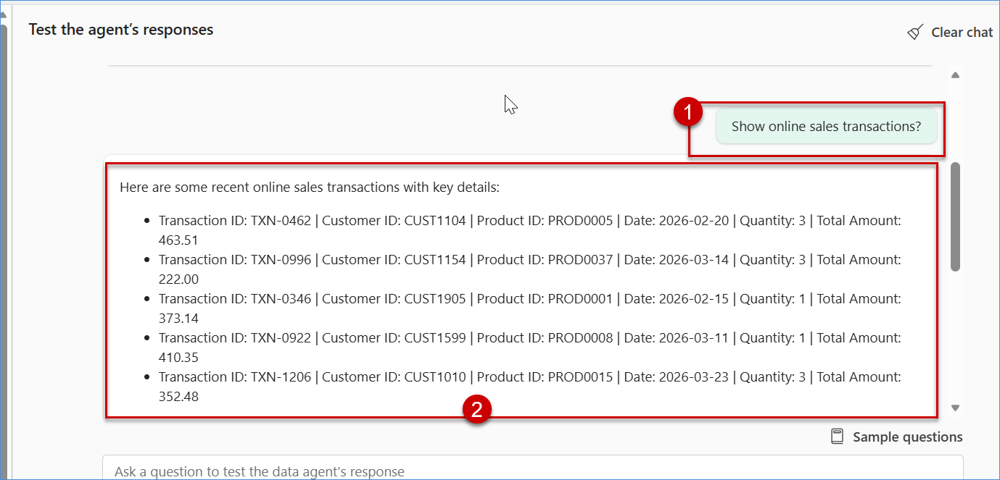

# Exercise 6: Connecting ontology using data agent & AI Foundry

In this section, you will create a **Fabric Data Agent**, connect it to the Ont language queries to retrieve business insights from enterprise data.

**Serena (Data Analyst)** now asks:
> *“Which stores had the highest stock outs and highest demand last quarter?”*
Instead of writing complex SQL queries, Serena interacts directly with a **Fabric Data Agent** that is grounded in the Ontology — enabling intuitive, context-aware analytics using natural language.

## ✅ Outcome
- Fabric Data Agent successfully connected to the Ontology  
- Cross-domain insights generated using natural language queries  
- Trusted and explainable responses powered by governed business context

## Task 6.1: Create a data agent with an ontology as the data source

1. Navigate to your **Fabric Workspace**: **<inject key= "WorkspaceName" enableCopy="false"/>**.

2. In your Fabric workspace, click on the **New item** button in the top command bar.

3. In the **New item** creation pane, use the search bar to type **"Data Agent"**.

4. Select the **Data Agent** card in the search results and click on it to initiate creation.

     

5. Paste **Ontology_DataAgent** in the **Create data agent** field and click on **Create** button.

     

#### Step 1: Attach Ontology as Data Source

1. Once the Data Agent opens, navigate to the **Data** tab in the Explorer pane, click on **Add Data**, select **Data source**, then browse and select the **Ontology** created in the previous lab.

    

2. Choose the Ontology created in the previous lab: **FabricIQOntology**, then click on **Add** and verify that the ontology is successfully attached.

    

     > **Note:**  
     > - The Ontology acts as a semantic layer, helping the Data Agent understand the data context.  
     > - Ensure the correct ontology is selected to get accurate insights.

## Task 6.2: Validate the data agent using natural language queries

1. Verify that the **Ontology (e.g., IQ_Ontology)** is successfully added under the **Data** tab in the Explorer pane.
  
          
    
2. Click on **Agent instructions** from the top menu.

3. In the **Agent instructions** section, remove any existing default content present in the instruction box, provide guidance to control how the agent responds by entering instructions. 

     
    ### Sample Agent Instructions (Copy & Paste)

    Copy the below instructions and paste them into the **Agent instructions** section:

     ```
     This data agent supports retail business analytics by answering questions related to sales, customers, marketing campaigns,  inventory, store operations, and website      activity using the IQ_Ontology(IQ Ontology)  dataset.

     The agent should interpret natural language questions and return clear business insights, summaries, and metrics derived from the relevant data tables.

     Please consider these tables only and the responses should prioritize business understanding rather than raw data output.

     ## **Data Domain Mapping**
     ### **Customer Analytics**

     Use tables like customer (Customer master information and demographics, feedback (Customer feedback, ratings, and  satisfaction) when the question relates to customers, demographics, or feedback.

     ### **Sales Analytics**
     - For online sales: Involved ecommerce  sales and consider tables like onlinesales, product, customer to generate values like "Total online sales by product", "Top   selling online products", "Online revenue by customer segment"
     - For offline sales: Involved store sales and consider tables like offlinesales, store, product, customer to generate values  like "Store revenue by location", "Best  performing store", Offline sales trend by region"

     ### **Marketing Campaign Analytics**
     For marketing and campaigning related question, please consider tables like campaigns, customer, onlinesales, offlinesales, product to answer below type questions
     - Campaign conversion rate
     - Sales generated by campaign
     - Customers acquired through campaign

     ### **Website Behavior Analytics**
     Consider tables like clickstream,  webtraffic, customer, product to provide answer and analytical values for "Most  visited pages", "Website traffic trend",      "Conversion funnel from visit to purchase"

     ### **Product & Inventory Analytics**
     Consider tables like product, inventory to provide values for "Current inventory level", "Products close to stock", "Inventory turnover"

     ### **Store Operations**
     Most important analytical report where it will consider tables like store, storemanager, shiftschedule l and provide the valuable information like "Store manager  performance", "Staff scheduling insights","Store operational metrics"

     ## **Rules for Query Planning**
     - While answering question, please consider retail domain.
     - Please consider both static and real-time data to provide most effective results
     - Please use aggregations where appropriate like SUM, COUNT, AVG, DISTINCT
     - Apply data filters if the user mentioned time periods
     - use joins only when required
     - avoid returning unnecessary columns
     Rules for Query Planning

     Use aggregations when appropriate like SUM, COUNT, AVG, DISTINCT.
     Apply filters if the user mentions time periods.
     Use joins through ontology relationships.
     Avoid returning unnecessary columns.

     Support group by in GQL.
     When users ask for highest, top, best   performing, or most, compute aggregated metrics and rank results accordingly.
     ```

4. After entering the instructions, click on **Publish** to save the configuration.

    

5. After adding the instructions, click on the **close (✕) icon** on the **Agent instructions** tab to exit the window.

     

6. Once closed, the main Data Agent interface will be displayed, where you can start querying the agent using natural language.

7. In the query input area, ask questions using natural language, for example:
    ````
     Show online sales transactions?
    ````
8. Submit the query and review the response generated by the Data Agent.

     

9. Observe how the agent:
   
   - Interprets the question  
   - Queries the underlying data using the ontology  
   - Provides insights in a readable format  

10. Try multiple queries and refine your questions to explore additional insights.
     
     ```
     Which customer generated the highest total sales amount?
     ```
     ```
     Which product has the highest total  sales amount?
     ```

     > **Note:**  
     > - Clear and specific questions provide more accurate results.  
     > - Responses may vary depending on how the question is framed.  
     > - The Data Agent uses the Ontology to translate natural language into meaningful queries.
