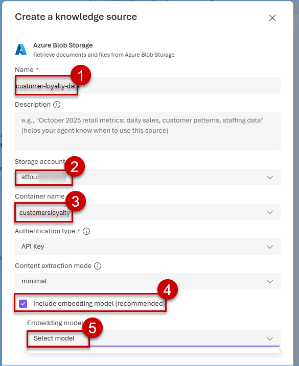
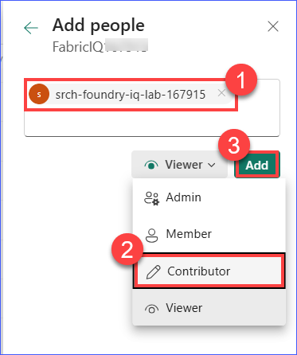
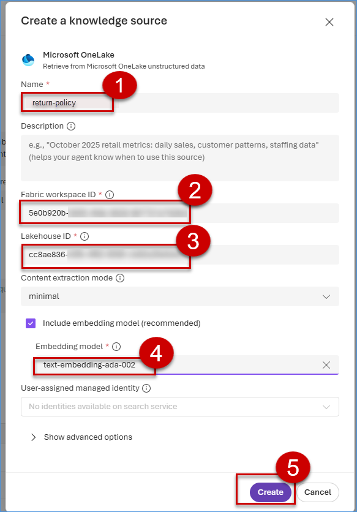
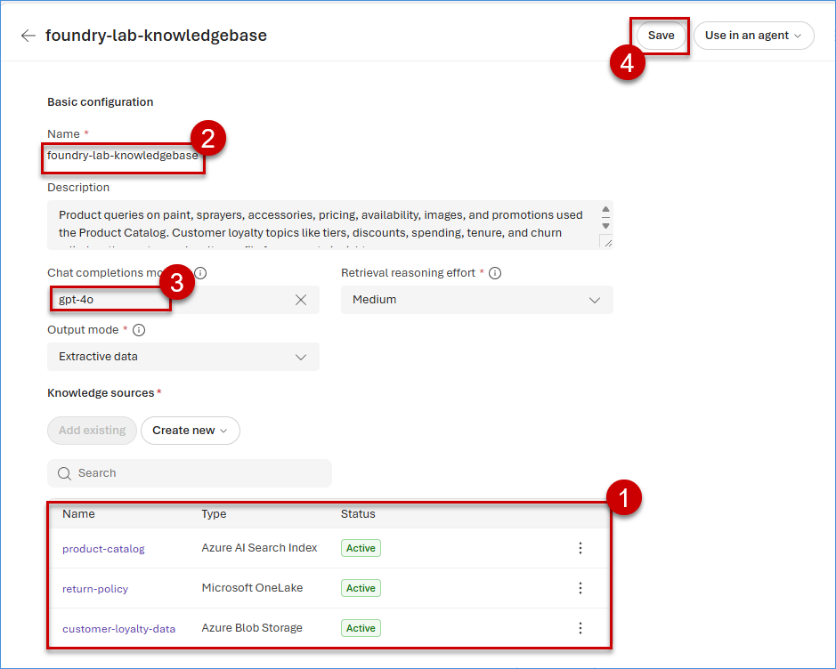

# Exercise 2: Integrate Enterprise Knowledge via Foundry IQ
 
This exercise focuses on integrating enterprise knowledge using **Foundry IQ** by enabling indexed sources for unstructured data and federated sources for real-time structured data retrieval, along with connectivity to the **Microsoft Fabric Lakehouse**.

**Ryan** (Customer) asks detailed product-related questions during an engagement.

To enable accurate and context-aware responses, Miguel integrates enterprise content sources such as:
- SharePoint Product Guides  
- Internal Policy Documents  
- Campaign and Marketing Materials  

**Foundry IQ** provides permission-aware, citation-backed grounding by connecting to these knowledge sources - ensuring that agent responses are both secure and traceable.

> *“The agent shouldn’t know everything - it should know who to ask.”*

## ✅ Outcome
- Foundry IQ Knowledge Base configured  
- Multi-source enterprise grounding enabled  
- No custom RAG code required for knowledge integration

### Task 2.1: Set up indexed sources for unstructured files and federated sources for real-time structured data retrieval. 

1. Click on Build in the Foundry portal. On the left side, click on **Knowledge** to configure Foundry IQ.

    

2. Click on drop down of **Foundry IQ Connection**, then click on **Connect a resource**.

    >**Note**: If the Search Service is already listed and visible, skip this step and select the existing Search Service.

    

3. Click on the dropdown for the **Azure AI Search** field, select the Search resource named **srch-foundry-iq-lab**, and then click on **Connect**. 

    

4. Click on **Create a knowledge base**.

    

5. Click on **Azure Blob Storage** to index unstructured return policy files, then click on **Connect**.

    

6. Paste **customer-loyalty-data** in the Name field. From the dropdown, select the **storage account** you want to use, then select the container **customersloyalty**. Scroll down and select the **checkbox** to include embedding model. Under the Embedding model, click **Select model**.

    **Note:** If the knowledge source name already exists, please add a suffix (e.g., _1, _new) to create a unique name.

    

7. Click on **text-embedding-ada-002**, then click on **Deploy**.

    

8. Select **text-embedding-ada-002** for the Embedding model field, then click on **Create**.
    

9. In the same **Knowledge base** page, in the **Knowledge source** section, click on **Create new** and then click on **Azure AI Search Index**.

    

10. Enter **product-catalog** in the Name field. From the dropdown, select **product-catalog-index**, then click on **Create**.

    **Note:** If the knowledge source name already exists, please add a suffix (e.g., _1, _new) to create a unique name.

    

### Task 2.2: Connect to a Microsoft Fabric Lakehouse to enable direct access to enterprise data

1. On the same **Knowledge base** page, in the **Knowledge source** section, click on **Create new** and then click on **Microsoft OneLake** to connect Lakehouse to enable direct access to enterprise data without the need for data movement.

    

2. Navigate to **Microsoft Fabric**, click on **Workspace** then select **<inject key= "WorkspaceName" enableCopy="false"/>** and click on **Manage access** button.

    

3. Click on **+ Add people or groups** button and enter the **<inject key= "searchServiceName" enableCopy="true"/>** and provide access as **Contributor** and click on **Add** button.

4. Click on **x** button to close the window.

    

5. Click on **Filter dropdown**, then select **Lakehouse** and then click on **<inject key= "Lakehouse" enableCopy="false"/>**

    

6. Copy the **Fabric Workspace ID** and the **Lakehouse ID** that appear before lakehouse and after lakehouse.

    > You can find the Fabric Workspace ID in the URL. It is the unique string between two "/" characters after /groups/ in your browser.
    
    >You can find the Lakehouse ID in the URL. It is the unique string between two "/" characters after /lakehouses/ in your browser.

    

7. Navigate back to Microsoft Foundry, enter name as **return-policy**, paste the previously copied **Fabric Workspace ID** and the **Lakehouse ID**, select **text-embedding-ada-002**, and then click on **Create**.

    >**Note:** If the knowledge source name already exists, please add a suffix (e.g., _1, _new) to create a unique name.
    > If the Lakehouse and workspace parameters are not visible, scroll down and select the lakehouse created in the Fabric Lab.

    

8. Review and validate all the **Knowledge sources**, enter name as **foundry-lab-knowledgebase** in the Basic configuration section. For the **Chat completion model** field, select **gpt-4o**.  Click on **Save** knowledge base.

    >**Note:** If the knowledge source name cannot be edited, leave it unchanged.

    

### What We Learned

- How to configure Foundry IQ by connecting to Azure AI Search and creating knowledge bases.
- How to index unstructured data from Azure Blob Storage and structured data from Azure AI Search indexes.
- How to connect to Microsoft Fabric Lakehouse for direct access to enterprise data.

### Next Exercise

In the next exercise, we will learn how to build intelligent agents with tool calling, including creating agent personas and implementing routing logic for user queries.
