# Exercise 4: Multi-Agent Orchestration and Validation

This exercise focuses on configuring and validating **multi-agent workflows** that coordinate interactions between specialized agents to support end-to-end business processes.

During high-demand events such as **Holiday Sales**, multiple domain-specific agents collaborate to deliver seamless customer experiences:

- Interior Designer Agent recommends products  
- Rewards Agent applies eligible discounts  
- Responsible AI Agent blocks unsafe or non-compliant prompts  
- Checkout Agent finalizes the customer order  

All agent interactions are orchestrated by the **Supervisor Agent** to ensure coordinated decision-making across systems.

## ✅ Outcome
- Multi-agent orchestration successfully configured  
- Business-aligned AI workflows enabled  
- Safe and scalable automation across agent-driven processes

### Task 4.1: Configure multi-agent orchestrator and specialist agents

1. Click on **Workflows**.

    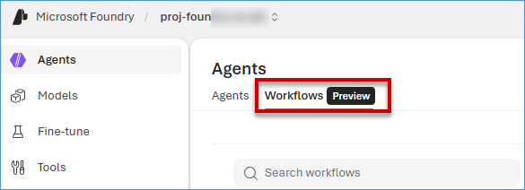

2. Click on **Create** and then click on **Blank workflow**.

    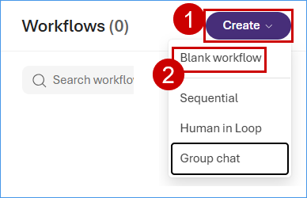

3. Click on **YAML**.

    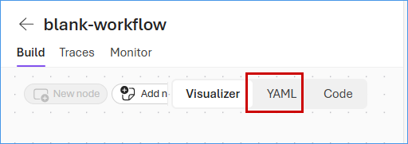

4. Paste the below following **YAML script** and click on **Save**.

    ```
    kind: workflow
    trigger:
      kind: OnConversationStart
      id: trigger_wf
      actions:
        - kind: SetVariable
          id: action-1768237669100
          variable: Local.Var2679
          value: =System.LastMessage
        - kind: InvokeAzureAgent
          id: action-1768237693978
          agent:
            name: Supervisor-Agent
          input:
            messages: =System.LastMessage
          output:
            autoSend: true
            messages: Local.Var5755
        - kind: ConditionGroup
          conditions:
            - condition: =Last(Local.Var5755).Text = "Sales-Associate-Agent"
              actions:
                - kind: InvokeAzureAgent
                  id: action-1768237857121
                  agent:
                    name: Sales-Associate-Agent
                  input:
                    messages: =System.LastMessage
                  output:
                    autoSend: true
              id: if-action-1768237712578-0
            - condition: =Last(Local.Var5755).Text = "Rewards-Campaign-Agent"
              actions:
                - kind: InvokeAzureAgent
                  id: action-1768237897049
                  agent:
                    name: Rewards-Campaign-Agent
                  input:
                    messages: =System.LastMessage
                  output:
                    autoSend: true
              id: if-action-1768237712578-0p9xo7ga
            - condition: =Last(Local.Var5755).Text = "Inventory-Agent"
              actions:
                - kind: InvokeAzureAgent
                  id: action-1768237934785
                  agent:
                    name: Inventory-Agent
                  input:
                    messages: =System.LastMessage
                  output:
                    autoSend: true
              id: if-action-1768237712578-ma22fceo
          id: action-1768237712578
          elseActions:
            - kind: SendActivity
              activity: " "
              id: action-1768238054760
    id: ""
    name: FoundryIQ-Workflow
    description: ""
    ```
    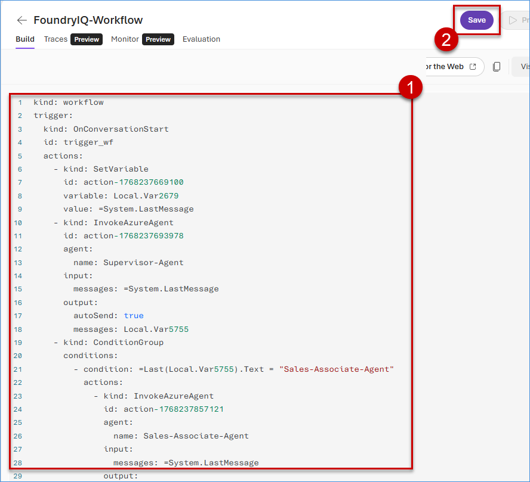

5. Enter **FoundryIQ-Workflow** in the Workflow Name field and click on **Save** button.

    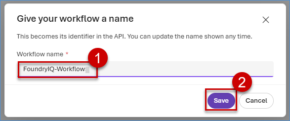

6. Review the **workflow**, click on **Publish** dropdown, then click on **Publish as workflow app**.

    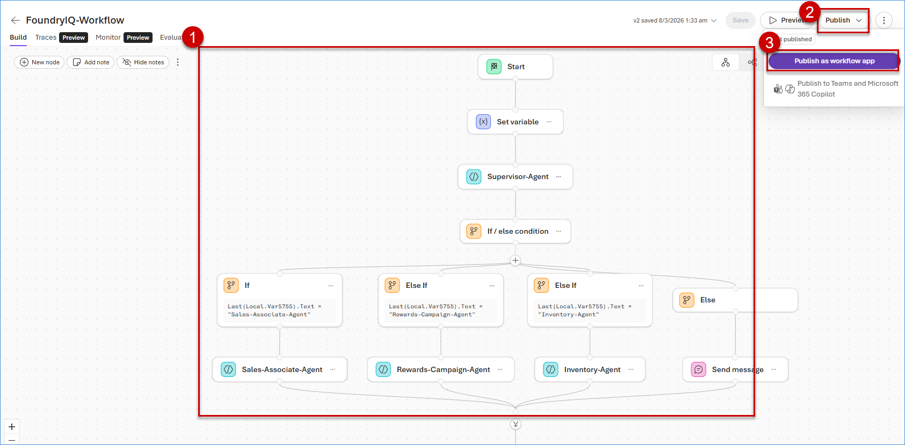

7. Select the checkbox, then click on **Publish**.

    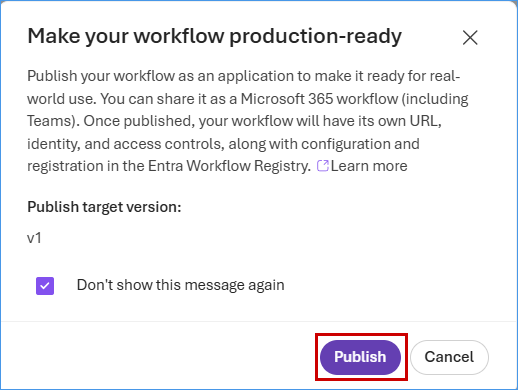


### Task 4.2: Validate the end-to-end agentic workflow

This section demonstrates how individual agents are invoked and how they operate.

1. Click on **Preview**.

    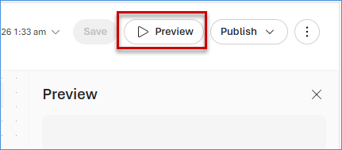

2. Enter prompt `Hey! I'm planning to paint my living room but I'm not sure which color would look best. Can you recommend some paint shades?,` then click on **Send button**.

    **Note**: If the agent asks for approval, expand the dropdown and select **Always approve all tools.**

      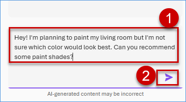

3. The **response** of the agents can be seen on the right side (See image pointer/box 1). You can also see the **called Agents** during the process on the right side and in the workflow (See image pointers/boxes 2 and 3).

    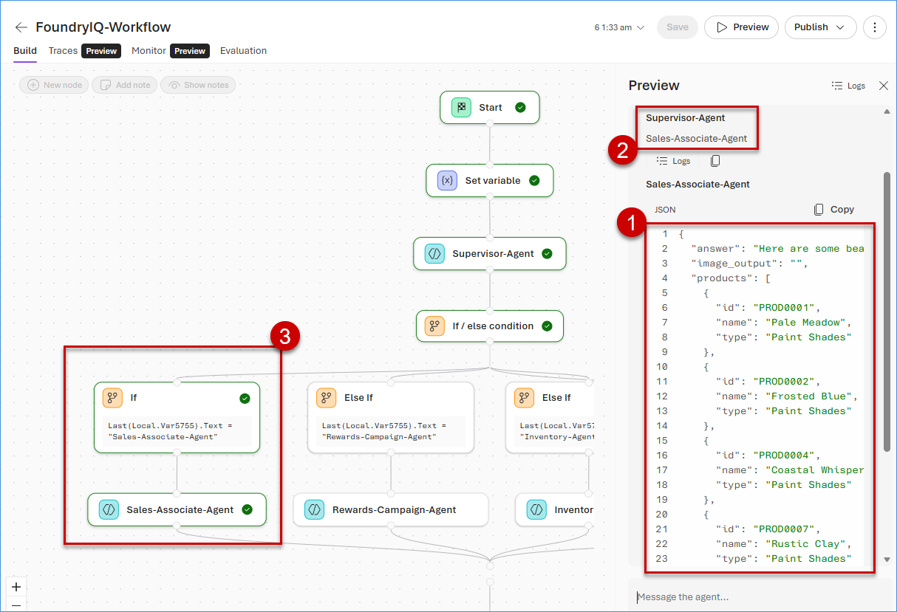

4. Enter prompt  `Can you tell me Joe's customer loyalty tier and discount?`, then click on **Send button**.

    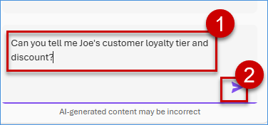

5. The **response** of the agents can be seen on the right side (See image pointer/box 1). Note that we have received this response in JSON format.  You can also see the **called Agents** during the process on the right side and in  the workflow (See image pointers/boxes 2 and 3).

    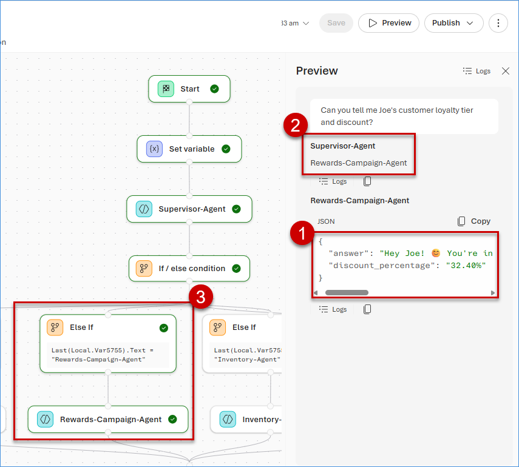

6. Enter prompt  `What is the inventory quantity for product ID PROD0011?`, then click on **Send button**.

    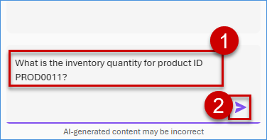

7. The **response** of the agents can be seen on the right side (See image pointer/box 1).  You can also see the **called Agents** during the process on the right side and in  the workflow (See image pointers/boxes 2 and 3).

    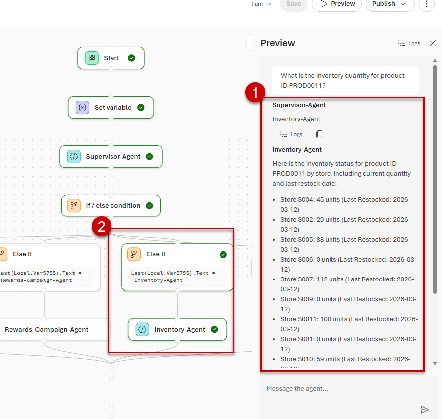


### Task 4.3: Inspect the execution path using the Trace tool

1. In the Workflow page, click on **Traces**, then click on **Create or connect**.

    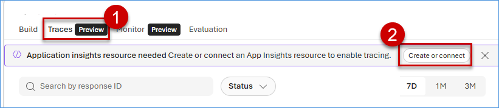

2. Select the **foundryiq-appinsight** as Application insights resource name, then click on **Connect**.

    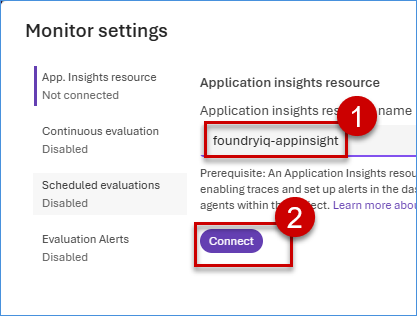

3. Review all the **details**

    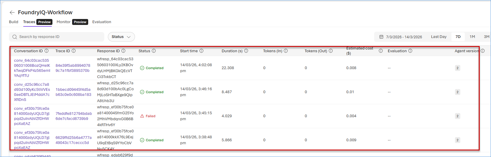

4. Click on any one of the **Conversation IDs**, to review the **agent** and **tool call**.  You can also review the **input**, **output**, and **metadata** for that conversation.

    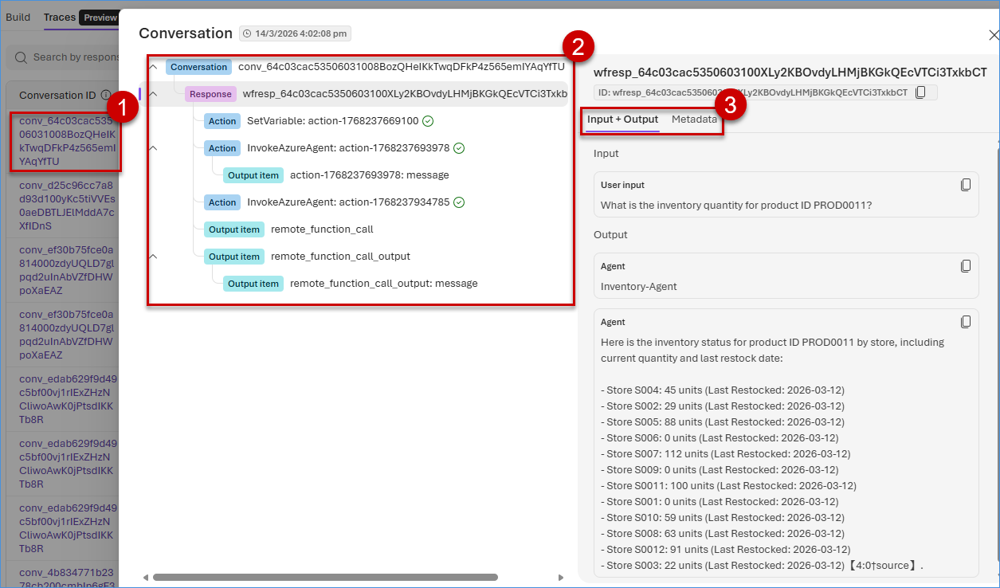

### What We Learned

- How to create and configure workflows for multi-agent orchestration using YAML.
- How to publish workflows as apps and validate agent interactions through previews.
- How to inspect execution paths and traces for debugging and monitoring agent performance.

### Next Exercise

In the next exercise, we will learn how to enforce guardrails and safety policies, and define evaluation metrics for assessing agent performance.
