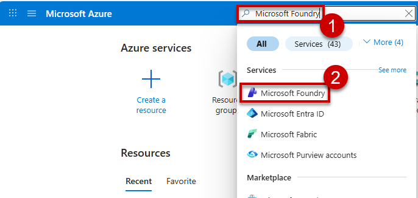
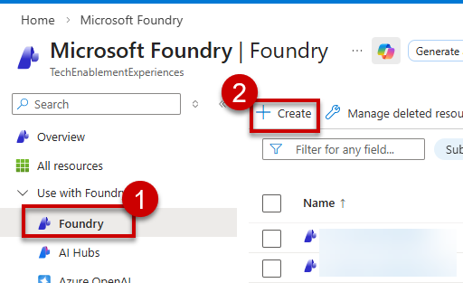
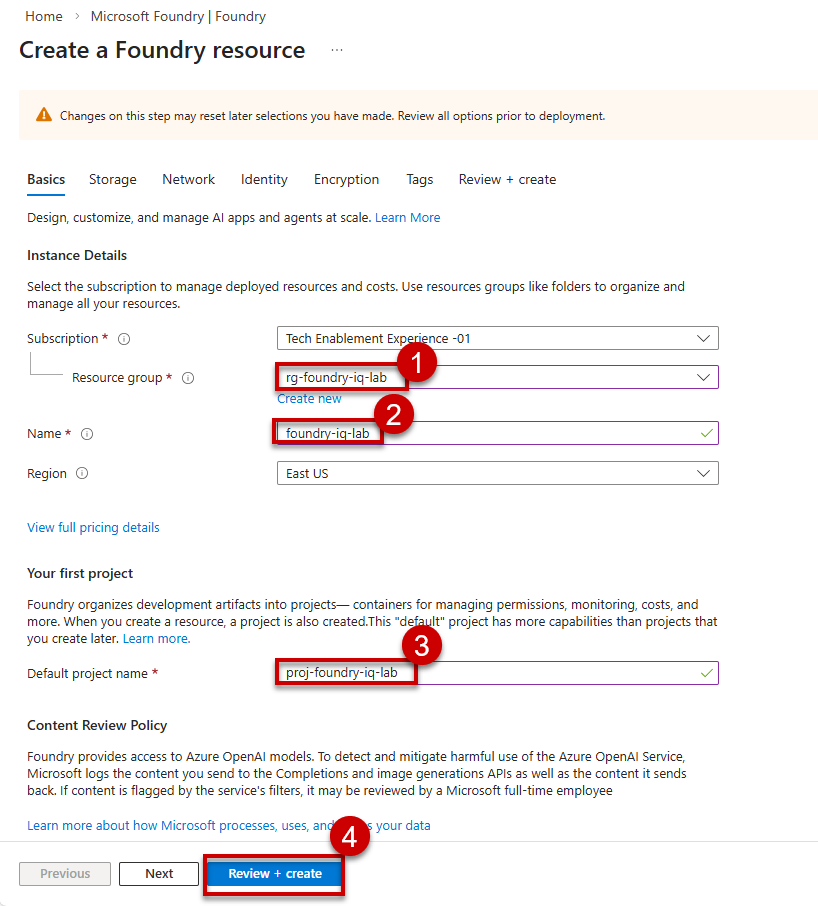
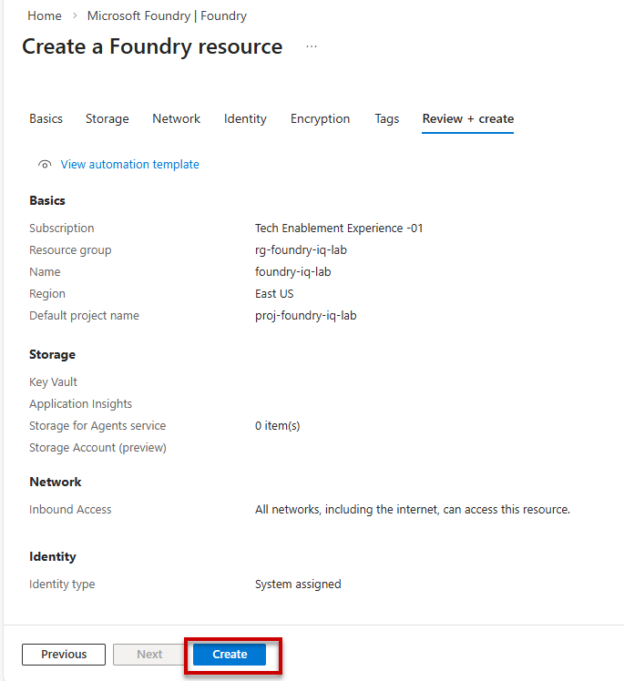
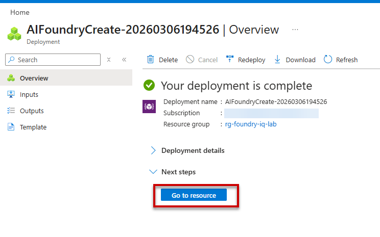
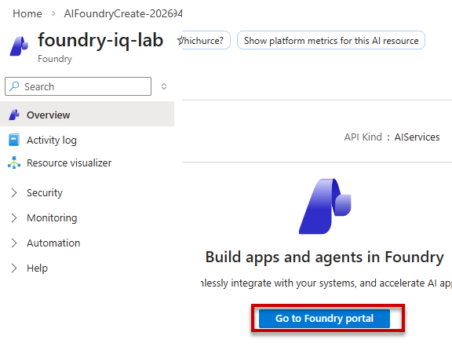

 ## Provision the AI Foundry Foundation

This a hands-on lab that would help you to understand how to create a Microsoft Foundry resource and deploy models. 

### Task 1.1: Provision an Microsoft Foundry Hub and a corresponding project to establish the central administrative and development workspace.

Using a web browser of your choice, please navigate to the Azure Portal. 

1. In the Azure Portal, search **Microsoft Foundry** and click on Microsoft Foundry.
    

2. On the Left side, under the Use with Foundry, click on **Foundry**, then click on **Create**. 

    

3. Select **Resource Group** and in the Name field enter `foundry-iq-lab`. Enter Defualt project name as `proj-froundry-iq-lab` and click on **Review and create**.   

    

4. After validating, click on the **Create**.

      

> It might take few seconds to create the Foundry resource.

5. Once the deployment is completed successfully, click on **Go to resources**

    

6. Click on **Go to Foundry portal** to navigate to the Foundry project.

    

7. Click on **Build** to create agents, deploy models, and build workflows.

**Note:** Make sure the **New Foundry** toggle is On.

### Task 1.2: Deploy a high-reasoning large language model and a compatible embedding model to provide the agent with core intelligence and vector search capabilities.

 In this task, we would be deploying a reasoning model and an embedding model in Foundry

1. On the Microsoft Foundry page, click on **Models**, then click on **Deploy base models**.

    

2. Search for **gpt-4o** then click on **gpt-4o**.

    

3. Click on the **Deploy** dropdown and select **Default settings**.

    

4. Again navigate to **Models** section to deploy embedding model, then click on **Deploy base models**.

    

5. Search **text-embedding-ada** then click on **text-embedding-ada-002**.

    

6. Click on the **Deploy** dropdown and select **Default settings**.

    
