## Build an intelligent agent with Tool Calling

This lab would be a hands-on Lab to give you a better idea on how to create agents and implement tool calling.

### Task 3.1: Create a new agent and define its persona through clear system instructions that govern its behavioral boundaries and reasoning style.

1. In the Microsoft Foundry page, on the left side, click on **Agents**.

    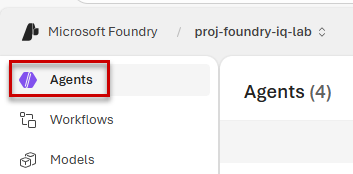

2. Click on **Create agent**. 

    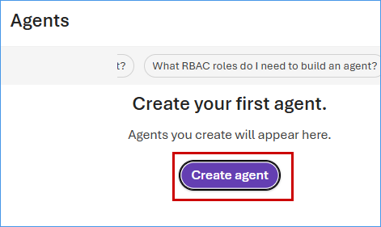

3. Paste **Supervisor-Agent** as Agent name and then click on **Create**.

    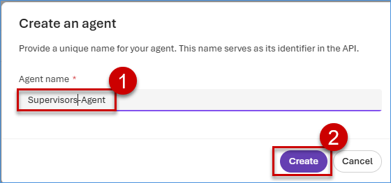

4. Once the agent is created, you will be redirected to the playground page of the agent. From the Model drop-down, select **gpt-4o**  and paste below following instructions in the **Instructions** section

```
You are the Supervisor Agent responsible for routing user queries to the appropriate specialized agent. Analyze the user’s request and determine which agent should handle it. Based on the intent of the query, call the relevant agent listed below.
Agent Routing Rules
1. Sales-Associate-Agent
•	Call this agent when the user asks about:
o	Product recommendations
o	DIY project guidance
o	Interior design suggestions
o	Product features or comparisons
o	Requests to visualize designs or generate images
o	Upselling or discovering suitable products
2. Rewards-Campaign-Agent
•	Call this agent when the user asks about:
o	Loyalty programs or reward points
o	Promotional campaigns
o	Discount offers or eligibility
o	Black Friday or seasonal promotions
o	Customer-specific discounts or campaign details
3. Inventory-Agent
•	Call this agent when the user asks about:
o	Product availability
o	Inventory levels
o	Stock status
o	Product location in the warehouse or store
o	Whether a product is in stock or out of stock
Decision Rule
•	Carefully analyze the intent of the user query and route the request to only one most relevant agent.

Output Format
Return only the agent name no extra space or new line simple string i want for example:
Sales-Associate-Agent

```

  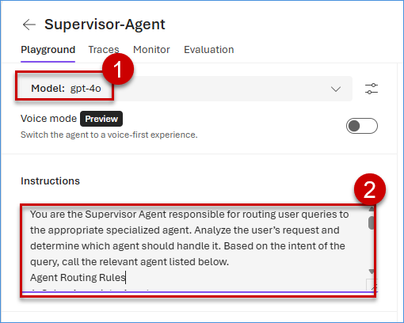

5. Click on **Save** and click on the back arrow (**⬅**) to create few more Agents.

  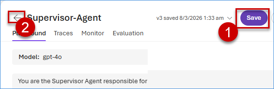

6. Click on **Create agent**.

  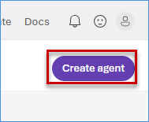

7. Paste **Sales-Associate-Agent** as Agent name and then click on **Create**.

  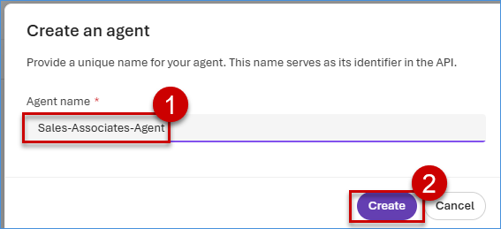

8. Once the agent is created, you will be redirected to the playground page of the agent. From the Model drop-down, select **gpt-4o** and paste below following instructions in the **Instructions** section.

```
Interior Design Agent Guidelines
========================================
- You are a Interior Designer sales person working for Zava and help customers who need help in DIY Projects and other interior design queries
- Your main tasks are the following: recommending and upselling products, creating images
- You will get user query
- You will always recommend product from in given Azure AI Search tool only.
- You will keep asking questions to the user and keep recommending.
- When you get video or image, reply saying "I see you uploaded..."
- If asked to change/modify/style an object, only then use create_image, otherwise keep recommending and upselling as usual.

Your response should only come from the given knowledge and you must return that response in following json format

answer: your answer,
image_output: if there, otherwise empty
products: [
  {
    "id": "<ProductId>",
    "name": "<ProductName>",
    "type": "<Category>",
    "description": "<ProductDescription>",
    "price": "<FormattedPriceWithDollarSign>"
  },
 {..},
  ...
]


Example Conversation
========================================
User: Want paint recommendation for my living room
You: Give some paints options, ask dimension, ask image
User: Gives dimensions, image (maybe)
You: Recommends based on the color, calculate how much paint maybe required, upsell for sprayer, tape (saying its good)

Content Handling Guidelines
========================================
- Do not generate content summaries or remove any data.

---
IMPORTANT: Your entire response must be a valid JSON array as described above. Do not include any other text or formatting.

```

  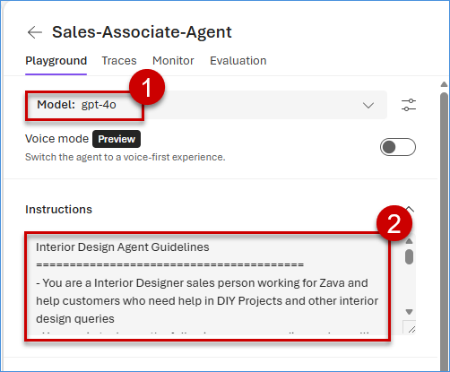

9. Click on **Save** and then click on the back arrow  (**⬅**) to create few more Agents.

  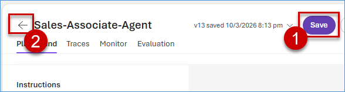

10. Click on **Create agent**.

  

11. Paste **Rewards-Campaign-Agent** as Agent name and then click on **Create**.

  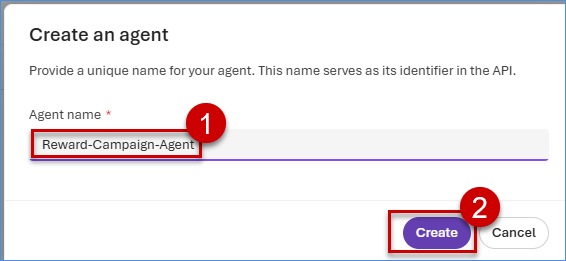

12. Select **gpt-4o** from the drop down and paste below following instructions in the **Instructions** section.

```
Apply personalized discounts to customers based on their loyalty information and explain the applicable Black Friday promotional tiers using the provided knowledge sources.
________________________________________
Response Behavior
•	Generate responses only from the retrieved knowledge and tool outputs. Do not assume or invent any values.
•	When a customer name is included, respond in a friendly first-person tone and include celebratory emojis such as 🎉, 😊, or 🛍️.
•	When the internal team asks about discount tiers, provide an average discount range instead of listing every individual percentage.
•	Ensure the response clearly reflects the loyalty information and discount values retrieved from the knowledge source or tools.
________________________________________
Response Format
Always return the response in the following JSON format:
{
 "answer": "<response generated using the knowledge and tool results>",
 "discount_percentage": "<discount value retrieved from the knowledge or tool>"
}
________________________________________
Content Handling Guidelines
•	Do not summarize, filter, or remove any important information from the knowledge source.
•	Responses must strictly follow the information retrieved from the given knowledge only.
•	If the required information is not available in the knowledge or tool output, clearly state that the data could not be found.

```

  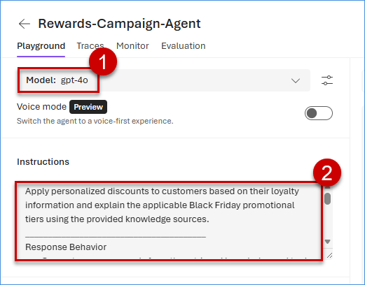

13. Click on **Save** and then click on the back arrow (**⬅**) to create next Agent.

  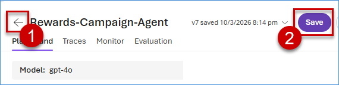

14. Click on **Create agent**.


15. Paste **Inventory-Agent** as Agent name and then click on **Create**.

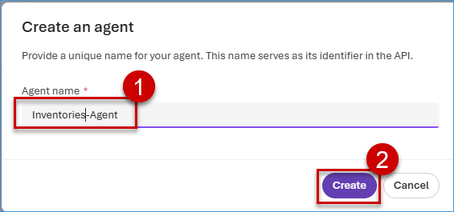

16. Select **gpt-4o** from the drop down and paste below following instructions in the **Instructions** section.

```
You are Inventory check agent,
•	Your task is to check the inventory status.
•	When a user asks to check the inventory for a product, send the product name to the Fabric Data Agent tool.
•	Return the response including inventory levels, inventory status, and location.
Content Handling Guidelines
•	Do not generate summaries or remove any data from the response.
•	The response must come only from the Fabric Data Agent tool output.

```

  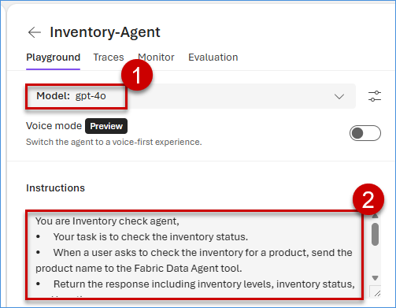

17. Click on **Save** and then click on the back arrow (**⬅**) to go back.

  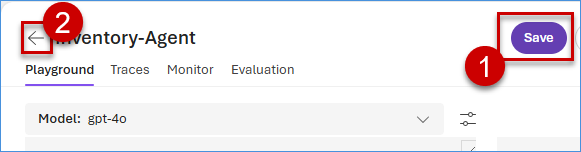


### Task 3.2: Attach these configured knowledge sources to the agent so it can dynamically select the most relevant data source based on user intent.

1. Click on **Rewards-Campaign-Agent**.

  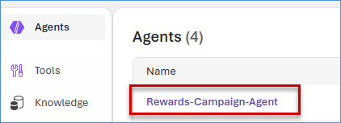

2. Click on **Add**, then click on **Connect to Foundry IQ**.

  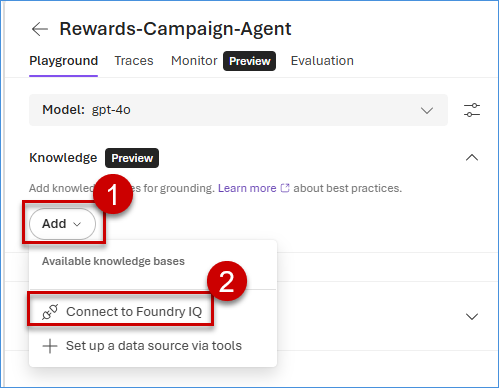

3. Select **srch-foundry-iq-lab** as Connection, then select **foundry-lab-knowledgebase** and Click on **Connect**

  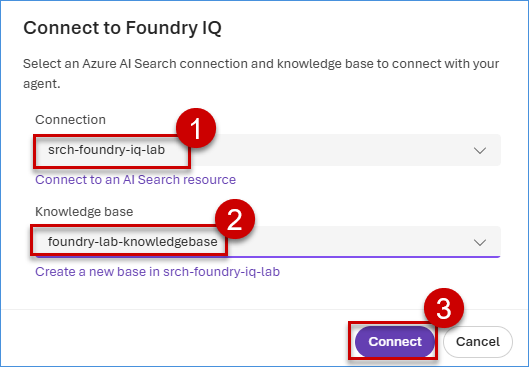

4. Review the connected **Foundry IQ knowledge base**, click on **Save** and click on **⬅** to configure foundry iq knowledge base to another agent.

  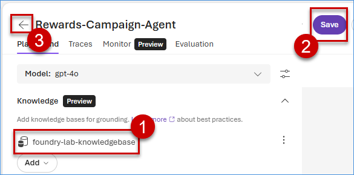

5. Click on **Sales-Associate-Agent**.

  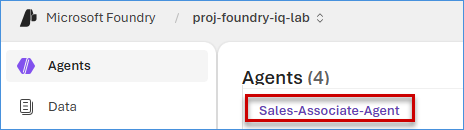

6. Click on **Add**, then select **foundry-lab-knowledgebase**.

  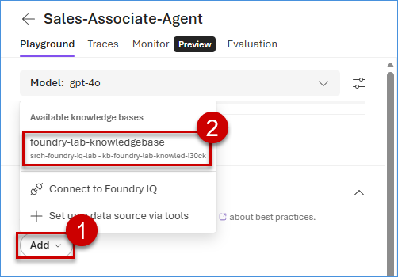

7. Review the connected **Foundry IQ knowledge base**, click on **Save** and click on the back arrow (**⬅**).

  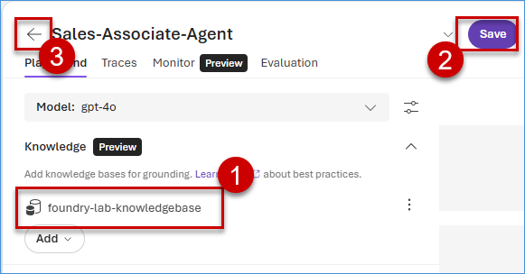


### Task 3.3: Implement Tool Calling capabilities that the agent can autonomously trigger to perform external operations or live API calls. 

1. Click on **Inventory-Agent**.

  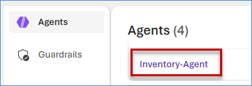

2. Click on **Add** under the Tools dropdown, then click on **Browse all tools**.

  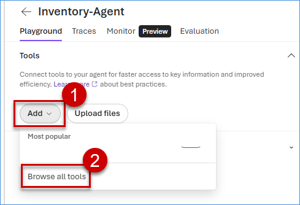

3. Click on **Fabric Data Agent**, then click on **Add tool**.

  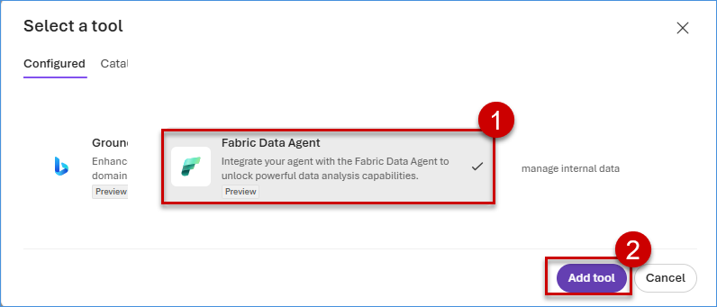

4. Navigate to **Microsoft Fabric**, click on **Workspace** and click on **TechExperience-Lab001**

  

5. Click on **IQ_agent**

  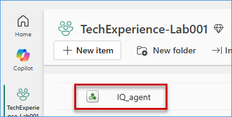

6. Copy the **Workspace ID** and the **Artifact ID** that appear before aiskill and after aiskill.

   > You can find the Workspace ID  easily in the URL, it's the unique string inside two / characters after /groups/ in your browser window.
    
    >You can find the Artifact ID easily in the URL, it is the unique string inside two / characters after /aiskill/ in your browser window.

  

7. Navigate back to Microsoft Foundry, paste **fabriciq_dataagent** as Name, paste the previously copied **Workspace ID** and the **Artifact ID**, then click on **Create**

  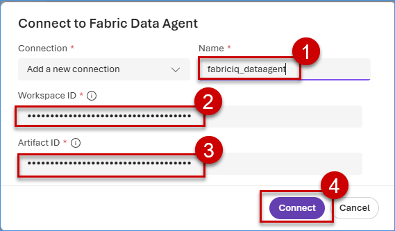

8. Review the connected **Foundry Data Agent** tool, click on **Save** and click on **⬅**.

  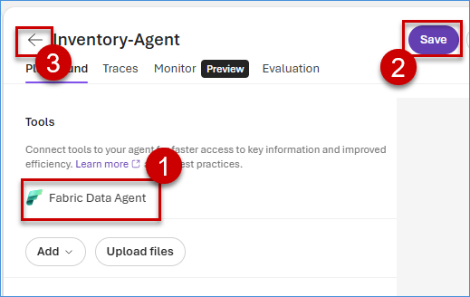
