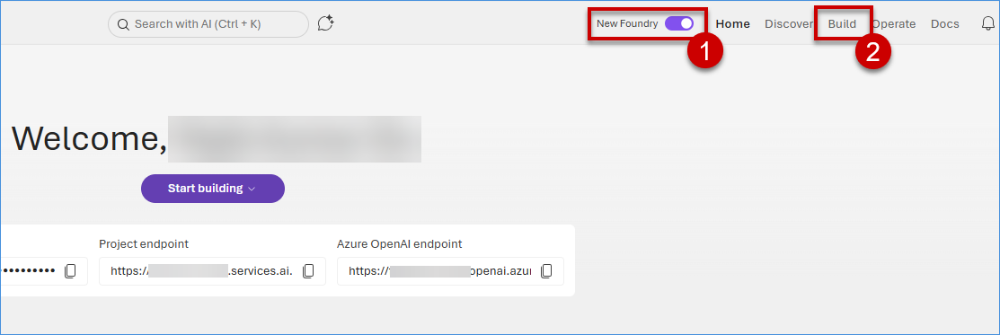
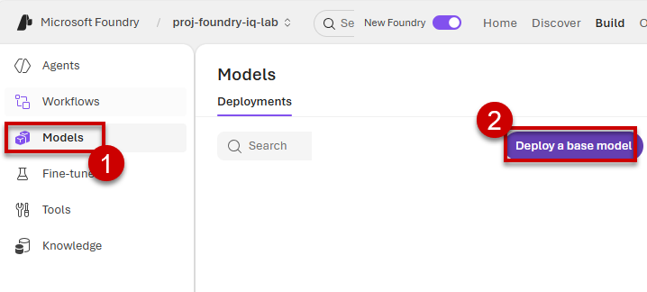
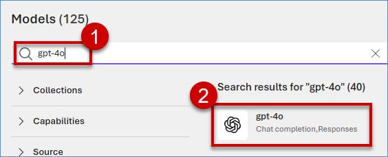
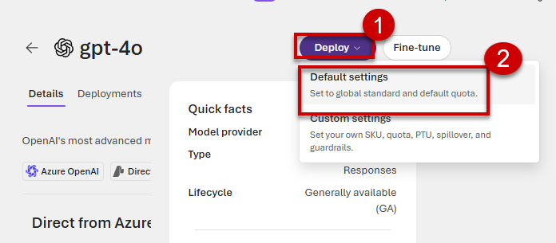
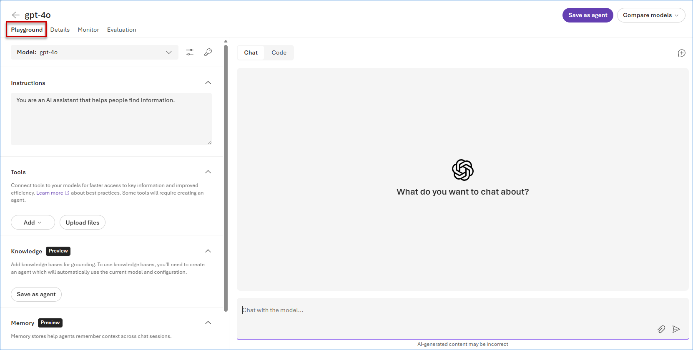
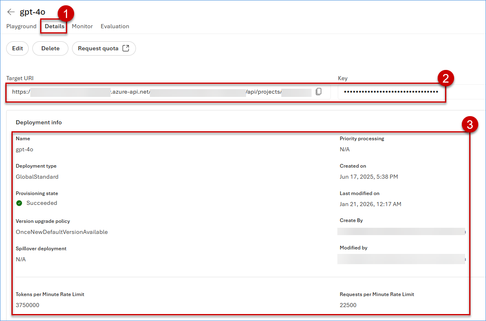
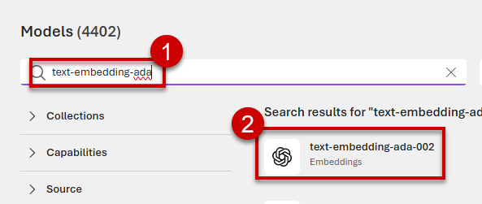
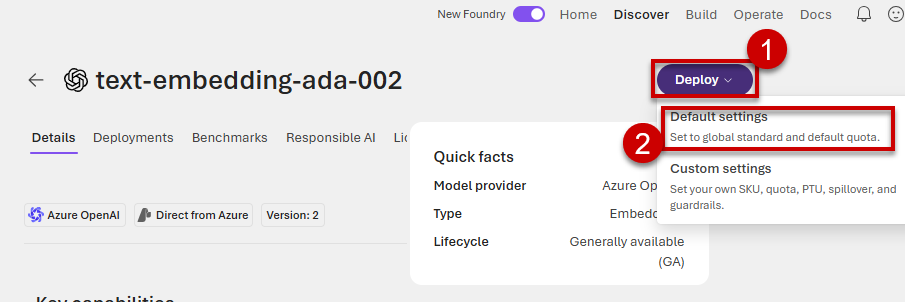

# Exercise 1: Provision the AI Foundry Foundation

This exercise focuses on provisioning the **AI Foundry Foundation**, including the creation of a **Foundry Hub** and **Project**, and deploying foundational AI models such as **GPT‑4o** and **text-embedding-ada-002**.

Miguel provisions the following core components within Microsoft Foundry:
- Microsoft Foundry environment  
- Foundry Agent Service  
- Secure identity and governance framework  

> *“Agents must be observable, auditable, and secure — from day one.”*

## ✅ Outcome
- Foundry Project successfully created  
- Base AI models deployed  
- Secure runtime environment ready for agent execution

### Task 1.1: Provision a Foundry Hub and Project 

1. Copy the following URL and open it in a new browser tab to access Microsoft Foundry: **<inject key= "aiFoundryPortalUrl" enableCopy="true"/>**

2. Click on **Build** to create agents, deploy models, and build workflows.

    > **Note:** Make sure the **New Foundry** toggle is turned On.
    > This setting is required to use the latest Foundry portal UI.
    > If you are redirected to a sign-in page, choose Sign in to access Foundry.

     

### Task 1.2: Deploy LLM and embedding models

 In this task, you will deploy a reasoning model and an embedding model in Foundry.

1. On the Microsoft Foundry page, click on **Models**, then click on **Deploy base models**.

    

2. Search for **gpt-4o** then click on **gpt-4o**.

    

3. Click on the **Deploy** dropdown and select **Default settings**.

    

4. Once the model is deployed, open the model **playground**.
   
   

5. Click on **Details** tab to view the **key**, **endpoint**, and **other model information**.

   

6. Again navigate to **Models** section to deploy embedding model, then click on **Deploy base models**.

    

7. Search **text-embedding-ada** then click on **text-embedding-ada-002**.

    

8. Click on the **Deploy** dropdown and select **Default settings**.

    

### What We Learned

- How to access the Azure Portal and navigate to the Foundry portal.
- How to deploy LLM and embedding models in Foundry using default settings.

### Next Exercise

In the next exercise, we will learn how to integrate enterprise knowledge using Foundry IQ, including setting up indexed sources for unstructured files and connecting to Microsoft Fabric Lakehouse for real-time structured data retrieval.
