# Exercise 5: Observability, Evaluation, and Guardrails
This exercise focuses on enabling end-to-end **observability**, implementing **evaluation frameworks**, and enforcing **guardrails** to ensure enterprise-grade safety and governance for AI-driven agents.

**April (CEO)** emphasizes the need for trust and transparency in automated decision-making:
> *“If AI makes decisions, I need to see, trust, and govern them.”*

To meet these requirements, Miguel enables the following capabilities:
- Telemetry for agent activity and performance monitoring  
- Prompt evaluation for response quality and alignment  
- Guardrails and policy enforcement for Responsible AI  

## ✅ Outcome
- End-to-end observability implemented  
- Responsible AI policies enforced  
- Enterprise-ready agents with governance and auditability

### Task 5.1: Enforce guardrails and safety policies

1. From the left pane, click on **Guardrails** and then click on **Create**.

    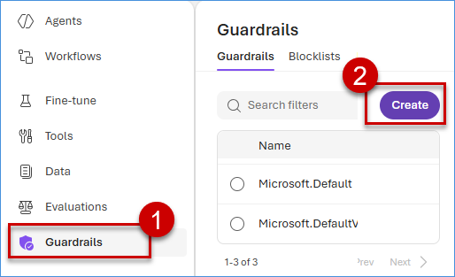

2. Under the **Controls** section, select the **Risk Type** checkbox for the dropdowns : **Jailbreak**, **Content Safety**, and **Protected Materials**, then click on **Next**.

    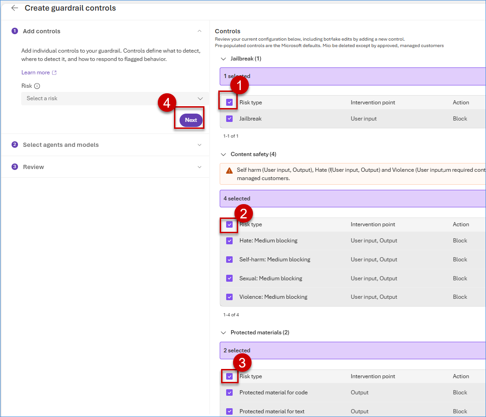

3. Under the **Select agents and models** section, click on **Add agents**, select the **Name** checkbox to include all agents, then click on **Save**.

    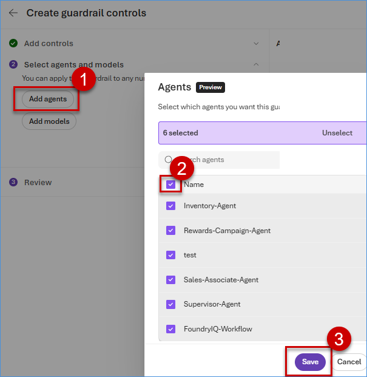

4. Click on **Next**.

    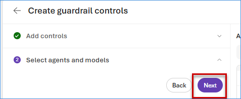

5. Under the **Review** section, paste `Guardrail11` as Guardrails name, Click on **Submit**.

    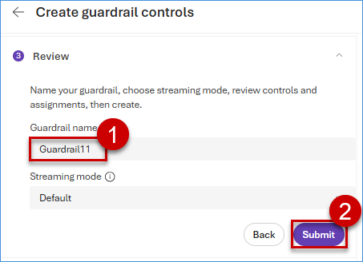

### Task 5.2: Define evaluation metrics and run offline/online assessments

1. Click on **Evaluations** and then click on **Create**.

    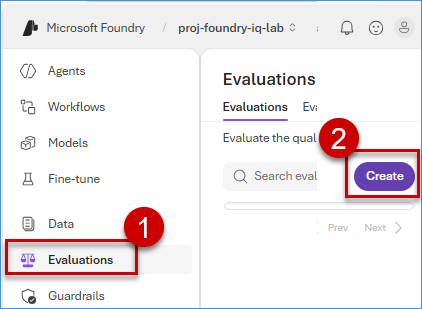

2. Under the **Target: Agent** section, select the **Supervisor** agent, then click on **Next**.

    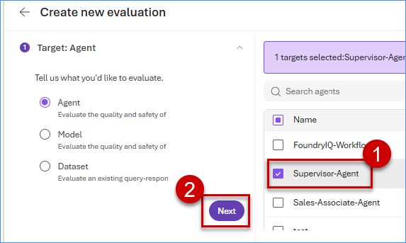

3. Under the **Data** section, click on **Generate**. Leave other values as default and enter `10` for **Number of rows**, then click on **Confirm**.

    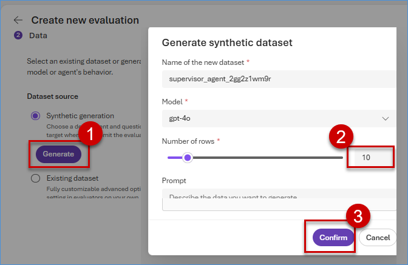

4. Click on **Next**.

    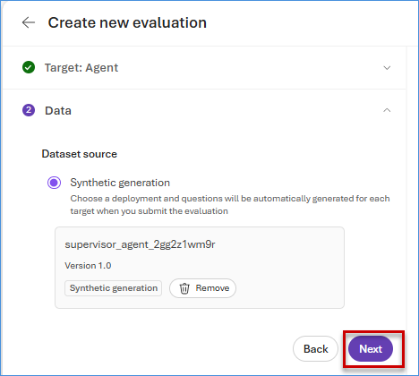

5. Under the **Criteria** section, click on **Next**.

    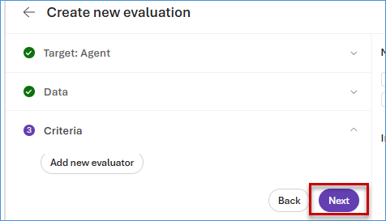

6. Under the **Review** section, enter `eval-7gthxnri` as **Evaluation name** and click on **Submit**.

    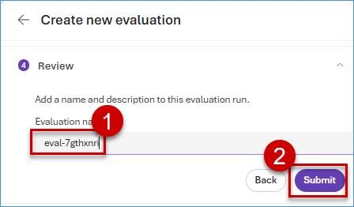

    > **Note:** It might take a few seconds to load.
    >
    > **Important:** Do not close the page until the evaluation run status is complete.

7. Review the **Evaluation runs** and **Evaluators**.

    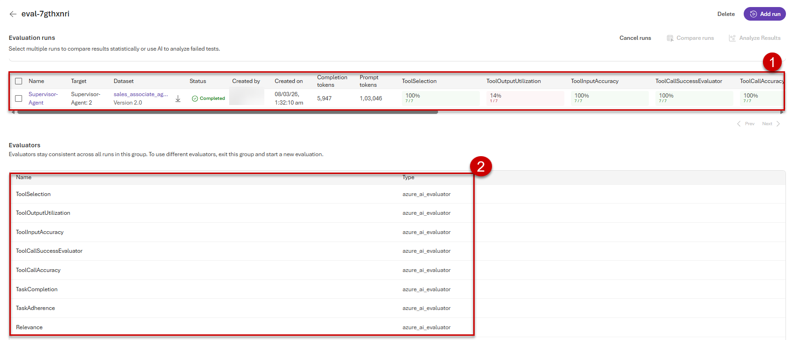

    **Note:** Similarly, perform evaluation on the other agents.

### What We Learned

- How to create and apply guardrails for content safety, jailbreak prevention, and protected materials.
- How to set up evaluations for agents using generated data and predefined criteria.
- How to monitor and assess agent performance through evaluation runs and metrics.

### Next Exercise

This concludes the "Building Foundry IQ" lab series.

## Lab Conclusion

Throughout this comprehensive lab, we journeyed from provisioning the foundational elements of ***Microsoft Foundry*** 🤖 to deploying sophisticated ***AI agents*** capable of intelligent interactions. Starting with setting up the ***Foundry Hub*** and deploying essential models like ***GPT-4o*** and ***text-embedding-ada-002***, we progressed to integrating enterprise ***knowledge*** 🧠 via ***Foundry IQ***, indexing unstructured ***data*** 📊 from ***Azure Blob Storage*** and structured ***data*** from ***AI Search indexes***, and connecting directly to ***Microsoft Fabric Lakehouse*** for seamless ***data access***.

We then delved into building intelligent ***agents*** 👥 with ***tool calling***, creating specialized ***agents*** for sales assistance, rewards campaigns, and inventory management, each equipped with tailored instructions and ***knowledge sources***. The orchestration phase taught us to coordinate multiple ***agents*** through ***workflows*** 🔄, validating their end-to-end operations and inspecting execution paths via ***traces*** for robust debugging and monitoring.

Finally, we emphasized ***observability*** and ***safety*** by implementing ***guardrails*** 🛡️ to enforce content policies and conducting ***evaluations*** 📈 to measure ***agent performance***, ensuring reliable and ethical ***AI deployments***. Happy learning as you continue to explore and build with ***Microsoft Foundry*** and ***Fabric IQ***! 
