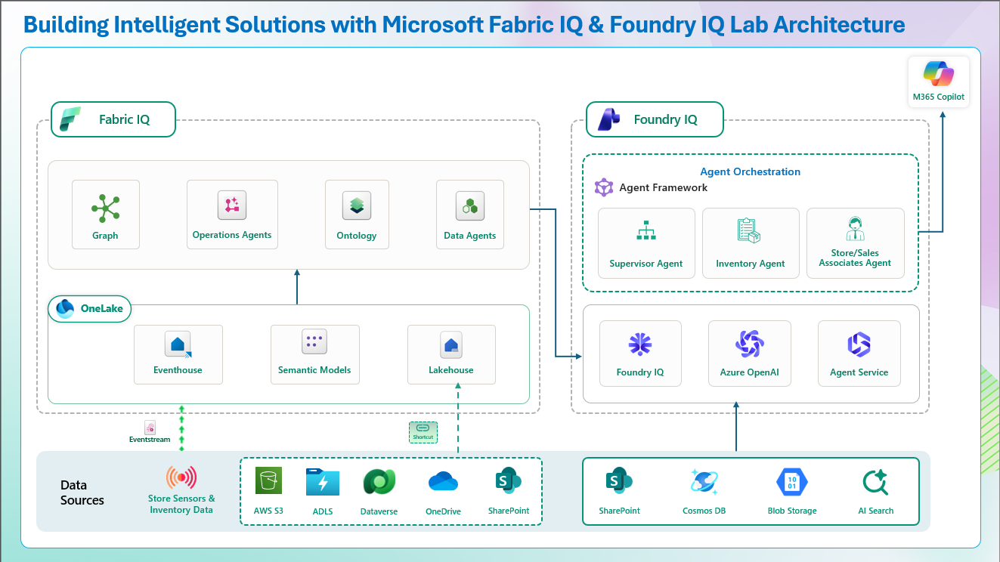

# Building Intelligent Solutions with Microsoft Fabric IQ & Foundry IQ – Hands-on Lab 
 
**The estimated time to complete this lab is 3-4 hours.**
 
**DISCLAIMER**
 
This presentation, demonstration, and demonstration model are for informational purposes only and (1) are not subject to SOC 1 and SOC 2 compliance audits, and (2) are not designed, intended, or made available as a medical device or as a substitute for professional medical advice, diagnosis, treatment or judgment. Microsoft makes no warranties, express or implied, in this presentation, demonstration, and demonstration model. Nothing in this presentation, demonstration, or demonstration model modifies any of the terms and conditions of Microsoft's written and signed agreements. This is not an offer, and applicable terms and the information provided are subject to revision and may be changed at any time by Microsoft.
 
This presentation, demonstration, and demonstration model do not grant you or your organization any license to patents, trademarks, copyrights, or other intellectual property covering the subject matter herein.
 
The information contained in this presentation, demonstration, and demonstration model represents the current view of Microsoft on the issues discussed as of the date of presentation and/or demonstration, for the duration of your access to the demonstration model. Because Microsoft must respond to changing market conditions, it should not be interpreted as a commitment on the part of Microsoft, and Microsoft cannot guarantee the accuracy of any information presented after the date of presentation and/or demonstration or for the duration of your access to the demonstration model.
 
No Microsoft technology, nor any of its component technologies, including the demonstration model, is intended or made available as a substitute for the professional advice, opinion, or judgment of (1) a certified financial services professional, or (2) a certified medical professional. Partners or customers are responsible for ensuring the regulatory compliance of any solution they build using Microsoft technologies.
 
**Copyright**
 
©2026 Microsoft Corporation. All rights reserved. 
 
By using this demo/lab, you agree to the following terms:
 
The technology and functionality described in this demo/lab are provided by Microsoft Corporation for the purposes of obtaining your feedback and providing you with a learning experience. You may only use the demo/lab to evaluate such technology features and functionality and to provide feedback to Microsoft. You may not use it for any other purpose. You may not modify, copy, distribute, transmit, display, perform, reproduce, publish, license, create derivative works from, transfer, or sell this demo/lab or any portion thereof.
 
COPYING OR REPRODUCTION OF THE DEMO/LAB (OR ANY PORTION OF IT) TO ANY OTHER SERVER OR LOCATION FOR FURTHER REPRODUCTION OR REDISTRIBUTION IS EXPRESSLY PROHIBITED.
 
THIS DEMO/LAB PROVIDES CERTAIN SOFTWARE TECHNOLOGY AND PRODUCT FEATURES AND FUNCTIONALITY, INCLUDING POTENTIAL NEW FEATURES AND CONCEPTS, IN A SIMULATED ENVIRONMENT WITHOUT COMPLEX SETUP OR INSTALLATION FOR THE PURPOSE DESCRIBED ABOVE. THE TECHNOLOGY AND CONCEPTS REPRESENTED IN THIS DEMO/LAB MAY NOT REPRESENT FULL FEATURE FUNCTIONALITY AND MAY NOT WORK THE WAY A FINAL VERSION WOULD WORK. WE ALSO MAY NOT RELEASE A FINAL VERSION OF SUCH FEATURES OR CONCEPTS. YOUR EXPERIENCE USING SUCH FEATURES AND FUNCTIONALITY IN A PHYSICAL ENVIRONMENT MAY ALSO BE DIFFERENT.
 
 

## Overview

> **Important:** This lab is structured as two stages (Fabric IQ + Foundry IQ). Complete each lab in order before moving to the next.  

This lab demonstrates how **Microsoft Fabric**, **Fabric IQ**, and **Foundry IQ** work together as a single, **end-to-end intelligence platform** to transform **raw enterprise data** into **trusted, business-aware AI actions**.

Using the **Zava Retail scenario**, participants experience how a modern organization evolves from **fragmented data** and **delayed insights** into a **Frontier Organization**—one that is **human-led and AI-operated**.

Zava operates hundreds of **physical stores** alongside a rapidly growing **e-commerce platform**. Despite significant investments in **data and analytics**, leadership continues to face **critical challenges**:

- **Disconnected data sources** across systems and clouds  
- **Slow, delayed insights** that limit responsiveness  
- **Poor customer experience** during peak events such as **Holiday Sales**  
- No shared **“business language”** for **AI systems and agents**

To address these challenges, Zava’s leadership adopts **Microsoft Fabric, Fabric IQ, and  Foundry IQ** to unify **data**, **intelligence**, and **AI execution** across the organization.

---

## Personas in the Scenario

- **April – CEO**, accountable for **revenue, customer experience, and growth**  
- **Rupesh – Chief Data Officer**, responsible for **data unification and governance**  
- **Eva – Data Engineer**, building the **data foundation**  
- **Serena – Data Analyst**, driving **insights using business language**  
- **Miguel – AI Engineer/Data Scientist**, designing **intelligent agents**  
- **Ryan – End customer**, experiencing the **outcomes firsthand**

---

## Lab Structure

The lab is intentionally designed in **two connected stages**, showing the progression from **data to insight to action**.

---

## Lab 1: Fabric IQ — Unified Data to Business Intelligence

Participants begin by establishing a **unified, governed data foundation** in **OneLake**, eliminating **silos** across **batch, historical, and real-time data sources**:

- **Batch and historical data** (Customers, Products, store) land in a **Lakehouse**.  
- **Streaming operational data** (customers, forecasts, inventories, products, carriers) flows into **Eventhouse**.  
- **Microsoft Fabric** provides a **single storage, security, and governance boundary** for **analytics and AI**.

On top of this foundation, **Fabric IQ** converts **raw data** into **shared business understanding**:

  - The **ontology** defines **core business entities** (**Store, Product, Inventory, customer**) and how they relate.
- A **graph representation** reveals how outcomes such as **stockouts, churn, and revenue** are connected.  
- **Real-Time Intelligence (RTI)** enriches the ontology with **live operational signals**.  
- **Operations agents** monitor **anomalies** as the business runs.  
- **Fabric Data Agents** enable **natural language questions** grounded in the **business ontology**.

At this stage, **humans and AI speak the same business language**—not **SQL, schemas, or dashboards**.

---

## Lab 2: Foundry IQ — Business Intelligence to Intelligent Action

Building on the **trusted business context** from **Fabric IQ**, **Foundry IQ** enables **AI agents** that can **reason, collaborate, and act safely**.

In this stage, participants design and observe:

- A **Supervisor Agent** that **orchestrates decisions**.  
- **Specialized agents** (**Inventory, Store, Sales Associate**) with **clear responsibilities**.  
- **Tool-calling integration** with **Fabric Data Agents** for **structured, trusted insights** . 
- **Knowledge grounding** using **Foundry IQ** for **enterprise documents, policies, and rules**.  
- **Azure OpenAI models** hosted in a **governed, auditable Agent Service**.

Agents do not **guess or hallucinate**. They reason over **business-aware intelligence** provided by **Fabric IQ** and operate within **defined governance boundaries**.

---

## End-to-End Scenario: Holiday Sales at Zava

The final architecture comes together during a **high-pressure Holiday Sales in retail scenario**:

- **Inventory Agents** assess **real-time availability**.  
- **Store Agents** reason over **local demand and constraints**.  
- **Sales Associate Agents** guide **customer interactions and fulfillment**.

All **agent interactions** are **observable, evaluated, and governed**, ensuring **trust, transparency, and compliance** at **enterprise scale**.

---

## What This Lab Demonstrates

By the end of the lab, you will see how:

- **OneLake** enables a **unified, governed data estate**.  
- **Fabric IQ** creates a **shared business language across humans and AI**.  
- **Real-time intelligence** drives **operational awareness** . 
- **Foundry IQ** powers **safe, collaborative, multi-agent AI systems**.  
- Organizations move from **analytics to intelligence to action**.
 

 
# Table of Contents

## Lab 1: Building Fabric IQ

## What is Fabric IQ?

**Fabric IQ** is the intelligence layer in Microsoft Fabric that transforms raw enterprise data into a **shared business understanding**.  
Instead of forcing users or AI systems to work directly with tables, schemas, or SQL queries, Fabric IQ introduces a **business-aware model of the organization**.

Fabric IQ allows organizations to define:

- **Business entities** such as stores, products, and inventory.  
- **Relationships** between those entities.  
- **Operational signals** from real-time systems.  
- **Natural language access** to trusted data.

This enables both **humans and AI systems to reason about data using business language** rather than technical data structures.

---

## What is an Ontology in Fabric IQ?

An **ontology** in Fabric IQ represents the **business model of the organization**.

It defines:

- **Entities** – the core objects in the business domain.  
- **Attributes** – properties that describe each entity.
- **Relationships** – how entities connect to each other.  

Instead of viewing data as isolated tables, the ontology represents the business as a **connected graph of meaning**.

Example retail entities include:

| Entity | Description |
|------|-------------|
| Store | Physical retail locations |
| Product | Items sold across stores and online |
| Inventory | Product availability across locations |

The ontology provides a **shared business language** that both people and AI systems can understand.

---

## What We Are Building

In this lab, participants build a **retail intelligence model** for the **Zava Retail organization**.

The goal is to transform fragmented operational data into a **connected business knowledge layer**.

The solution combines several Fabric capabilities:

| Component | Purpose |
|----------|--------|
| Lakehouse | Stores historical and batch retail data |
| Eventhouse | Processes real-time operational signals |
| Ontology | Represents the retail business domain as connected entities |

By combining these components, the platform moves beyond raw analytics to create a **business-aware intelligence layer**.

---

## Real-Time Intelligence and Operations Monitoring

Retail environments generate large volumes of **real-time operational data**.

Fabric IQ integrates these signals into the ontology using:

- **Eventhouse**
- **Operations Agents**

These components monitor live events such as:

- Inventory updates
- Store activity signals
- Operational anomalies

This allows the system to detect issues such as **inventory shortages or demand spikes** before they impact customers.

---

## Fabric Data Agents

Once the ontology is created, **Fabric Data Agents** provide a natural language interface to the business model.

A Data Agent connects directly to the ontology and allows users to ask **business questions in plain language**.

Examples include:

- Which stores experienced the highest stockouts last quarter?
- Which products are driving the most revenue?
- Where is inventory running low right now?

Instead of manually writing SQL queries or exploring dashboards, the agent translates these questions into queries against the ontology.

---

## Connecting the Data Agent to Fabric IQ

In the final step of the Fabric IQ lab, the **Fabric Data Agent** is connected directly to the **Ontology**.

This allows the agent to:

- Understand business entities and relationships  
- Query both historical and real-time data  
- Provide explainable answers grounded in the business model  

At this stage, the organization has established a **trusted intelligence layer** where both humans and AI systems can reason about the business using the same language.

This intelligence foundation becomes the starting point for the next stage of the lab, where **Foundry IQ introduces AI agents that can act on this intelligence**.

### **Exercise 1: Create a Workspace for Fabric IQ**

**Task 1.1:** User login to Fabric  \
**Task 1.2:** Set up a Fabric workspace with proper capacity 

### **Exercise 2: Generate Ontology Data**

**Task 2.1:** Building a Lakehouse \
**Task 2.2:** Building an Eventhouse \
**Task 2.3:** Loading data into Lakehouse and Eventhouse

### **Exercise 3: Create Ontology**
**Task 3.1:** Generate ontology from package \
**Task 3.2:** Ontology Validation

### **Exercise 4: Creating a Data Agent with Ontology**
**Task 4.1:** Create a data agent with an ontology as the data source  \
**Task 4.2:** Validate the data agent using natural language queries 

### **Exercise 5: Create Operations Agent (Fabric IQ)**

**Task 5.1:** Create Operations Agent  \
**Task 5.2:** Observe agent behavior in real-time  
  

---

## Lab 2: Building Foundry IQ

## Why Foundry IQ?

In modern organizations, **data alone is not enough**. Businesses need systems that can **reason, collaborate, and act** based on trusted intelligence.

After building a unified data foundation and business ontology using **Microsoft Fabric and Fabric IQ**, the next challenge is transforming those insights into **real-world business actions**.

This is where **Foundry IQ** becomes essential.

**Foundry IQ** enables organizations to build **intelligent, multi-agent AI systems** that operate on trusted enterprise knowledge and structured business intelligence.

Rather than relying on isolated prompts or disconnected data sources, Foundry IQ allows agents to:

- Access **structured insights from Fabric Data Agents**
- Ground answers in **enterprise documents and policies**
- Reason over **business-aware context**
- Collaborate with **other specialized agents**
- Operate within **secure and governed enterprise environments**

Foundry IQ bridges the final gap in the intelligence lifecycle:

| Layer | Purpose | Example |
|------|--------|--------|
| Data | Unified enterprise data foundation | OneLake, Lakehouse, Eventhouse |
| Intelligence | Business understanding of the data | Fabric IQ Ontology |
| Action | AI agents that reason and execute | Foundry IQ Agents |

Most analytics platforms stop at **dashboards and reports**.  
Foundry IQ moves organizations beyond insights into **intelligent automation and decision execution**.

In this lab, Foundry IQ enables the **Zava Retail organization** to deploy AI agents that can assist employees, guide customers, and respond to operational conditions in real time.

---

## What We Are Building Using Foundry IQ

In this lab scenario, we extend the **Fabric IQ business intelligence layer** by introducing **AI agents that can act on that intelligence**.

The solution models a **modern retail environment** where AI agents assist both employees and customers by combining structured insights with enterprise knowledge.

## Intelligent Agent System

The architecture introduces a **Supervisor Agent** that orchestrates several specialized agents:

| Agent | Responsibility |
|------|---------------|
| Supervisor Agent | Coordinates decisions and routes tasks to the appropriate specialized agents |
| Inventory Agent | Uses Fabric Data Agents to understand stock levels and inventory conditions |
| Rewards Campaign Agent | Designs and evaluates promotional campaigns, loyalty rewards, and customer engagement strategies |
| Sales Associate Agent | Assists customers with product questions and purchasing guidance |

Each agent performs a **specific business function**, but all operate using the same trusted intelligence from **Fabric IQ**.

---

## Enterprise Knowledge Sources

To ensure agents respond with **accurate and trusted information**, the system integrates multiple enterprise data sources.

These sources provide both **structured and unstructured knowledge** that agents can use when answering questions or making decisions.

Configured data sources and services for the solution include:

| Data Source | Description |
|-------------|-------------|
| Inventory Data Agent | Configured the Fabric Data Agent for inventory data |
| Product Catalog | Stored and managed in Azure Cosmos DB |
| Return Policy Documents | Stored in Microsoft Fabric OneLake |
| Customer Loyalty Data | Stored in Azure Blob Storage

These sources allow agents to combine **business intelligence with enterprise knowledge**.

For example:

- The **Inventory Agent** retrieves real-time inventory insights through the **Fabric Data Agent**.
- The **Sales Associate Agent** answers product questions using **policy documents**.
- The **Supervisor Agent** coordinates decisions by combining both structured insights and document-based knowledge.

---

## Intelligent Workflow Scenario

The system is designed around the **Zava Retail scenario**, where AI agents support operations during high-demand retail events.

During major retail periods such as **Holiday Sales**, agents collaborate to assist both employees and customers.

Examples of agent-driven workflows include:

- Checking **real-time inventory availability**
- Answering **customer product questions**
- Applying **promotion and loyalty logic**
- Ensuring actions comply with **company policies**

Agents do not rely on guesses or hallucinated responses. Instead, they reason over **trusted intelligence provided by Fabric IQ** and **enterprise knowledge grounded in Foundry IQ**.

---

## How Foundry IQ Enables Intelligent Agents

Foundry IQ provides the infrastructure required for **enterprise-ready agent systems**.

Key capabilities include:

| Capability | Description |
|-----------|-------------|
| Knowledge Grounding | Agents retrieve information from enterprise documents and data sources |
| Tool Calling | Agents invoke Fabric Data Agents and other services to retrieve insights |
| Multi-Agent Collaboration | Supervisor agents orchestrate specialized agents |
| Governance and Security | Agents operate inside a controlled and auditable environment |
| Observability | Every interaction can be monitored and evaluated |

These capabilities allow organizations to deploy **AI agents that are not only intelligent but also trustworthy and governed**.

---

## What This Section Demonstrates

By building the Foundry IQ layer in this lab, participants learn how organizations move beyond analytics into **AI-powered operational intelligence**.

You will see how:

- **Fabric IQ provides trusted business intelligence**
- **Foundry IQ enables AI agents to reason and act**
- **Enterprise knowledge sources ground agent responses**
- **Multi-agent systems collaborate to solve business problems**

Together, **Microsoft Fabric, Fabric IQ, and Foundry IQ** create a single platform that connects **data, intelligence, and AI action** across the enterprise.

### **Exercise 1: Provision the AI Foundry Foundation**

Set up governance, compute, models, and secure connectivity for the agentic platform.

 **Task 1.1:** Provision a Foundry Hub and project \
 **Task 1.2:** Deploy LLM and embedding models 
 
### **Exercise 2: Integrate Enterprise Knowledge via Foundry IQ**
Connect the agent to live enterprise data using indexed and federated patterns for "Zero-ETL" RAG.

  **Task 2.1:** Set up indexed sources for unstructured files and federated sources for real-time structured data retrieval \
  **Task 2.2:** Connect to a Microsoft Fabric Lakehouse to enable direct access to enterprise data

### **Exercise 3: Build Intelligent Agents with Tool Calling**
Define agent behavior and enable tool‑based interactions.

 **Task 3.1:** Create agent persona and system instructions \
 **Task 3.2:** Attach configured knowledge sources to the agent \
 **Task 3.3:** Implement agent tool calling capabilities 

### **Exercise 4: Multi-Agent Orchestration and Validation**
Implement advanced agent-to-agent communication and verify the complete workflow.

 **Task 4.1:** Configure multi-agent orchestrator and specialist agents  
 **Task 4.2:** Validate the end-to-end agentic workflow \
 **Task 4.3:** Inspect the execution path using the Trace tool

### **Exercise 5: Observability, Evaluation & Guardrails**
Ensure monitoring, safety, and continuous evaluation.

 **Task 5.1:** Enforce guardrails and safety policies \
 **Task 5.2:** Define evaluation metrics and run offline/online assessments
