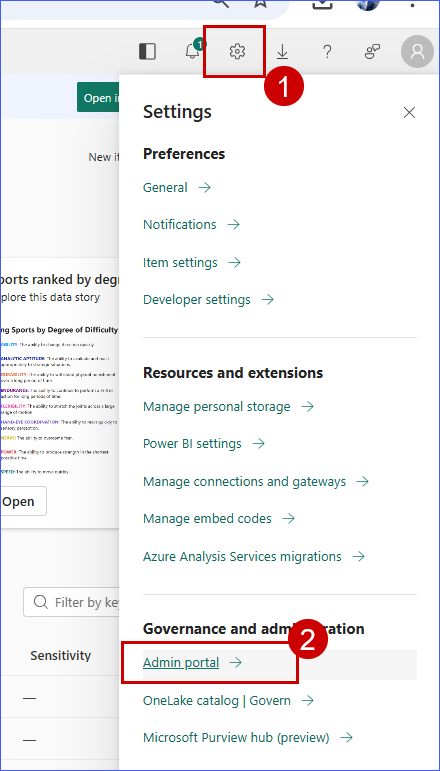
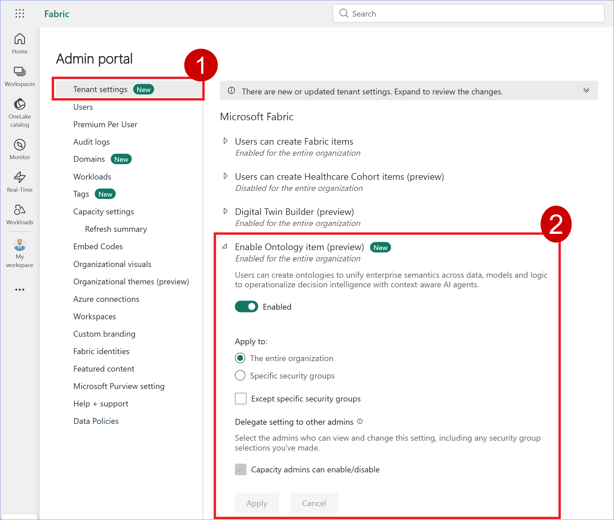
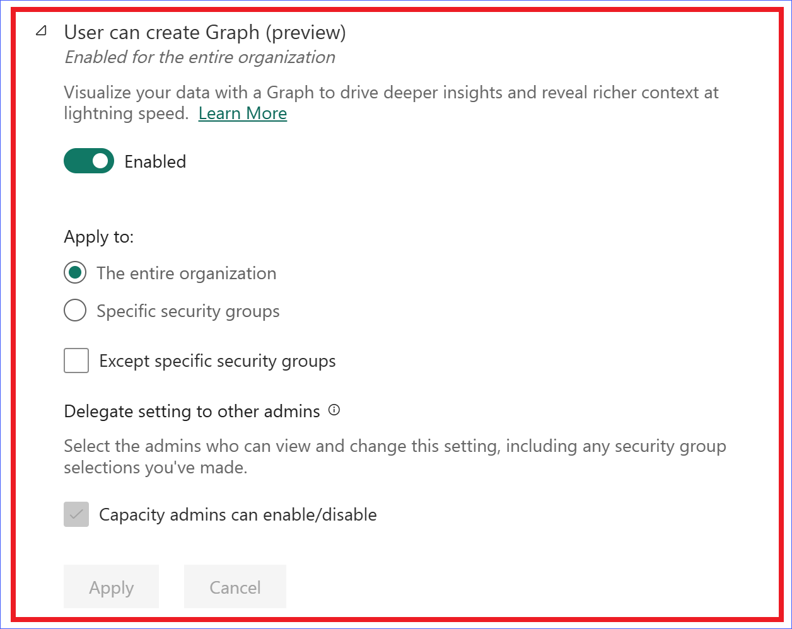
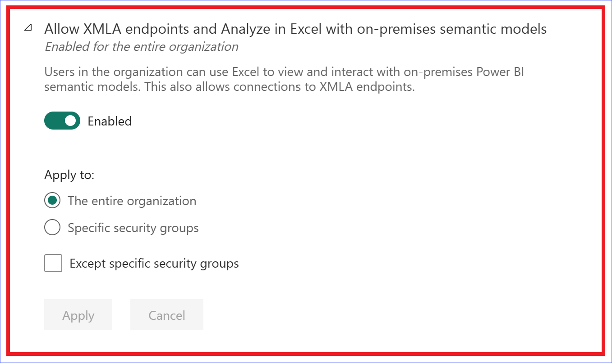
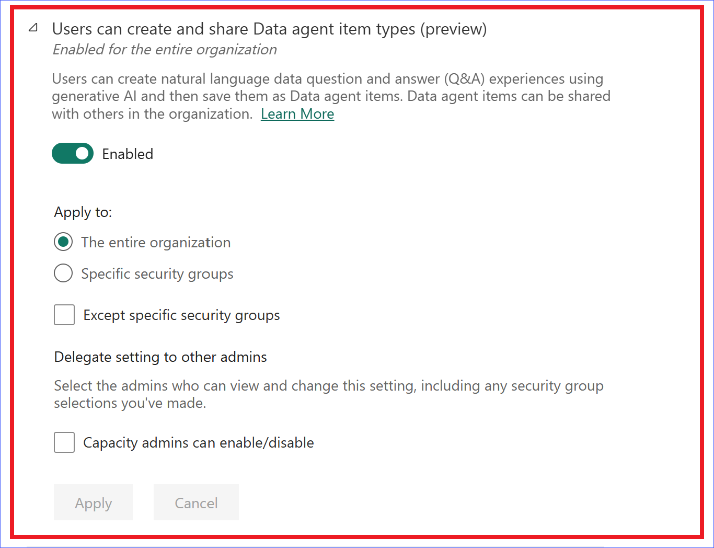

# Prerequisites
1. **Ontology item (preview)**, **Graph (preview)**, **XMLA endpoints**, and **Data agent item types (preview)** enabled on the tenant.

2. Navigate to [Fabric](app.powerbi.com). Click on **Settings** and select **Admin portal**.

3. In the **tenant settings**, enable **Ontology item (preview)**.

4. Enable **Graph (preview)**.

5. Enable **XMLA endpoints**.

6. Enable **Data agent item types (preview)**.

