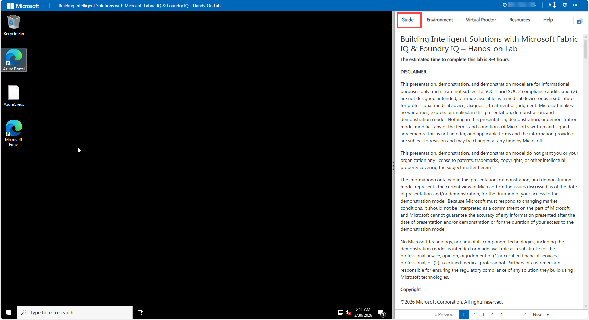
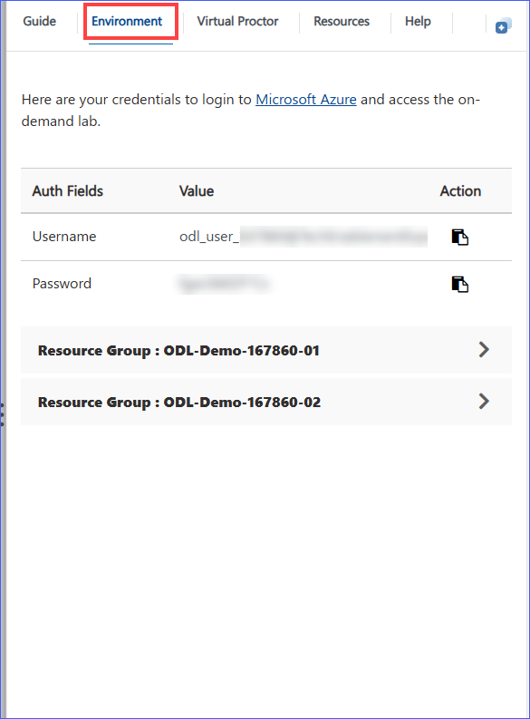
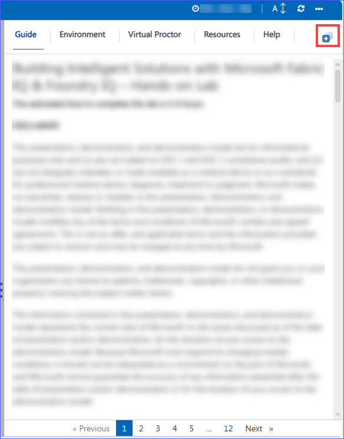
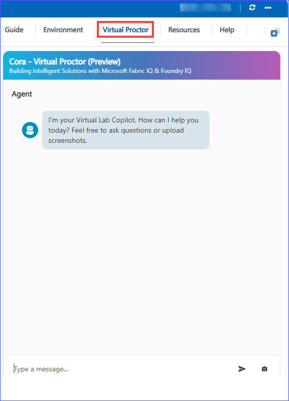
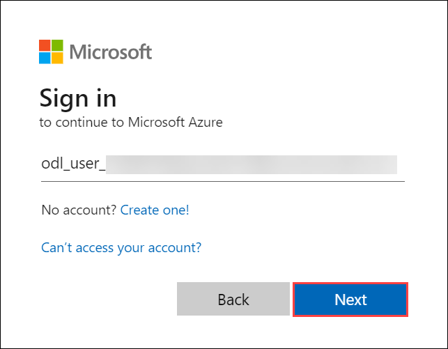
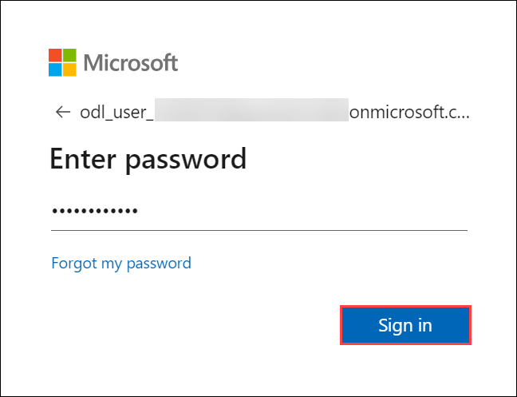
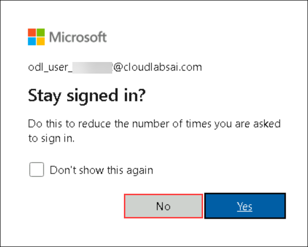
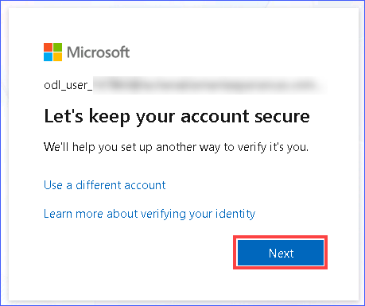
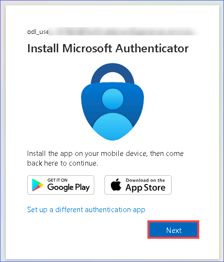
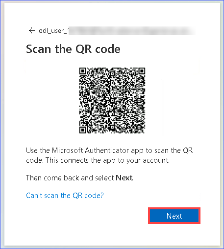

##  Getting Started with the Lab
 
This lab demonstrates how Microsoft Fabric, Fabric IQ, and Foundry IQ work together as a single, end-to-end intelligence platform to transform raw enterprise data into trusted, business-aware AI actions. Let's begin by making the most of this experience:
 
## Accessing Your Lab Environment
 
Once you're ready to dive in, your virtual machine and **Lab Guide** will be right at your fingertips within your web browser.

### Virtual Machine & Lab Guide
 
In the integrated environment, the lab VM serves as the designated workspace, while the lab guide is accessible on the right side of the screen.

**Note:** Please ensure all instructions are followed carefully to guarantee a smooth lab experience and optimal results. Do not close the PowerShell script while it is running. Once the script execution is completed and shows a “Completed” status, you may then close the PowerShell window.
 
## Exploring Your Lab Resources
 
To get a better understanding of your lab resources and credentials, navigate to the **Environment Details** tab.

 
## Utilizing the Split Window Feature
 
For convenience, you can open the lab guide in a separate window by selecting the **Split Window** button from the Top right corner.
 

## Lab Guide Zoom In/Zoom Out
 
To adjust the zoom level for the environment page, click the **A↕ : 100%** icon located next to the timer in the lab environment.

 
 
##  Get Help from Your Virtual Proctor
 
If you encounter any issues while performing the lab, assistance is readily available. Simply describe your problem in the Virtual Proctor tab, and the assistant will help guide you through the solution. You can also ask questions or upload screenshots for better support.
 

 
## Let's Get Started with Azure Portal
 
1. On your virtual machine, click on the Azure Portal icon as shown below:
 
   
 
1. You'll see the **Sign into Microsoft Azure** tab. Here, enter your credentials:
 
   - **Email/Username:** <inject key="AzureAdUserEmail"></inject>
 
     
 
1. Next, provide your password:
 
   - **Password:** <inject key="AzureAdUserPassword"></inject>
 
     
 
1. If you see the pop-up **Stay Signed in?**, click **No**.

      

1. Review the message “Let’s keep your account secure.” Click on the **Next button**.

   **Note:** This is a one-time security setup required to access Microsoft services during the lab.

   

1. Install the **Microsoft Authenticator** app on your mobile device. After installation, click the **Next button** and follow the on-screen instructions to set up your work account.

   

1. Open the **Microsoft Authenticator app** and scan the QR code displayed on the screen. Once the scan is complete, click the **Next button** to continue setting up MFA.

   

You have **successfully completed** the account setup and authentication process. Your environment is now ready for use.

Now, click on the **Next** from the lower right corner to move to the next page.

 
